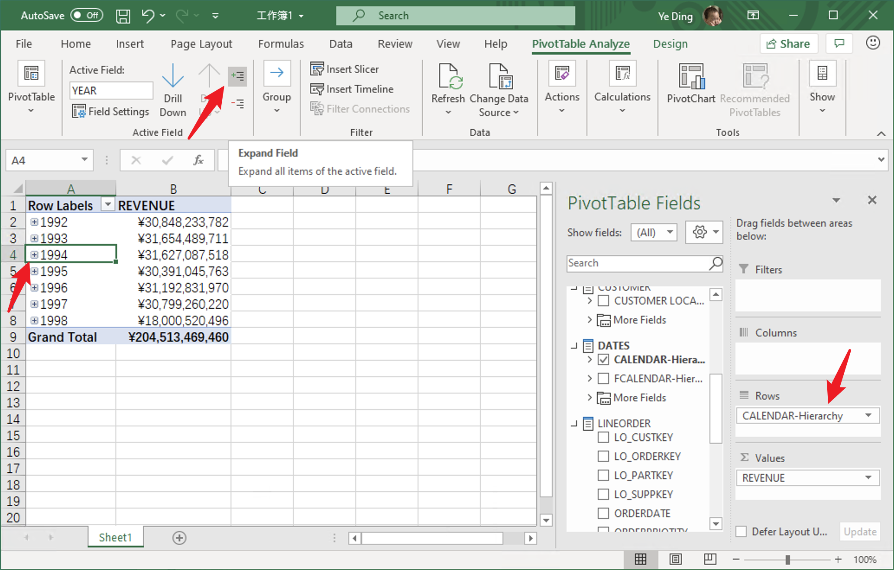
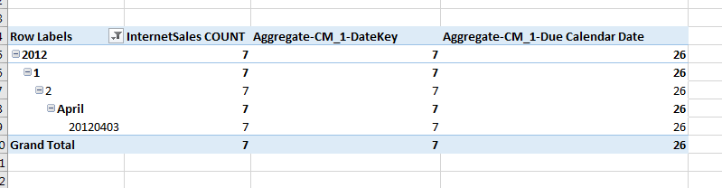

##  Known Limitations

The following records some known limitations of MDX for Kylin.

**Limitation 1:** Unlike SQL Server Analysis Service, only the **hierarchies** can be expanded in Excel. The detailed operation is shown in the figure below.

**Limitation 2:** When using hierarchies on row/column and adding filters on attributes that hierarchies rely on, the grand total and subtotals of calculated measures with **currentMember** function may be inaccurate.

**Limitation 3:** The implementation of Aggregate function is incomplete. The value of calculated measures using Aggregate function will be affected by report filters or slicers. For example: calculated measures named **Aggregate-CM_1-DateKey** and **Aggregate-CM_1-Due Calendar Date** are both defined by an expression as "Aggregate({[20120401], [20120402], [20120403], [20120404]}, [Measures].[InternetSales COUNT])",  and thus should have a fixed value **26**. However, the filter on hierarchy with the value 20120403 affects the value of Aggregate-CM_1-DateKey, changing it to **7**.

**Limitation 4:** MDX for Kylin only supports IP hash as load balance policy. Other policies such as round robin might cause slow response or exception when canceling query in Excel.

**Limitation 5:** MDX for Kylin not supports the related kylin to query the relationship of many-to-many.
