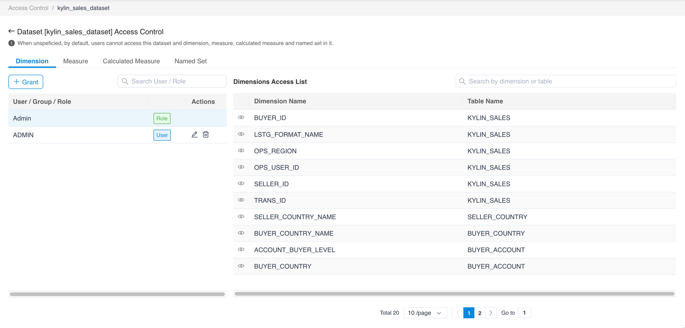
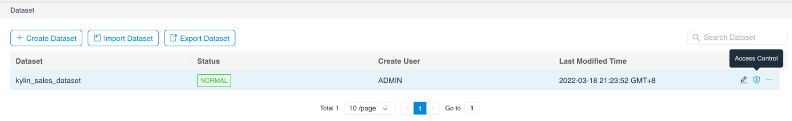
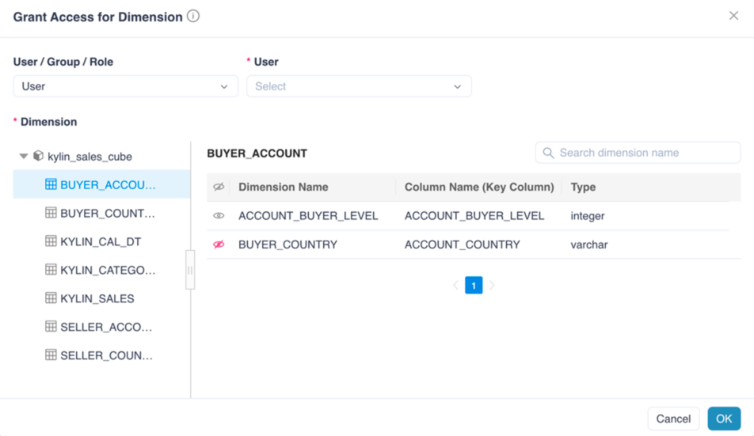

## Configure Access List

After created the dataset, users can configure the access control of it.

Users can set the access lists for a User, Group or a Role at object-level. The object that user can set the access list are Dimension, Measure, Calculated Measure and Named Set.

1. On the dataset list, click the access icon on the right side and enter the access control configuration page.

   

2. Select one of the tab pages for the dimension, measure, calculated measure or named set and click the **+ Grant** button.

3. A pop-up window appears. Select the user or group or role for editing access list at the top of the pop-up window.

   

4. Switch between the model and the table in the navigation bar on the left side of the pop-up window. On the right side, you can see the dimensions in the table or the measures / calculated measures / named set in the model.

5. Click on the dimension, measure, or calculation of the **Eye** icon in the front. When there is a slash on the mark, the corresponding dimension / measure / calculated measure / named set will not be accessible by the user, group or role.

6. Click on the **Eye** icon again so you can remove the restriction.

7. Click the **Submit** button.

The saved access list will appear in the table below. Users can click the **Delete** button on the right side of the table to remove the visibility limit or click the **Edit** button to edit the access list again.

To learn more about Object-level Security, please check [Object-level Security](../security/object_level_security.en.md)
