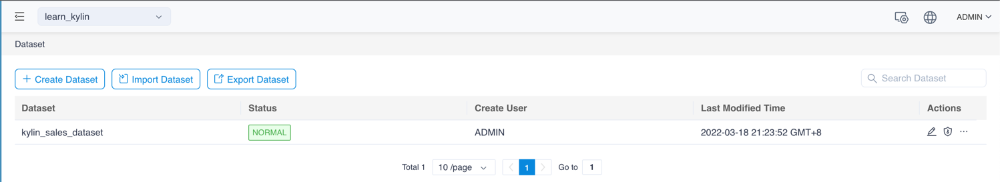
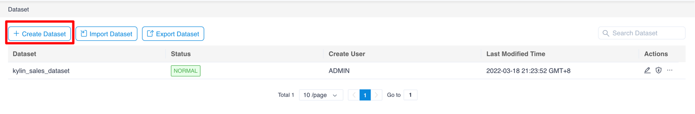
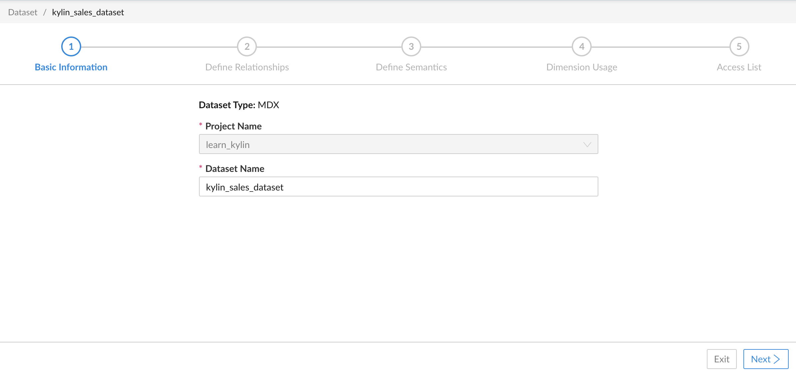

## Basic Information

This chapter introduces how to design a dataset, using sample data (*learn_kylin*) as an example.

Open the Web UI and click on the dataset menu to open the dataset list.

Click the Add button to add a new dataset. Here we create a new dataset named *kylin_sales_dataset*.

Then you will be taken to the Dataset Design Wizard. At the top of the GUI, you can see the current step.

### Next

[Define a relationship](s2_relationship.en.md)