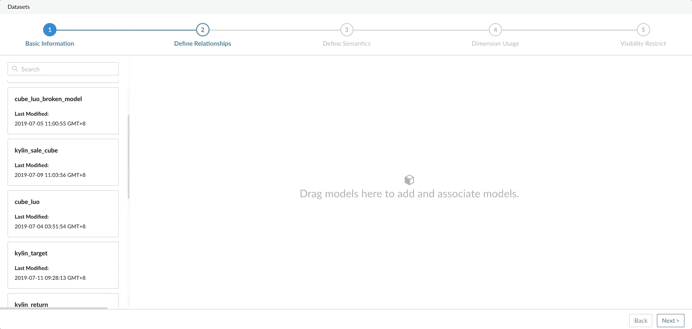

## Define Relationships

In step 2 you can define the relationships between Models, before that you need to add Models to the dataset based on your analysis needs.

> Note：You must add at least one model. 

After adding the first model, you can add new models and define the relationship between them.

> Note：There must be at least one pair of common dimension tables between models

### Next

[Define semantics](s3_semantic.en.md)