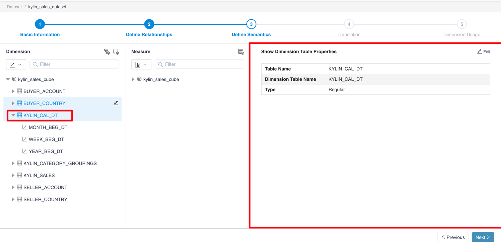
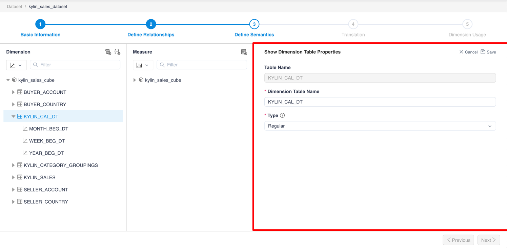

## View and edit dimension tables

Click **Dimension Table Name** to view the properties of the dimension table

After clicking the **Edit** button, you could edit the type of the dimension table.

> Note：If you need to use YTD, QTD, WTD, MTD functions, you need to specify the date table as the time type.

### Next

[View and edit dimensions](s3_2_dimension.en.md)