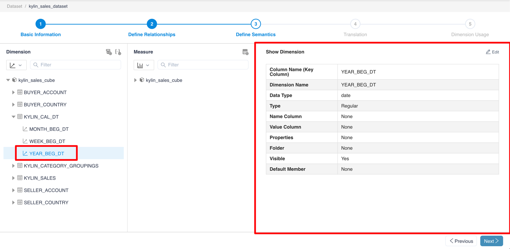
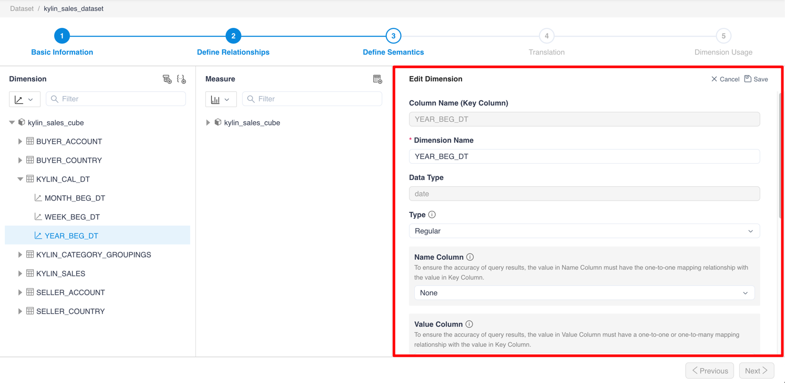
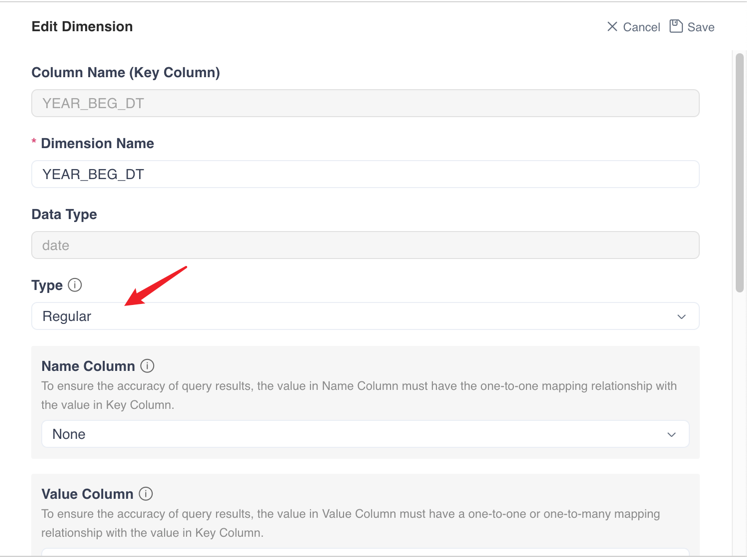
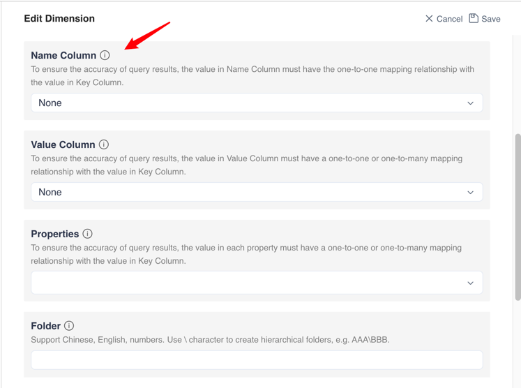
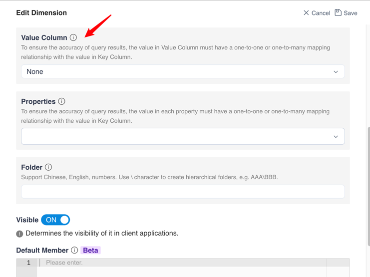
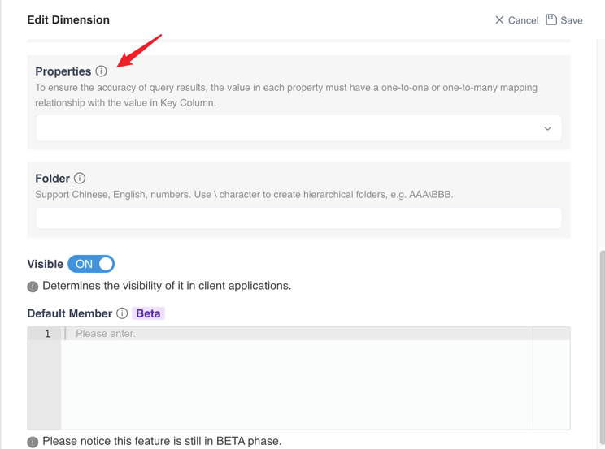
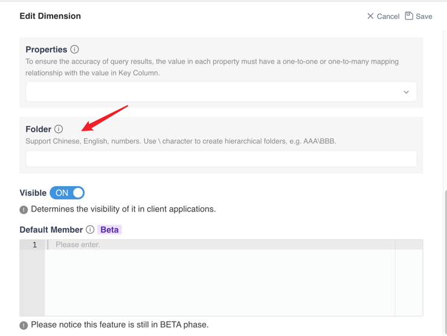
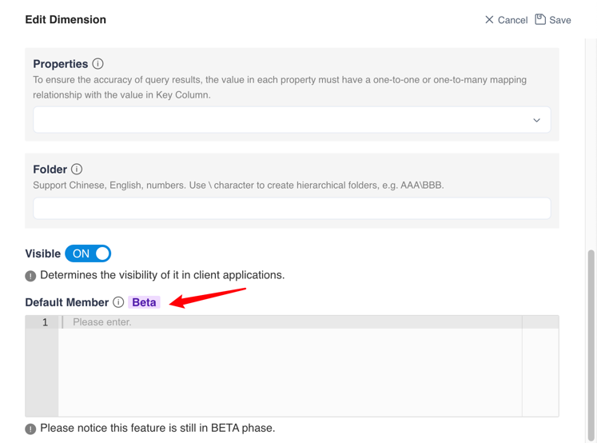

## View and edit dimensions

Click **Dimensions Name** to view the Properties of the dimensions

### Introduct of Dimension Properties

In MDX for Kylin system, there are many properties that determine how dimensions function. The following table lists and describes each of these properties.

> Note: To ensure the query performance, please add the dimension, which is served as dimension properties on the the following table, to the aggregation group in kylin models.

| Dimension Properties | Description                                                  |
| -------------------- | ------------------------------------------------------------ |
| Key Column           | The column corresponding to this dimension which cannot be changed. |
| Dimension Name       | The displaying name of the dimension.                        |
| Data Type            | The data type of the dimension which cannot be changed.      |
| Type                 | The property of the dimension. After set as the time property, the dimension can be used for time-related calculations. E.g., YTD, YOY, etc. |
| Name Column          | Name Column identifies the column that is displayed to users while analyzing. This column is used to improve the usefulness and friendlines in the client applications. For example, set the Name Column of the dimension Datekey (***20120101***) as the dimension Date_name (***Jan. 1 st, 2012***). When analyzing the dimension Datekey in the report, the value shown in the report is ***Jan. 1 st, 2012***. The value in the Name Column must only correspond to the value in a Key Column, otherwise, it will cause an MDX calculation error. |
| Value Column         | After the Value Column is defined, MemberValue can be used in the expression of the calculated measure to return the specified column. For date-related dimensions, the Value Column can be set to a date type dimension and utilize the benefits for filtering purposes, e.g., **Last Year**, **Last Week**. To ensure the accuracy of query results, the value in Value Column must have a one-to-one or one-to-many mapping relationship with the value in Key Column. |
| Properties           | After setting Properties with dimensions, you can refer to the property in MDX expression. The value in each property must have a one-to-one or one-to-many mapping relationship with the value in Key Column. |
| Folder               | To determine which folder this dimension belongs to.  If you need multiple levels of folders, please use \ character to separate. For example, when user input `folder1\folder2` in this field for a dimension, then this dimension will be placed in **folder2**, and **folder2** is nested in **folder1**. |
| Visible              | After turning off visibility, all users cannot access to this dimension.  This option will be synchronized to the access list. |
| Default Member       | Use an expression to specify a single default member returned of this dimension.  Please notice this feature is still in the BETA phase. |

### Edit Dimension

After clicking the **Edit** button, you could edit the type of the dimension and the name of the dimension, and define visibility restrictions.

> Note: Key Column, Name Column and Value Column used in the dimension only support String, Int, Long, Double, Timestamp, Date, Boolean types

You can edit attribute here.

> Note：If you need to use the YTD, QTD, WTD and MTD functions, you need to change the type of dimensions to the year, quarter, month and day.

You can edit Name Column here.

> Note: When the Name Column is none, the expressions related to the Name Column will be processed according to the contents of the Key Column;

You can edit Value Column here.

> Note: When Value Column is none, the expressions related to Value Column will be processed according to the contents of Name Column;

You can edit Properties here.

You can set the folder to which the dimension belongs here. If you need multi-level folders, please use \ to separate them.

> Note: Multi-level folders only take effect in Excel.

Secondly, you can also set the Default Member of the Dimension

> Note: This function is currently in the BETA stage, and now Default Member can be only set as a member of this dimension, such as [Dates].[Year].&[2019]

### Default member behavior description

1. When default member is set for a dimension in the hierarchy, the default value will not be default member when the hierarchy is placed in the filter box or slicer. In addition, when the hierarchy is put on rows or columns, the default member will be filtered.

2. When no default member dimension is checked, the display of other dimensions will be filtered by default member.

**Known Limitations**:

- After placing the dimension with Default Member in the filter of the pivot table, the filter status on the filter interface is single-select Default Member, but the list below shows Select All.

- If the set Default Member does not exist, you can still save the data set normally, and eventually the Default Member will not take affect in Excel.

At the same time, you can set whether the dimension is visible in the client application.

### Next

[View and edit measure](s3_3_measure.en.md)
