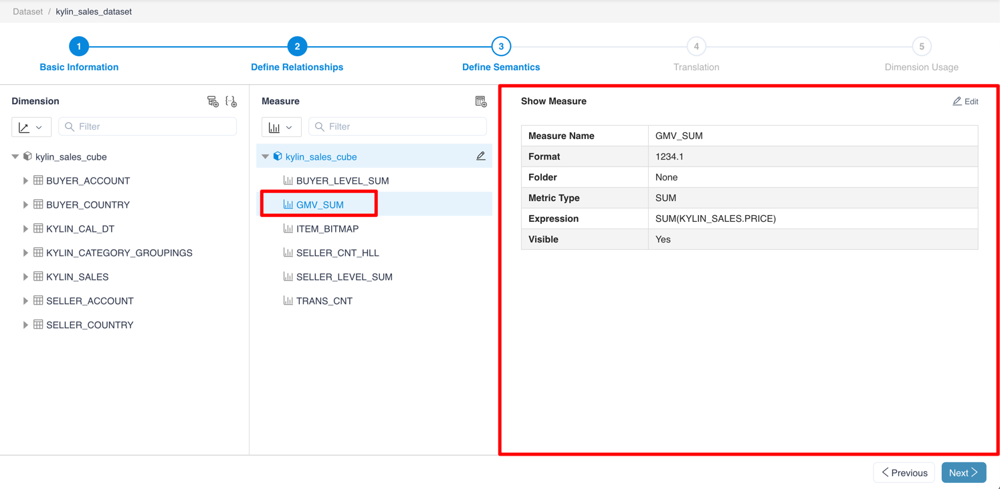
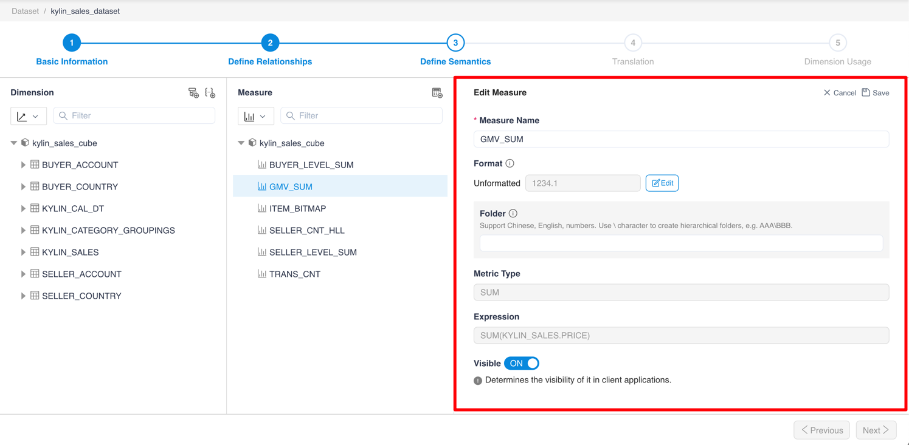
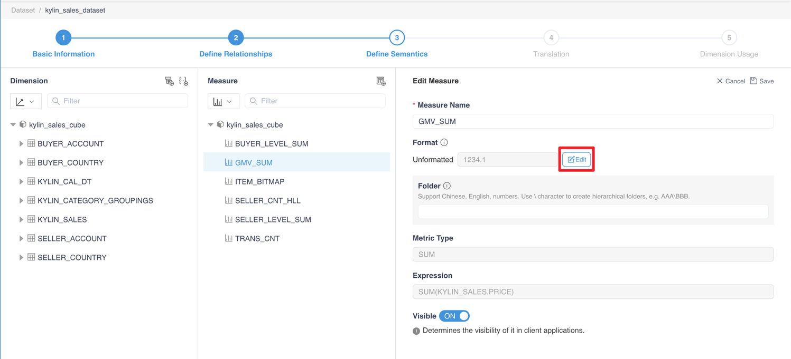
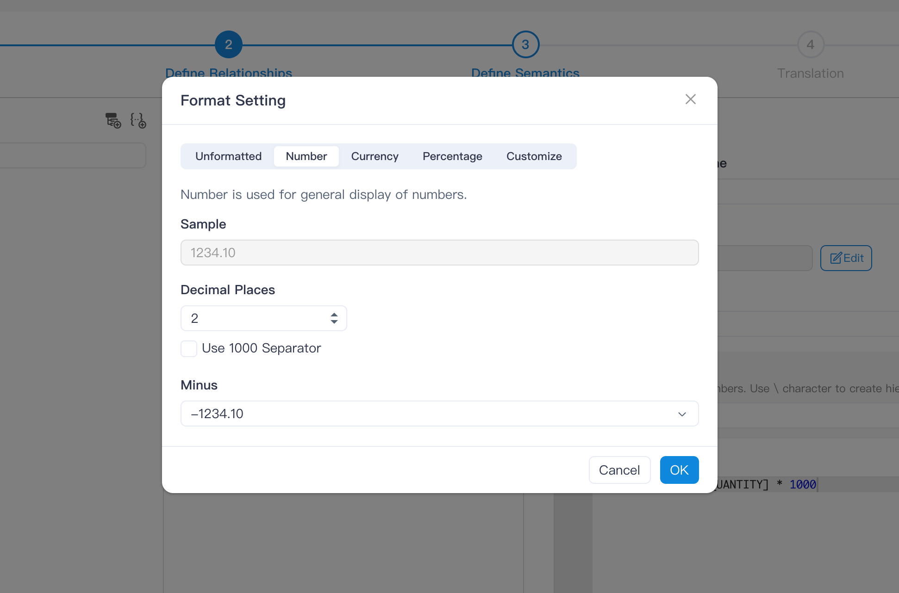
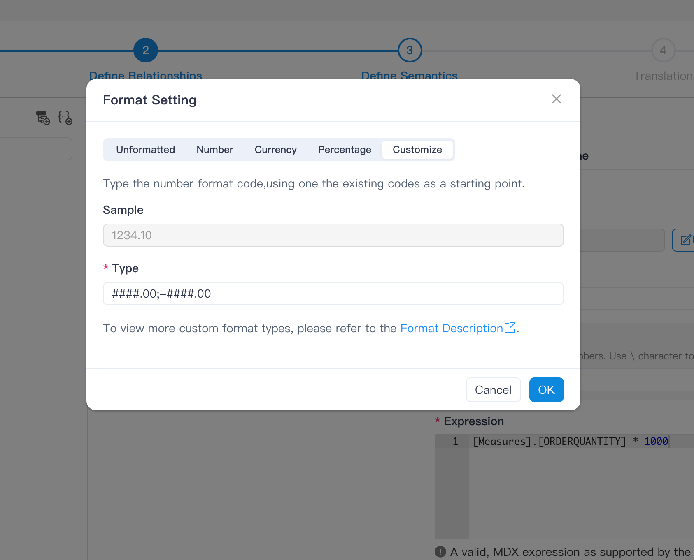
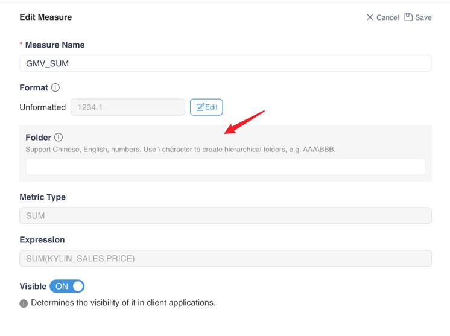
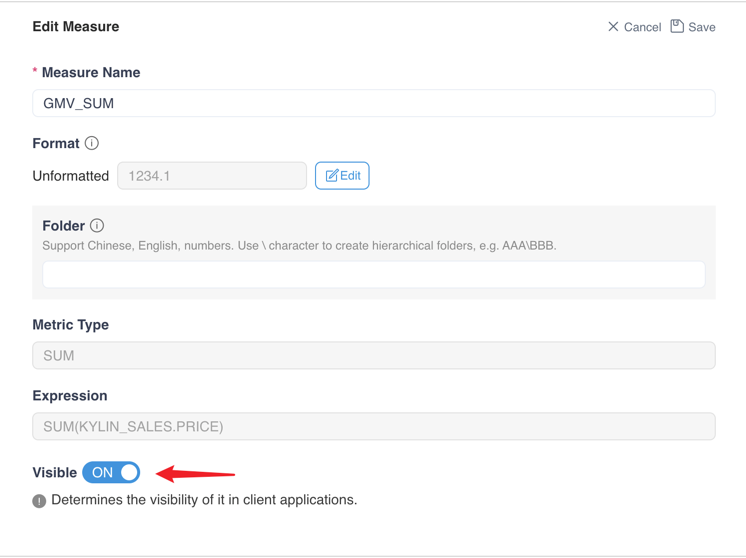

## View and edit measures

Click **Measures Name** to view the properties of the measures

After clicking the Edit button, you could edit the name and format setting of the measure, and define visibility restrictions.

> Note:
> 1. MDX now only supports the SUM, MIN, MAX, COUNT, COUNT_DISTINCT measures in Kylin.
> 2. Only the return types of measures in Kylin are String, Int, Long, Double.
> 3. The measure format is to improve the readability of the measure value. You can specify the required format for any measure. The system supports the selection and configuration of predefined formats, such as: number, currency, percentage, and also supports the usage of format characters to configure custom formats. View [Predefined measure formats and measure format characters](\appendix\formatstring.en.md).

You can set the measure format here:

**[Open format setting page]**

**[Predefined measure formats - Number]**

**[Customize]**

You can set the folder to which the measure belongs here. If you need multi-level folders, please use \ to separate them.

> Note: Multi-level folders only take effect in Excel.

At the same time, you can set whether the measure is visible in the client application.

### Next

[Add, View and edit Hierarchy](s3_4_hierarchy.en.md)
