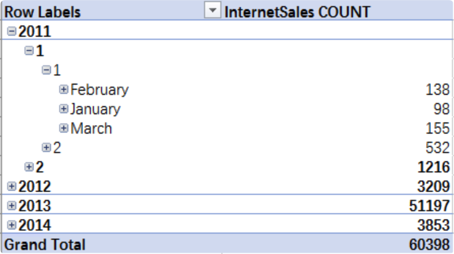
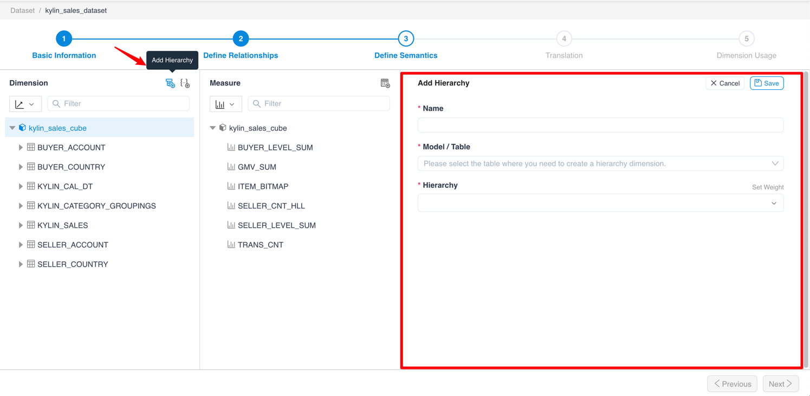
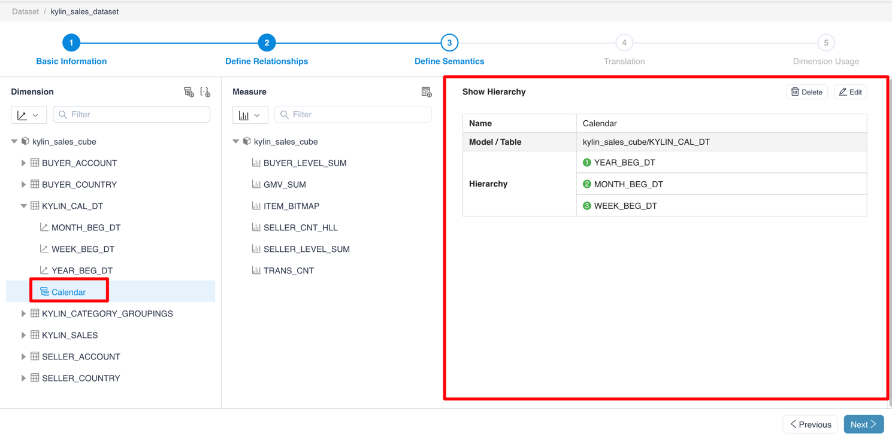
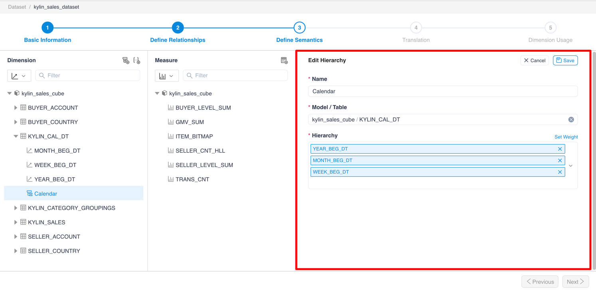
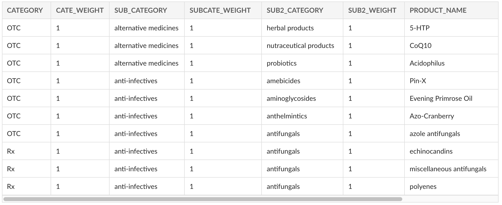
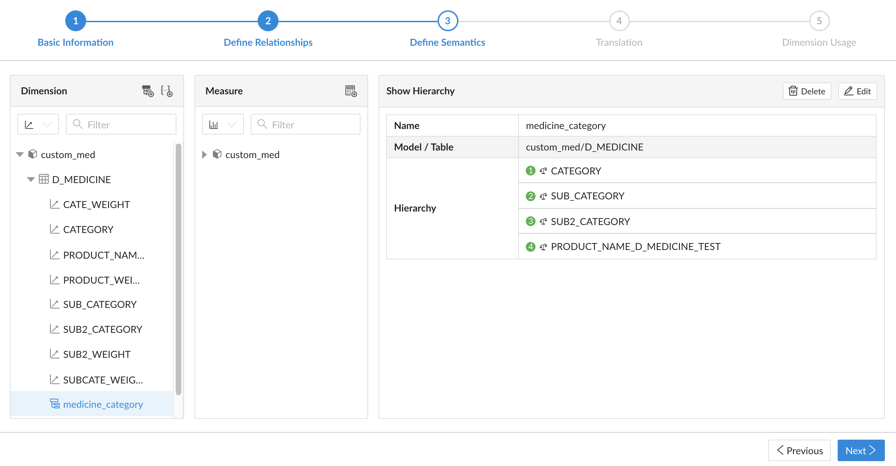
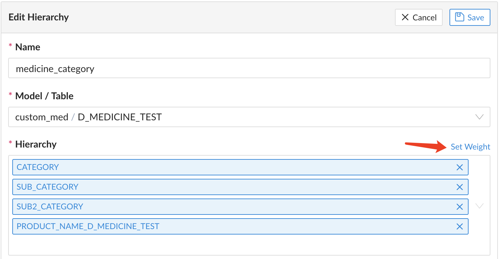
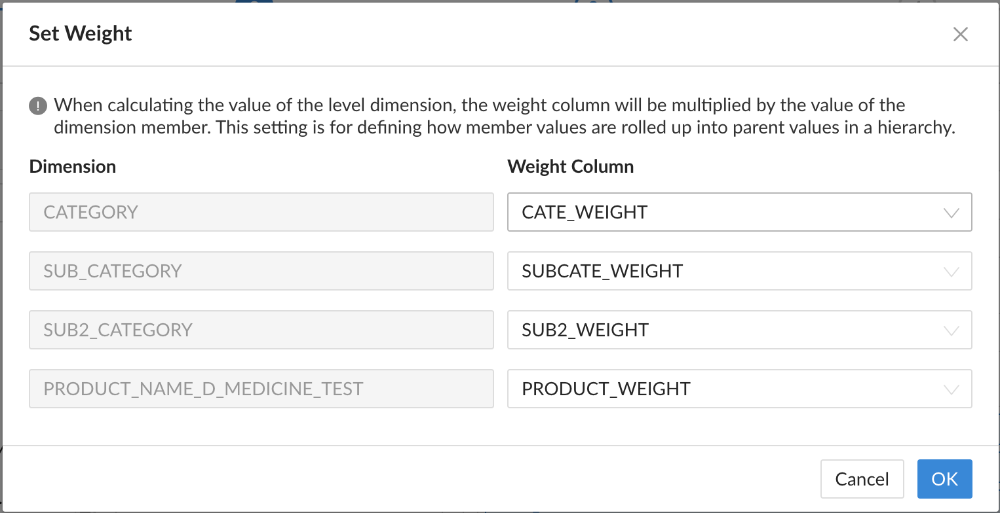

## hierarchy

You could add hierarchies in MDX for Kylin. A hierarchical structure is a collection of levels based on dimensions, which can be used to improve the analytical capabilities of data analysts. 

For example, you can create a time hierarchy that contains Year, Quarter, Month, Week, and Day levels. In this way, analysts can analyze the sales by year in the client, and when necessary, they can respectively expand "Year > Quarter > Month > Week > Day" for more granular analysis.

### Add, view, and edit hierarchy

Click the **+ Hierarchy** button to add hierarchy.

> Note：
> 1. Hierarchy cannot be created across dimension tables
> 2. When adding dimensions to the hierarchy, please choose from the coarse to the granular dimension

Click **Hierarchy Name** to view the properties of the hierarchy

After clicking the **Edit** button, you could edit the properties of the hierarchy.

### Set Weight

According to different business analysis requirements, users may need to set up customized roll-ups in the hierarchy, that is, customize the way of rolling up member values. In the hierarchy, you can set weight fields for different levels in a hierarchy. Whenever the value of the parent member is calculated, the weight field is multiplied by the child member. 

The weight field generally contains values from -1 to 1, such as -1, -0.25, 0, 0.25, 0.5, 0.75, 1, etc. A positive value means adding the value to the parent level, a negative value means subtracting the corresponding value, and 0 values make no change to the parent level. Users can use customized roll-ups for almost all hierarchical structures.

For example, we have created a model with the transaction data of a pharmacy as follows:

* Fact table F_TRANS

| TRANS_ID | PRODUCT_NAME | PRICE |
| -------- | -------------------- | ----- |
| 001 | polyenes | 33 |
| 002 | 5-HTP | 84 |
| 003 | Evening Primrose Oil | 53 |
| ... | ... | ... |

* The dimension table D_MEDICINE contains the following dimensions:
   * CATEGORY: the category of medicine
   * SUB_CATEGORY: the sub-category of medicine
   * SUB2_CATEGORY: the sub-sub-category of medicine
   * PRODUCT_NAME: medicine name
   * And the corresponding weight columns of the above dimensions

   

Configuration required:

> Set the configuration `insight.kylin.only.normal.dim.enable` to `false`.

Step 1: Create a new MDX dataset and create a hierarchy in the dimension table as follows.

Step 2: When editing the hierarchy, click the button `Set Weught` to open the pop-up window for weight setting.

The content of the pop-up window is as follows, and the user can set the weight column for each level. After setting, click OK to submit.

Step 3: After saving the changes of this dataset, connect to Excel for analysis. Place the hierarchical structure and measure SUM(PRICE) in the pivot table, and expand the hierarchy, you can see the roll-up calculation result for each level customized by the value of the weight field.

#### Known limitations

1. Only supports customized roll-up calculations for SUM measures.
2. If you need to filter the hierarchy for customized roll-up calculations, you should filter it on the row label or column label. If you put the hierarchy into the filter panel, the result might be inaccurate.
3. It's not recommended to set the weight field on the hierarchy defined on the time-type dimension table.
4. If in the model, the dimension table where the weighted field is located is joined to the fact table on multiple primary keys with a many-to-many relationship, the analysis result might be inaccurate.
5. If there are multiple hierarchies in the same dimension table, and the same weight field is referenced. When multiple hierarchies are added to the report, the query results may be inaccurate.

### Next

[Add, View and Edit Named Sets](s3_5_namedset.en.md)
