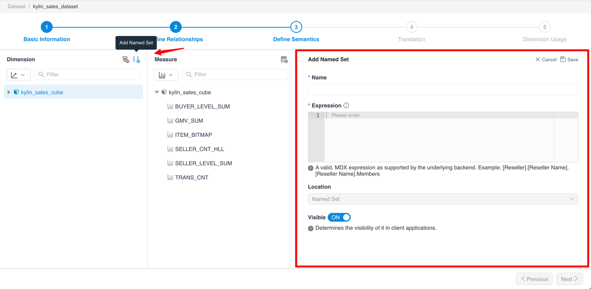
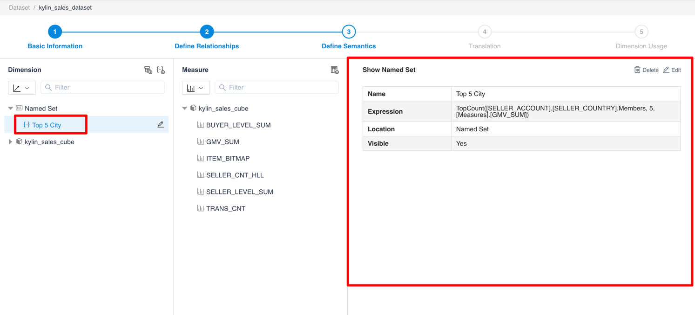
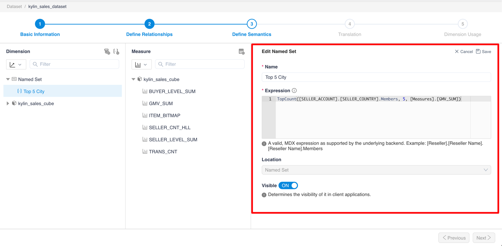
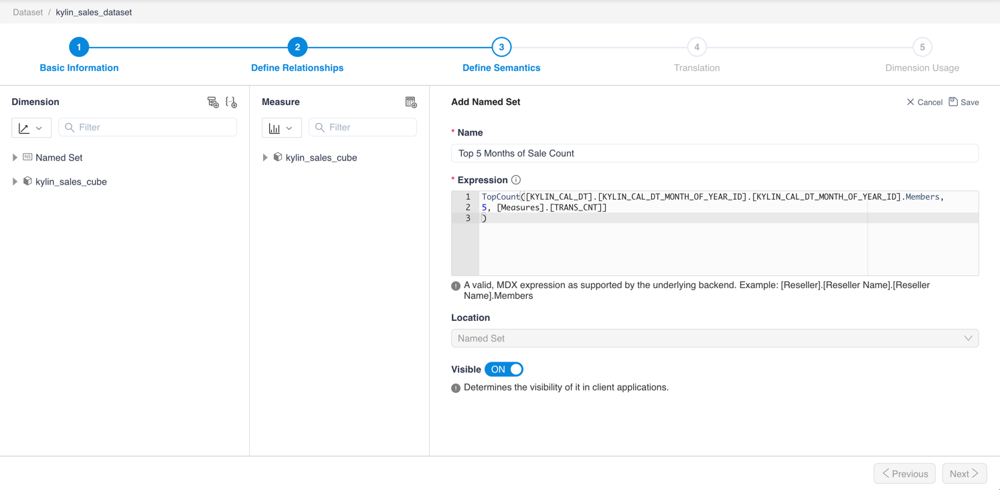
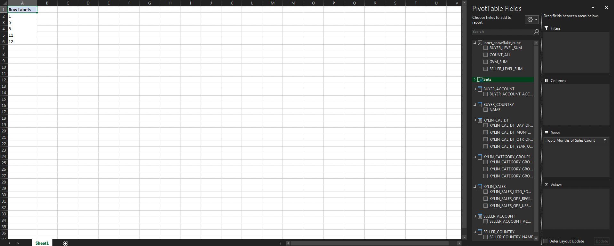
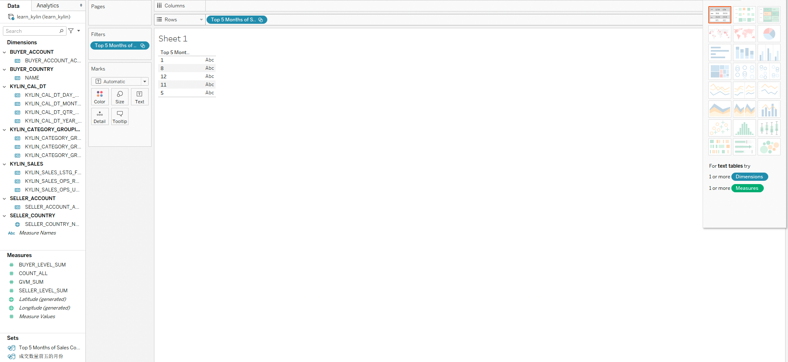

## Add, View and Edit Named Sets

### Introduction

It is a common demand of MDX for Kylin to reuse a set of Members. This demand can be satisfied by Named Sets. A Named Set is a 
set of Members, called Member Set, which is evaluated according to a specified expression. Named Sets can be directly 
put on axes, and can also be referenced in the expressions of Calculated Measures and other Named Sets.

### Remarks

1. Currently, supported BI tools of the Named Set feature are Excel and Tableau.

2. Now the Named Set feature supports Member Sets only, which are sets of Members. It does not support Tuple Sets, 
   which are sets of Tuples (A Tuple consists of several Members that all belong to different Dimensions).

3. All Members in a Named Set must belong to the same Hierarchy.

### Steps

Click the **+ Named Set** button to add a Named Set.

Click the Named Set to view the detail properties.

Click the **Edit** button to edit properties of the Named Set. The expression can be written in MDX; 
Location shows where the Named Set will be shown in the "PivotTable Fields" list of Excel; The "Visible"
switch controls whether the Named Set is visible in BI tools.

### Examples

1. Create a Named Set in a Dataset. The expression of this Named Set is like the "Top 5 City" Named Set in above steps.

2. In Excel, put the new Named Set on the Rows axis, it shows like:

3. In Tableau, put the new Named Set on the Rows axis, it shows like:

### Next

[Add, view, and edit calculated measures](s3_6_calculated_measure.en.md)

