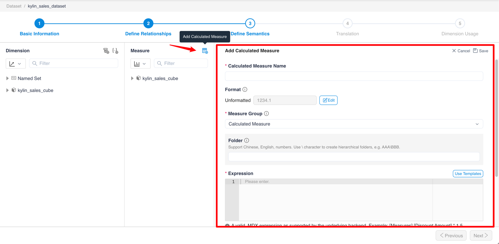
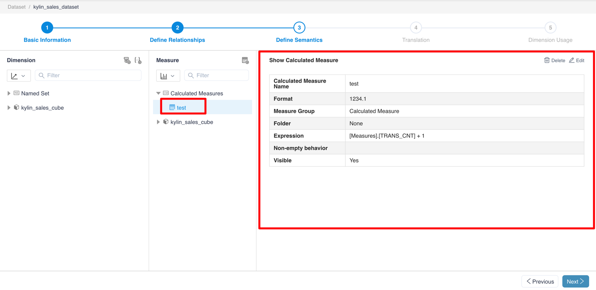
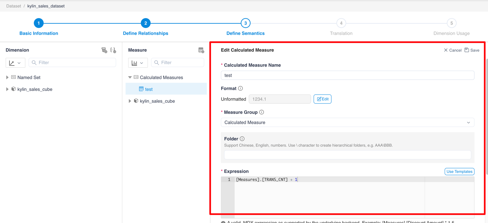
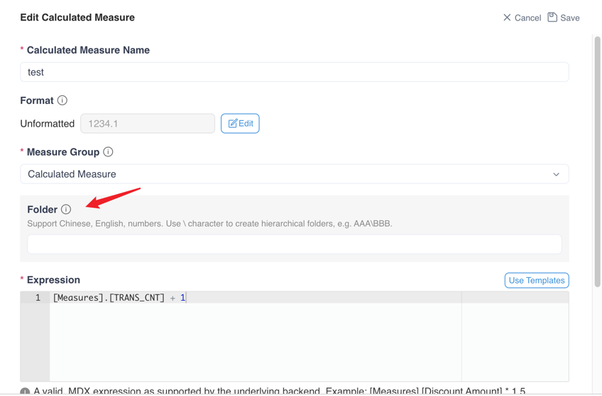
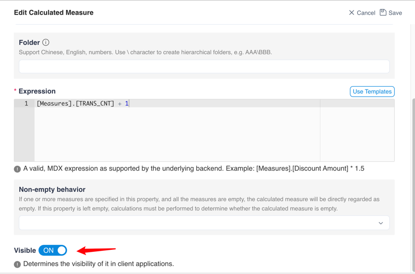

## Add, view and edit calculated measure

Click the **+ Calculated Measure** button to add calculated measures.

> Note：
> 1. On this page you can set the format string. The drop-down box at the format string can be selected either by drop-down or manually.
> 2. The expression at the expression needs to fill in the **MDX** query

Click **Calculated Measure Name** to view the properties of the calculated measure

After clicking the **Edit** button, you could edit the properties of the calculated measure.

You can set the folder to which the calculated measure belongs here. If you need multi-level folders, please use \ to separate them.

> Note: Multi-level folders only take effect in Excel.

At the same time, you can set whether the calculated measure is visible in the client application.

### Next

[Define translation](s4_translate.en.md)
