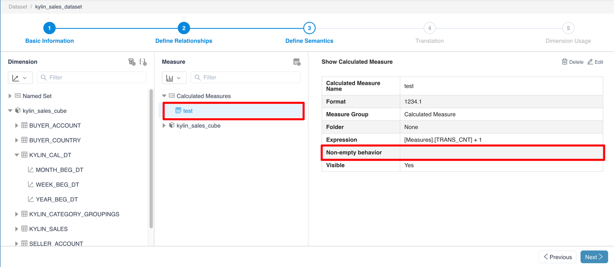
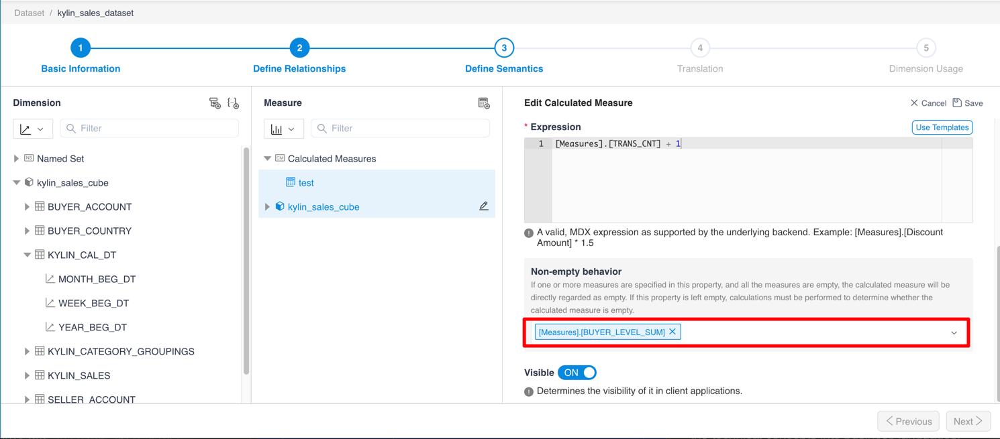
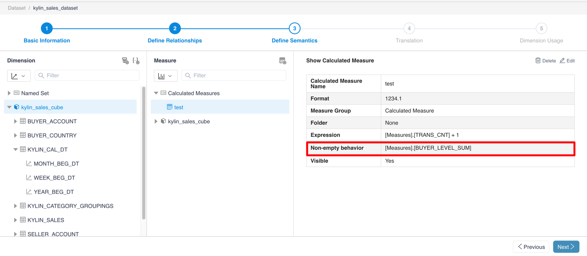

## Non-empty behavior
Non-empty behavior includes a set of base measure names which will be used to parse MDX queries. If the set is empty, MDX will perform the evaluation to evaluate the measure value. If there is any base measure name and all base measure values are empty on a cell, the calculated measure value of the cell will be treated as empty without further evaluation.

### Why set Non-empty behavior?
Non-empty behavior is an optimization specified by the user. Using this function can improve the performance of NON EMPTY queries that include calculated measures.

### How to set Non-empty behavior?
To set the Non-empty behavior for a calculated measure, you need to follow three steps:

1. In the define semantics step, find the calculated measure which you want to set Non-empty behavior and click edit.

1. In the calculated measure form, click the Non-empty behavior select box, then select one or more base measures which may have empty values.

1. Click OK to save the calculated measure. You can see your selected base measures in the non-empty behavior field of the table. Finally, save the dataset.

### Notice
- In order to reach the best performance of cells evaluation, only one member should be designated as far as possible, and no more than five members are recommended.
- If the Kylin model has been changed, the base measures referenced by Non-empty behavior in the dataset may be deleted. In this case, the dataset status will be set to error, but Excel can still connect to the dataset. You can still use the calculated measure as normal, since the deleted base measure in non-empty behavior list will be treated as invalid. (The current version of MDX will not explicitly show an error tip on a calculated measure whose non-empty behavior list contains any deleted base measure. We will report an error in the future version.)
