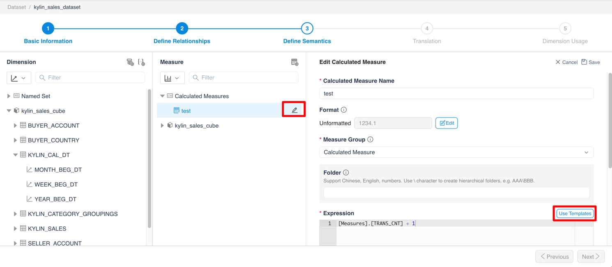
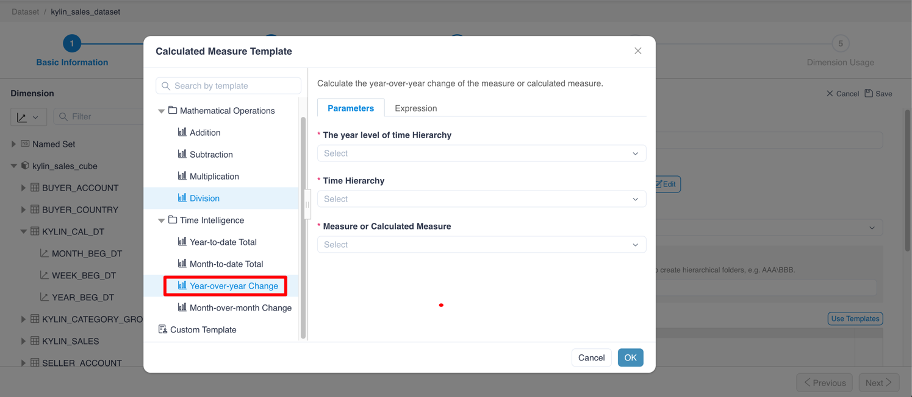
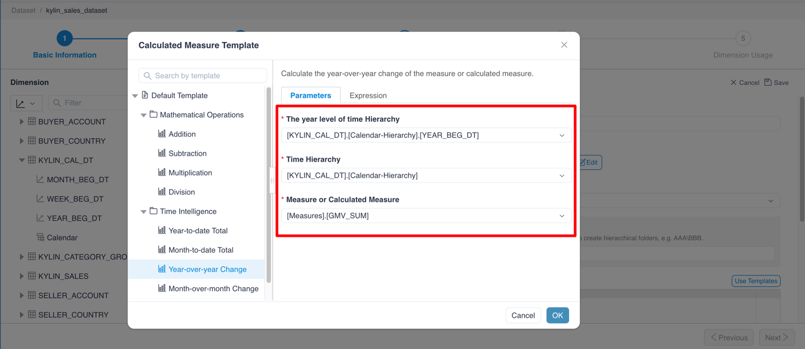
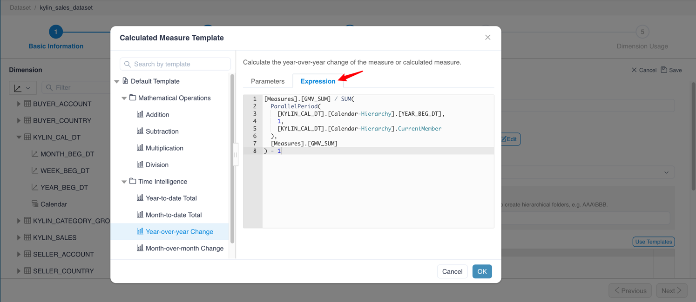
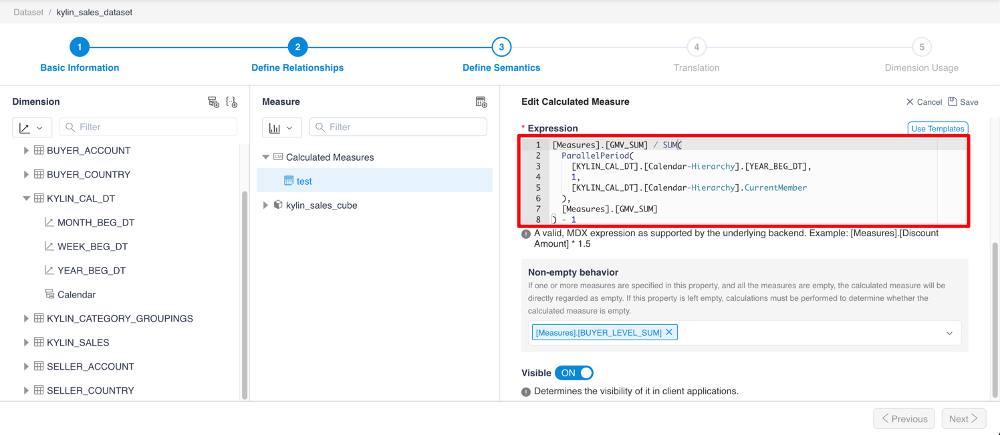
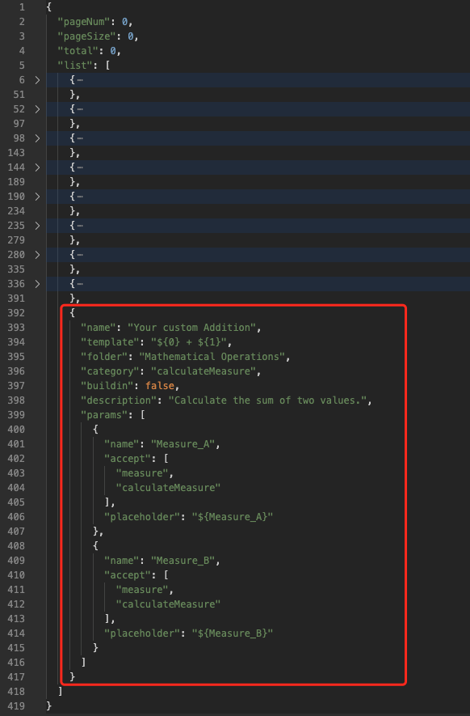
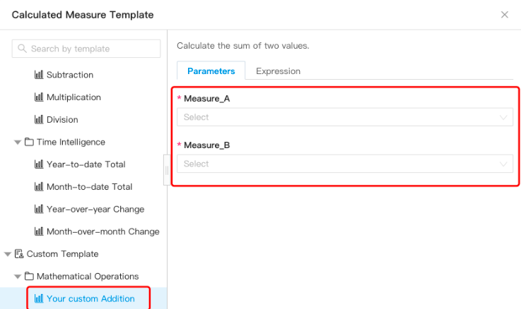

## Use template
Using template means we can use the template to generate a calculated measure expression quickly. This feature can help us to create calculated measures faster.
MDX will generate the build-in and widely-used templates automatically, you can create your customize templates by yourself.

### Why use template
- Reduce the complexity of editing calculated measure: It helps the persion, who is not familiar with MDX query, defines the calculated measures.
- Reduce the possibility of writing error expression: Because MDX syntax is complex and the expression is hard to write, the user will make the mistake easily. Using correct templates will prevent the mistake happened.
- Improve the efficiency of editing calculated measure: You can use the pre-defined templates to create many widely-used calculated measures easily, which expression are similar.
- Preview the frequently used expressions: Template can be defined with description and translation by yourself. you can click the template list and preview the description when you are editing the calculated measures.

### How to use template
1. Edit calculated measure and click **Use Templates** button.

1. Open `Calculated Measure Template` dialog, select one template.

1. Select all **required** parameters on `Parameters` tab.

1. [Optional]Click `Expression` tab and check the result of template.

1. Click `OK` and fill the result in `Expression` field.


### The build-in templates
MDX has the build-in and widely-used templates, this is the list of templates.
```
├── Default Template
│
│ ├── Mathematical Operations
│ │ ├── Addition: Calculate the sum of two values.
│ │ ├── Subtraction: Calculate the difference between two values.
│ │ ├── Multiplication: Calculate the product of two values.
│ │ ├── Division: Calculate the ratio of a value to another one.
│ │
│ ├── Time Intelligence
│ │ ├── Year-to-date Total: Calculate the total of the measure or calculated measure, 
│ │ │   starting from the beginning of the current year.
│ │ ├── Month-to-date Total: Calculate the total of the measure or calculated measure,
│ │ │   starting from the beginning of the current month.
│ │ ├── Year-over-year Change: Calculate the year-over-year change of the measure or
│ │ │   calculated measure.
│ │ ├── Month-over-month Change: Calculate the month-over-month change of the measure
│ │ │   or calculated measure.
```

### Add the custom templates
MDX allow you to create the customize template by yourself. You should edit the `indicators.json`, which is located in MDX software package, to create templates.

The path of the JSON file is the same as the `insight.properties` file's. The file defines the template JSON structure. You should add your new template JSON at the end of `list` JSON property, which is an array.

### Quick start with custom templates
The picture is the demo custom template which is added into the `indicators.json` file.


The template will be listed in dialog immediately.

<br />
<br />

<details>
  <summary>Click here to see the demo JSON</summary>

  <p>Notice: `${0}` means Measure_A, `${1}` means Measure_B in the `template` field</p>
  <code style="white-space: pre; display: block; padding: 20px;">{
  "name": "Your custom Addition",
  "template": "${0} + ${1}",
  "folder": "Mathematical Operations",
  "category": "calculateMeasure",
  "buildin": false,
  "description": "Calculate the sum of two values.",
  "params": [
    {
      "name": "Measure_A",
      "accept": [
        "measure",
        "calculateMeasure"
      ],
      "placeholder": "${Measure_A}"
    },
    {
      "name": "Measure_B",
      "accept": [
        "measure",
        "calculateMeasure"
      ],
      "placeholder": "${Measure_B}"
    }
  ]
}</code>
</details>

### More details about custom template JSON
When you add the templates, please split each template JSON by comma. The last template JSON doesn't need the comma at the end.

```json
{
  "pageNum": 0,
  "pageSize": 0,
  "total": 0,
  "list": [
    ... // The other templates' JSON
    {
      "name": "Month-over-month Change", // The last templates' JSON
      "template": "Template expression",
      "buildin": true,
      "params": [...]
    }, // 1. Add the comma here
    {
      "name": "New template name", // 2. Add your new template JSON here
      "template": "New template expression",
      ...
    } // 3. Don't keep the comma after your new last template JSON
  ]
}
```

The calculated meausre template is based on template JSON. More details about template is below:

Notice: `[Translatable]` means the field can be translated by `translation` in JSON. If the `translation` field is not defined, it will use the default value.

```json
{
  "name": "The template's name [Translatable]",
  "template": "The template's expression: '\n' means wrap text. '${N}' means the nth of params.",
  "folder": "The template's folder: Split by'\\' to create multilayer folder [Translatable]",
  "category": "calculateMeasure", // Default by "calculateMeasure"
  "buildin": false, // "buildin" means that is buildin or not.
  "description": "The template's description [Translatable]",
  // Param list
  "params": [
    {
      "name": "The param's name",
      "accept": [
        // The param's accept type.
        "column",
        "namedSet",
        "measure",
        "calculateMeasure"
        "hierarchy",
        "hierarchyLevel"
      ],
      "placeholder": "The param's placeholder"
    }
  ],
  // The above fields are [required], the below fields are [optional].
  // Translation list
  "translation": {
    // Chinese translation
    "zh": {
      "name": "模板的名称",
      "folder": "模板所属文件夹",
      "description": "模板的描述",
      "params.0.name": "参数的名称",
      "params.0.placeholder": "参数在表达式中占位符"
    },
    // English translation
    "en": {
      "name": "Template's name",
      "folder": "Template's folder",
      "description": "Template's description",
      "params.0.name": "Parameter's name",
      "params.0.placeholder": "Parameter's placeholder"
    }
  }
}
```

### For future
For now, defining a template JSON is not easy and it requires you know about JSON knowledge. However, it is friendly for the future of MDX. Because of the JSON structure, MDX system can fit in with a diversity of situations, even if you would like to define translation in template dialog by yourself. Maybe it will have an Web UI to replace the configuration for template JSON in the future.
