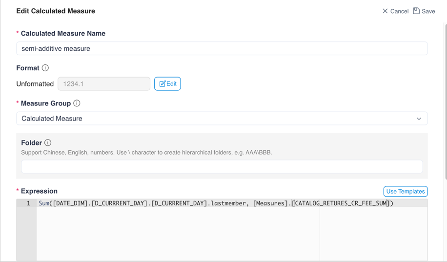

## semi-additive measure

Semi-additive measures are very common in various data analysis scenarios, like account balance or inventory analysis. Take account balance as an example, you can analyze account balance based on the account transactions history, SUM() is used when aggregated by default, but for aggregating multiple records under the same account, we need to use last record value along the time dimension.

Click the **+ Calculated Measure** button to add calculated measures, you can add semi-additive additive measure.

