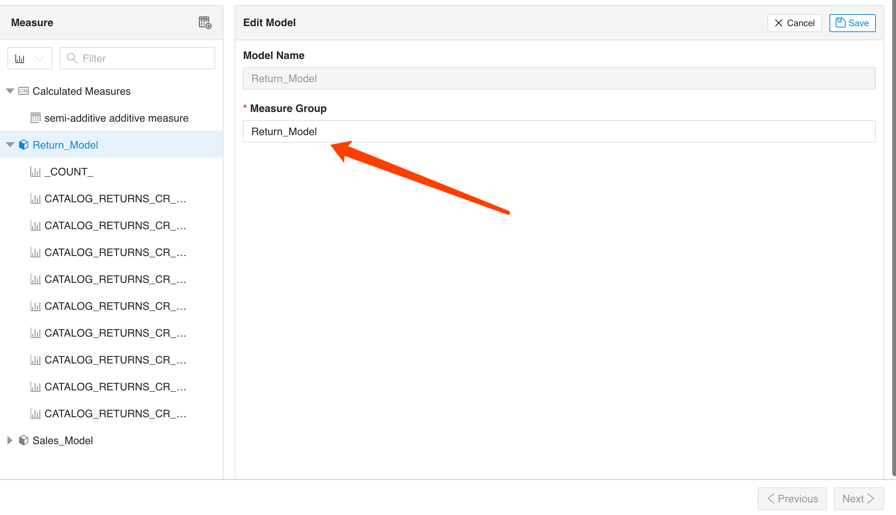

# View and edit measure group

In datasets, measures are grouped according to Cubes in Kylin, and measure groups are used to associate dimensions and measures with each other.

> Note:
> 1. The Cube in Kylin forms a measure group in MDX
> 2. For calculated measures is a separate measure group
> 3. Support for moving calculated measures into different measure value groups

You can edit the measure group name here.

