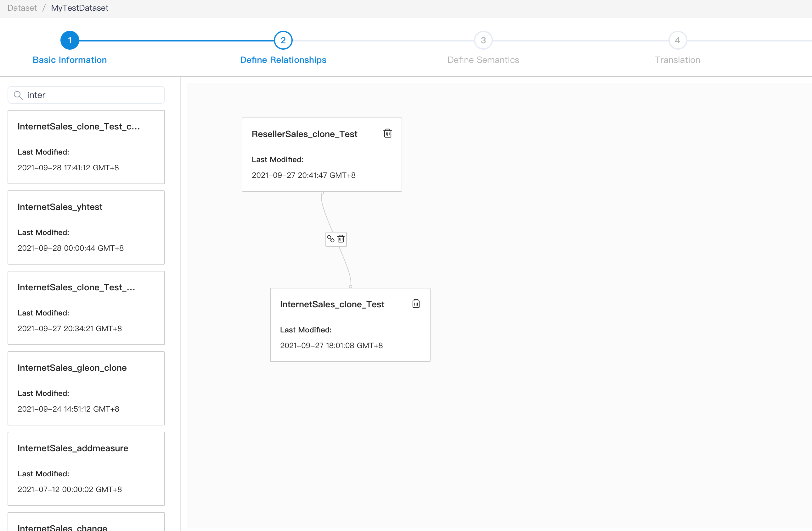
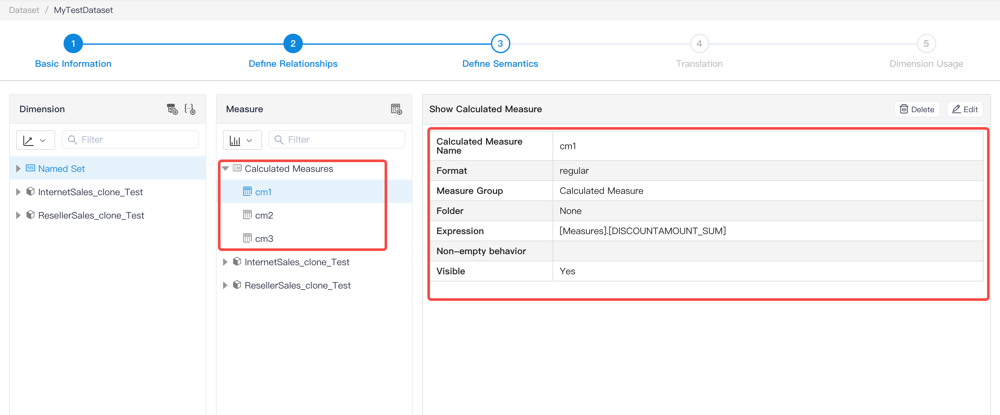
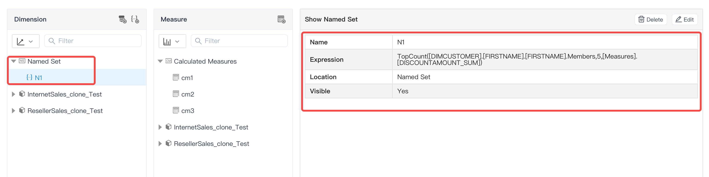
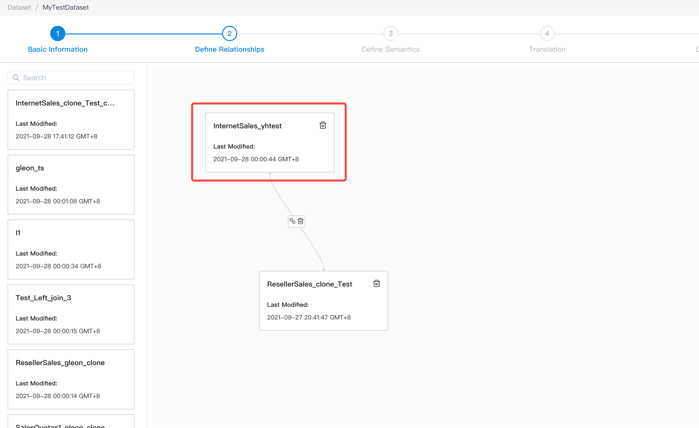
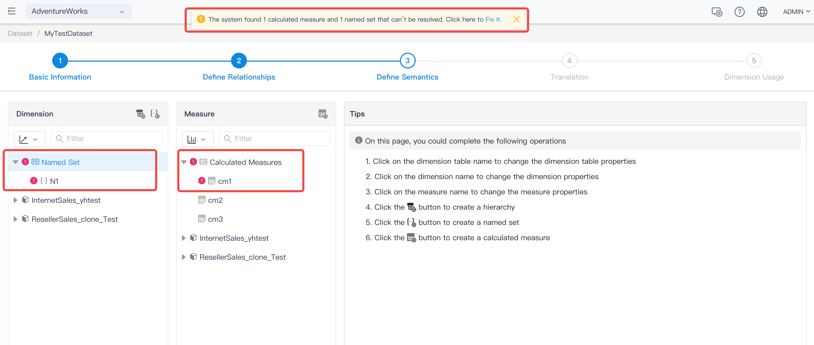
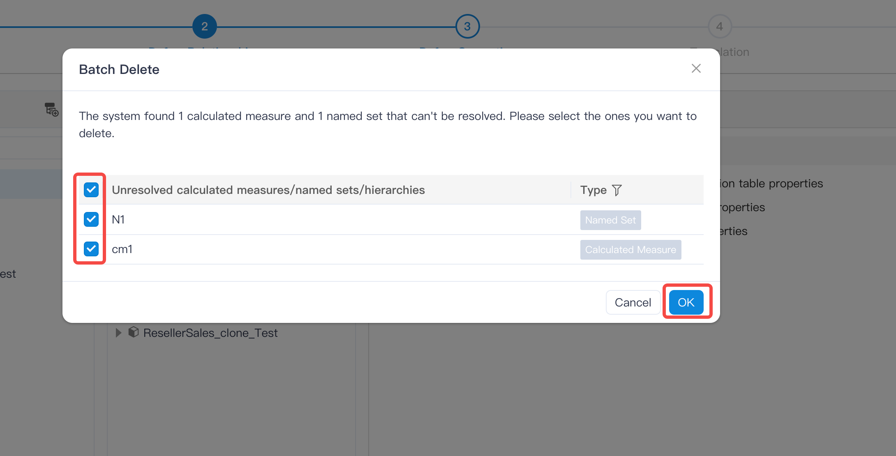
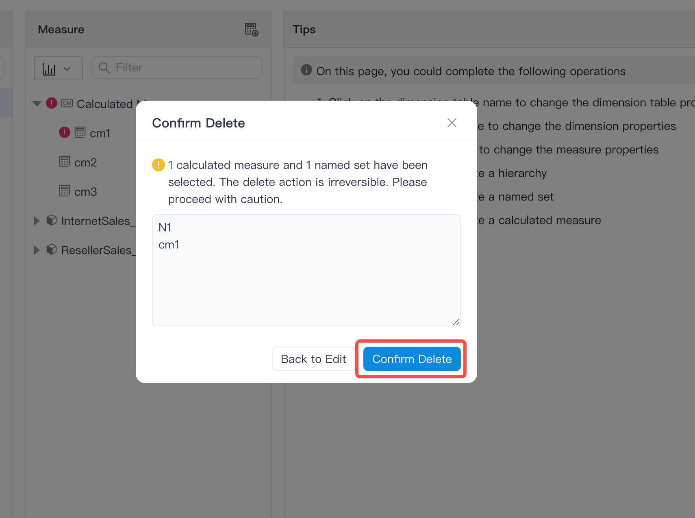
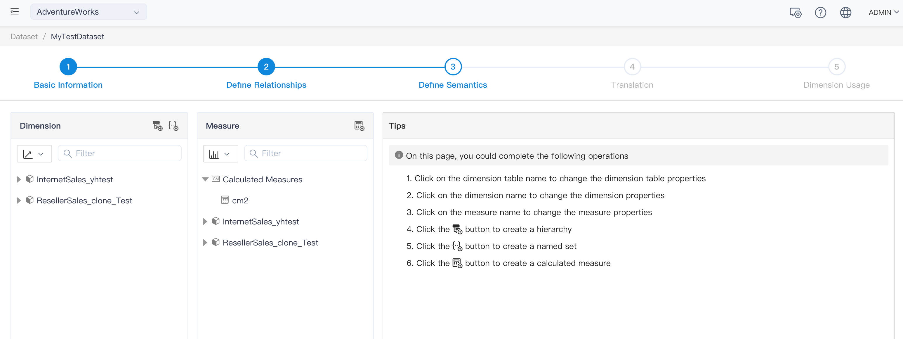
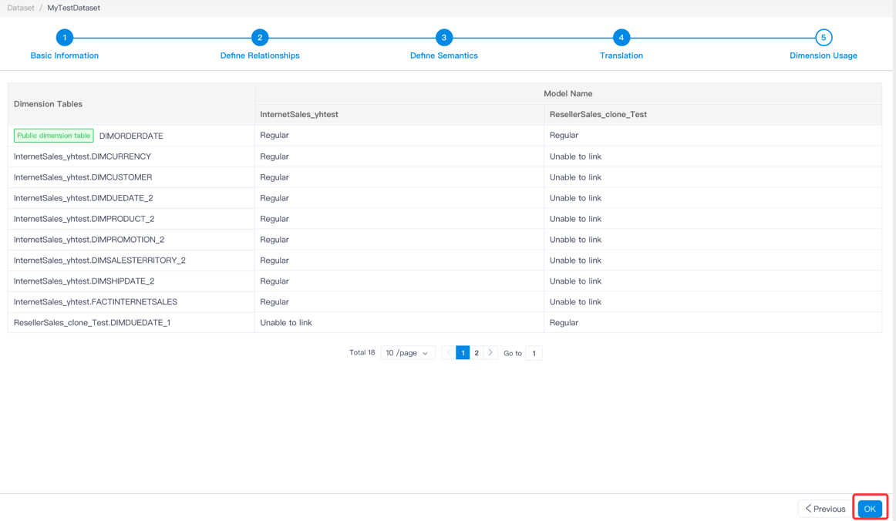

## Batch deletion of named sets/hierarchies/calculated measures

When a dataset change occurs, such as replacing a model with a new model with a different name, if the named set/calculation measure in the dataset uses the dimension/measure/calculation measure in the replaced model, it will cause the named set/calculation measure in the dataset to become invalid. Another example: Delete the dimension of the model in Kylin, and the hierarchy created by using that dimension will become invalid.

In this case, the number of failed namesets/hierarchies/computational metrics may be very large, and batch deletion operations can be used to delete the invalid content.

The following example deletes both the invalid named set and the calculated metrics -

### Models and datasets:

The model **InternetSales_clone_Test** and the model **ResellerSales_clone_Test** to form the data set **MyTestDataset**. It contains the calculation metric cm1 which references the measure from InternetSales_clone_Test, the calculation metric cm2 which references the measure from ResellerSales_clone_Test, and the named set N1 which references the dimension/measure from InternetSales_clone_Test.

### Change operation:

Replace the model InternetSales_clone_Test in the dataset with another model

### Calculate measure and named set invalidation:

Calculate metric cm1 and named set N1 invalidation:

### Batch delete operation:

Click on this **process** at the top, select the calculated measure and named set you want to delete in the window, and click **OK**

Confirm again to delete

Delete successful

Save dataset

