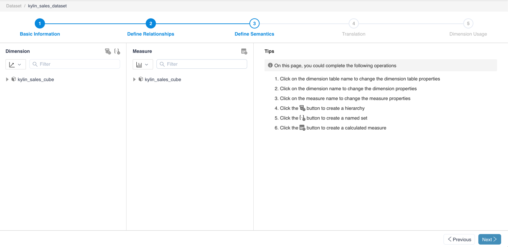

## Define Semantics

After clicking Next, you could define semantics in this step. The left side of the page shows the dimensions and measures in each cube.

On this page you can do the following:

1. [View and edit dimension table](s3_1_dimension_table.en.md)
2. [View and edit dimensions](s3_2_dimension.en.md)
3. [View and edit measure](s3_3_measure.en.md)
4. [Add, View and Edit Hierarchy](s3_4_hierarchy.en.md)
5. [Add, view and edit named sets](s3_5_namedset.en.md)
6. [Add, view, and edit calculated measures](s3_6_calculated_measure.en.md)

### Next

[View and edit dimension table](s3_1_dimension_table.en.md)