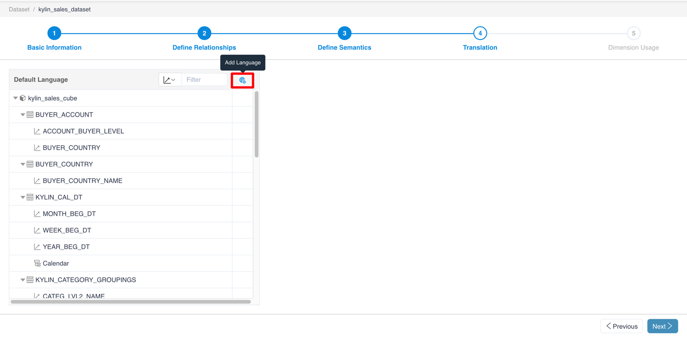
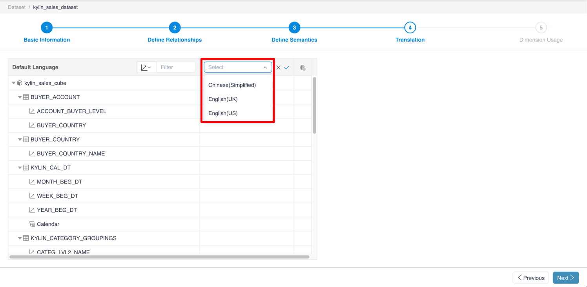
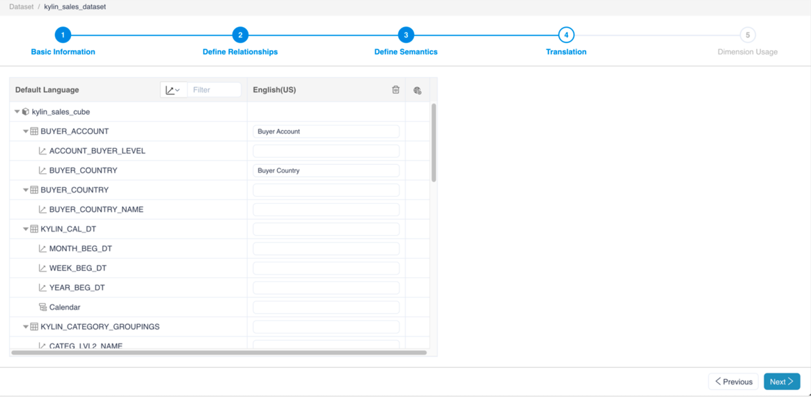
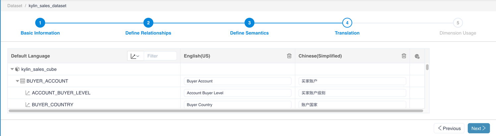
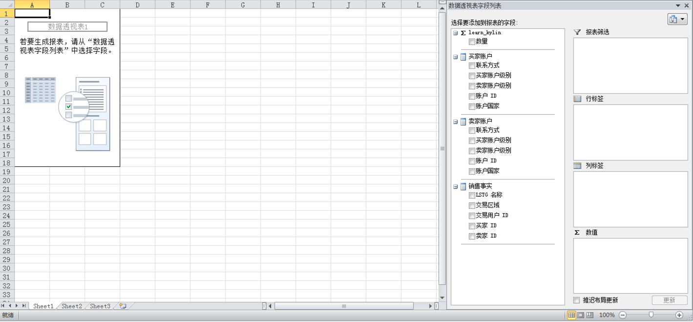
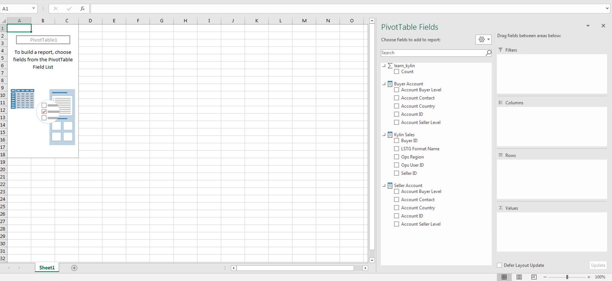

## Translations

### Introduction

In MDX for Kylin, you can embed multiple translation of a caption to provide culture-specific strings based on the localed identifier (LCID).

Analysis application clients (such as Excel, Tableau) can pass the Language Code Identifier (LCID) when connecting to MDX for Kylin to obtain the language setting, and display the names of the objects in the corresponding lanaugage.  

This feature helps international teams to consume the same dataset without the need to repeatedly defining the dataset for localization purposes.

### Note

1. There are three language supported: Chinese, English(US), and English(UK).
2. The objects that can be set are **names of the dimension table, dimension, measure, calculated measure, and hierarchy**. If a dimension is defined with a translation, then it will also be applied in the hierarchy containing the dimension.
3. If the language in the analysis application client is not defined in the dataset translation, the dataset will use the default language. When using Excel, Excel will pass the LCID as language settings in Excel. For Tableau users, the language settings of the Windows system will be applied, so you can change the translations of the dataset displayed in Tableau by changing the language setting of the Windows system.
4. When creating a new calculated measure, please reference the measure in the original name, instead of the translation in the MDX expression.

### How to set translation

1. When editing a dataset, go to translation, click the globe icon to add a language.

   

2. Choose a language in the new column and click confirm.

   

3. In this new group of translation, the user can input the translation of table names, dimensions or measures.

   

### Examples

Define two language settings for a dataset, including Chinese and English (US).

Open in Excel with Chinese language settings, the Chinese translation will apply:

Open in Excel with English language setting, the English translation will apply:

> Note: you can change language settings of Excel through `Options` - `Language`

### Next

[Define Dimension Usage](s5_dimension_usage.en.md)

