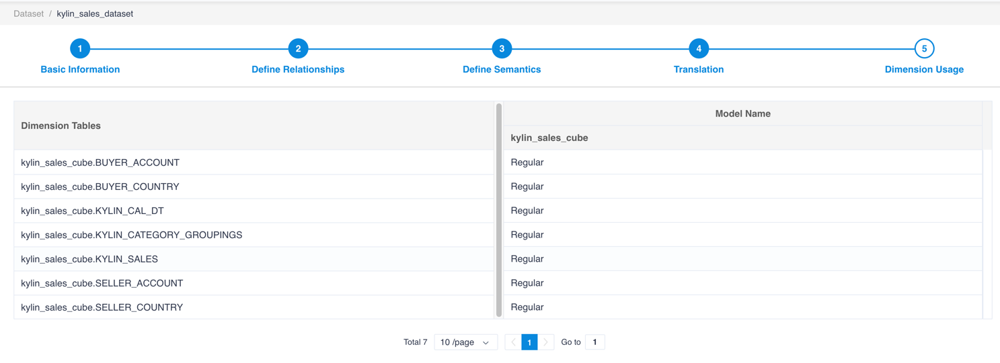
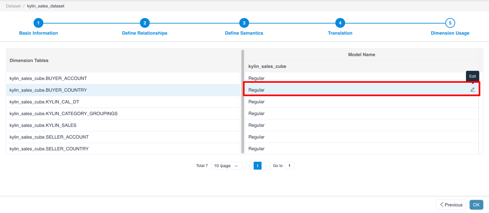
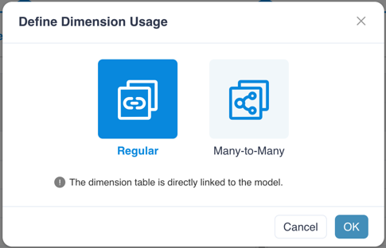

## Define Dimension Usage

This page will list all the dimension tables and models in this dataset. You can define relationships between dimension tables and measures within models.

For other kinds of relationships, you can edit the relationship type by clicking the **Edit** button.

There are 2 possible dimension usage options:

1. Regular: The dimension table is directly linked to the model.

2. Many to Many：Kylin can not support many-to-many currently.

### Next

[Save](save.en.md)
