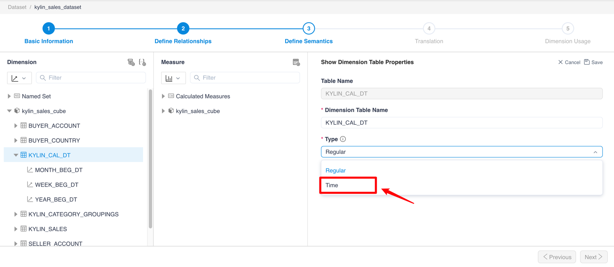
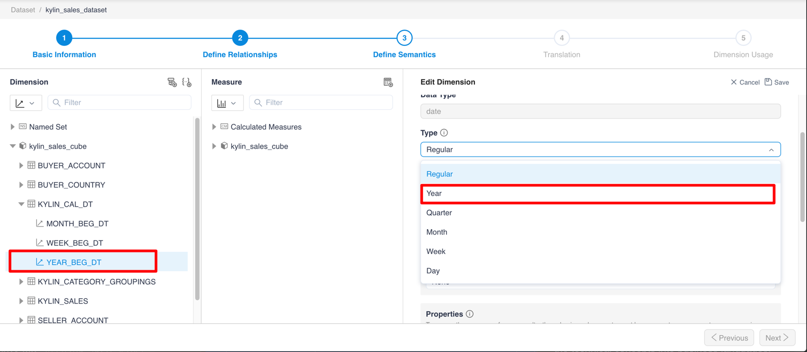

## YTD, QTD, MTD instructions

+ Define a time dimension table type as time.

  

+ Create a Hierarchy with the year, month, and day. Name this Hierarchy as `Date-Hierarchy`. **Note:**

  You should set the corresponding date attribute for each level. E.g., for year dimension, you should set it as the **Year** attribute.

+ Create a CM with the following formula:

  YTD : `SUM(YTD([DATE_DIM].[Date-Hierarchy].CurrentMember), [Measures].[XXX])`

  MTD : `SUM(MTD([DATE_DIM].[Date-Hierarchy].CurrentMember), [Measures].[XXX])`
