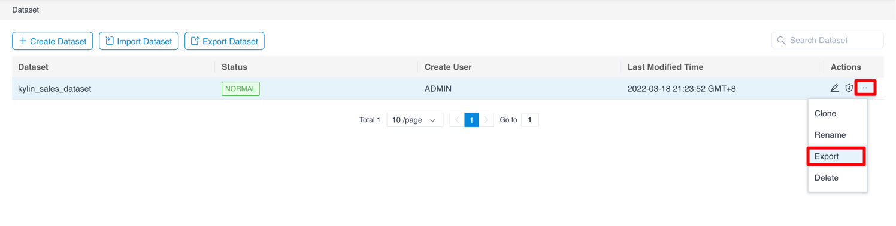
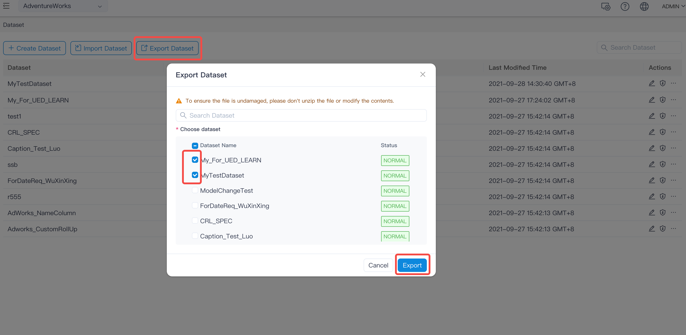
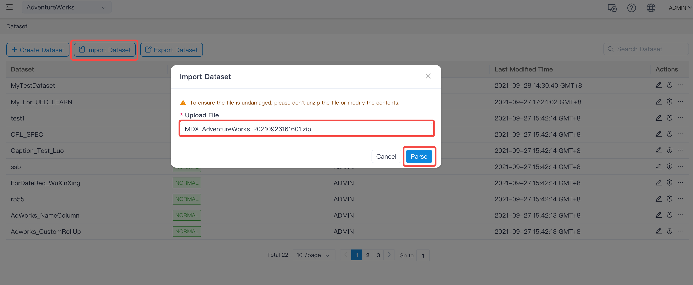
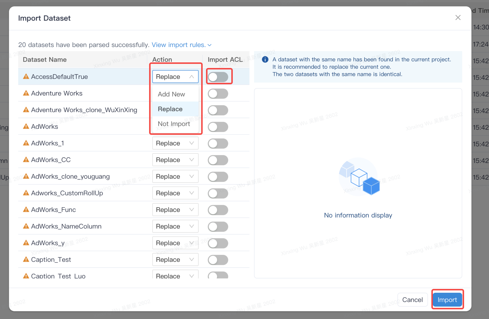
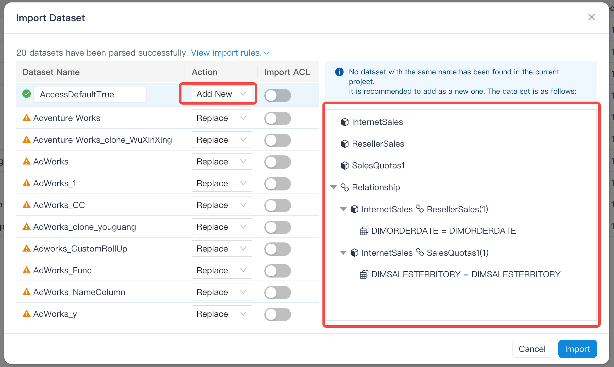
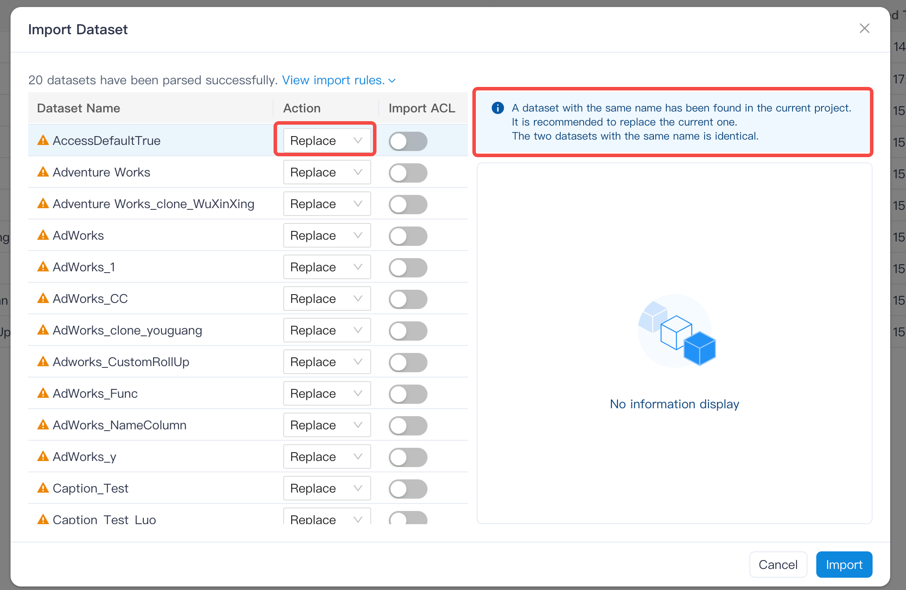
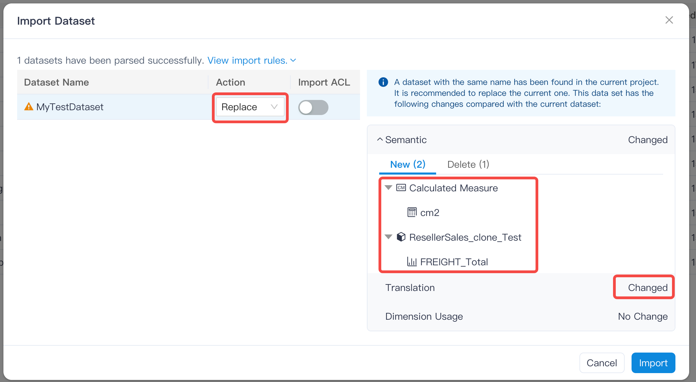
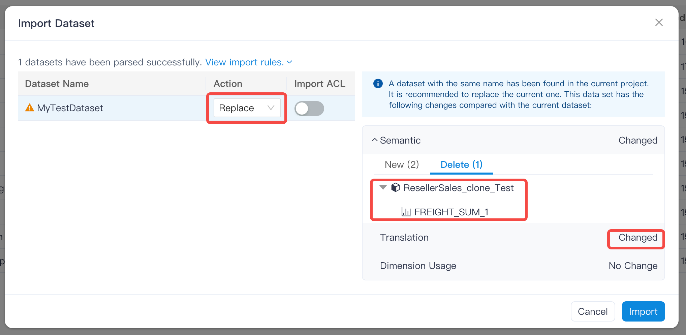
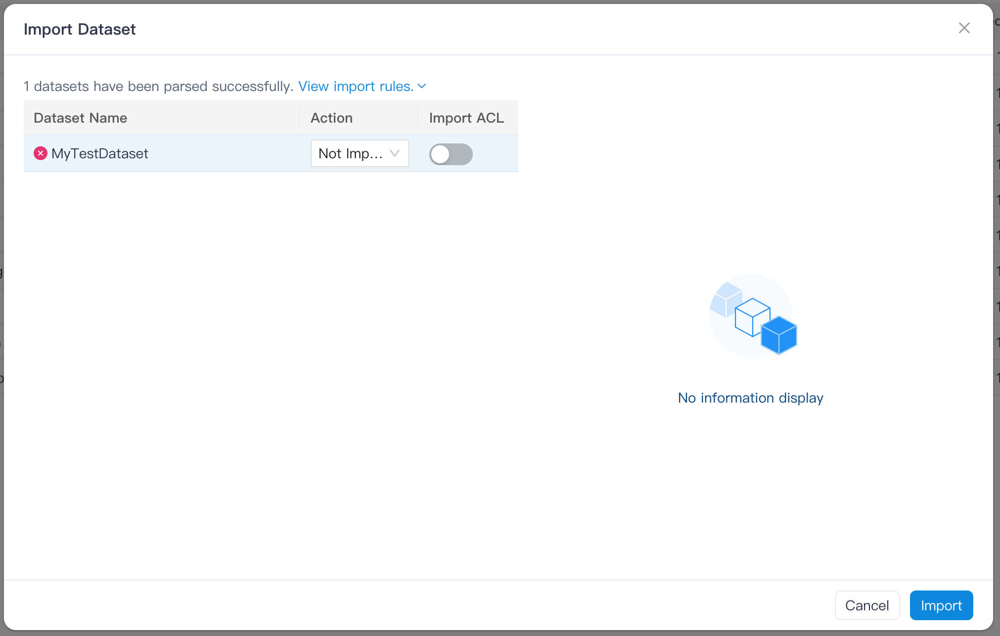

## Datasets import and export

- [Export Dataset](#export-dataset)
- [Import Dataset](#import-dataset)

### Export Dataset

#### Export a single dataset

Open the dataset page, in the action column of a single dataset, click the **ellipsis** - > **Export** to export the ZIP file corresponding to the dataset.

#### Export multiple datasets

Open the dataset page, click **Export Dataset**, check the datasets you want to export in the list (you can fuzzy search the dataset name first), and click **Export** to generate the ZIP file corresponding to the datasets.

### Import Dataset

Open the dataset page, click **Import data set**, select the ZIP file of the dataset, and click **Parse**:

When the analysis is successful, a window will pop up, select the Action type and whether to import permissions, click **Import** to complete the import.

### Explanation for Add New/Replace/Not Import

#### Add New

When there is no dataset with the same name as the source dataset in the target project, the default is Add New operation, and the default drop-down option for the Action column is Add New.

#### Replace

When there is a dataset with the same name as the source dataset in the target project, the default is an Replace operation, and the default drop-down option for the Action column is Replace.

#### Not Import

In any case, the user can choose Not Import.

### Information about the dataset when importing

The system will display corresponding information on the right according to different operations.

#### Add New

Display the model name in the new dataset and the relationship between the models.

#### Replace

##### The source data set and the target data set are exactly the same

The definitions of the two data sets are exactly the same: model name, correlation between models, named set, calculation measure, dimension table/dimension/measure under the model, translation (accurate to the translation content of each object in each translation language) and dimension usage are consistent.

##### The source and target datasets are not exactly the same

The system will display the added objects (such as: model, measure, calculation measure) of the source data set relative to the target data set, and will also display the deleted objects (such as: model, measure, calculation measure). In addition, when the translation or dimension usage is inconsistent, the system will make a text prompt, but will not list the detailed differences.

#### Not Import

### Remarks

- Supports exporting/importing datasets across environments (e.g. from development to production) and across projects
- Support for importing JSON dataset files exported in older versions