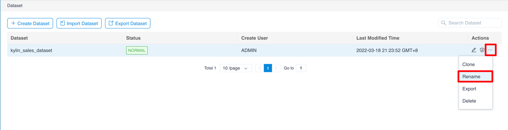
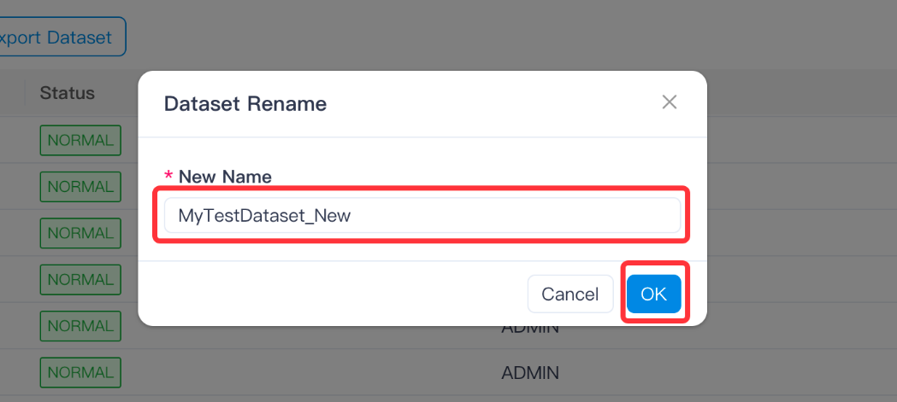
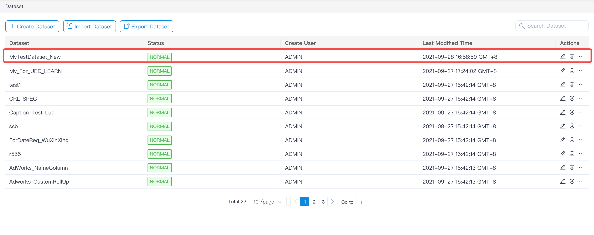

## Rename Dataset

Open the dataset page, in the Action column of the individual dataset, click the **ellipsis** - > **Rename**:

Enter a new name that conforms to the naming rules, and click **OK**:

Complete renaming:

