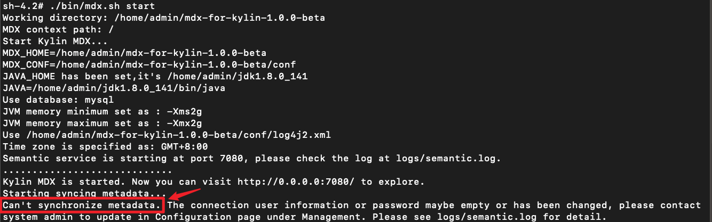
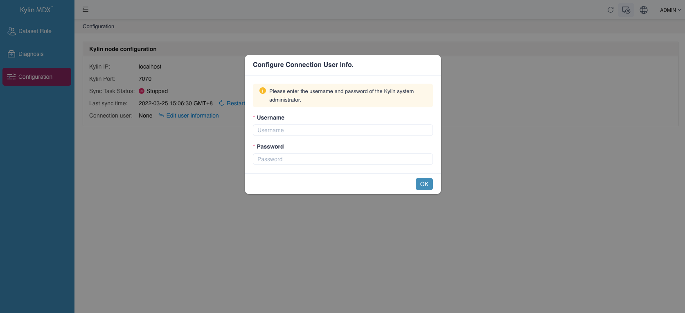

## Install on Linux

In this section, we will guide you to install MDX for Kylin in the Linux operating system quickly.

Please **make sure** that your server meets the [Installation Prerequisites](prerequisite.en.md) of MDX for Kylin. 

- [Download Package](#download-package)
- [Create Metastore Database](#create-metastore-database)
- [Unpack Package](#unpack-package)
- [Encrypt the Password of Mysql Server](#encrypt-the-password-of-mysql-server)
- [Modify Necessary Configurations](#modify-necessary-configurations)
- [Start MDX for Kylin](#start-mdx-for-kylin)
- [Notice](#notice)

### Download Package

Download MDX for Kylin package from Github [Package Download](https://github.com/Kyligence/mdx-kylin/issues/1#issue-1174836123).

### Create Metastore Database

- Create a new database and set character_set_database to **utf8mb4** or **utf8**, and set collation_server to **utf8mb4_unicode_ci** or **utf8_unicode_ci**

- **Note**: 

   - The sample creation database command in MySQL 5.7 is as follows:

   ```mysql
   mysql> create database `<database name>` default character set utf8mb4 collate utf8mb4_unicode_ci;
   ```
  
   - The sample creation database command in PostgreSQL 10.1 is as follows:

   ```
   postgresql> create database <database name> encoding='utf8';
   ```

### Unpack Package

- Unpack the software package:

   ```sh
   $ tar -xf [package_name.tar.gz]
   e.g.:
   $ tar -xf mdx-for-kylin-1.0.0-beta.tar.gz
   ```

### Encrypt the Password of Mysql Server

- Open the unzipped file; encrypt the password of Mysql server.

   ```sh
   $ cd [Unzipped file]
   $ bin/mdx.sh encrypt '<Input database password of MDX for Kylin>'
   ```

   > Note: If there are some special characters in the input passwords, these characters should be in single quotes. If they self are single quotes, they should be in double quotes.

### Modify Necessary Configurations

- Modify necessary configurations in the properties file under `conf` directory.

   Configure insight.properties

   ```properties
   $ vim conf/insight.properties
   
   Modify the configurations listed below:
   insight.kylin.host: IP address or Hostname of the kylin server
   insight.kylin.port: port number of the kylin server
   insight.kylin.ssl: whether the kylin server enables SSL. The default value is false.
   insight.database.type: The type of MDX for Kylin database that needs to be connected. The default is mysql. if choose PostgreSQL as metadata, change type from mysql to postgresql.
   insight.database.useSSL:Whether use SSL to connect mysql.The default is false.
   insight.database.ip: IP address or Hostname of the Database server of the MDX for Kylin server
   insight.database.port: database port of the Database server of the MDX for Kylin server
   insight.database.name: database name of the Database server of the MDX for Kylin server
   insight.database.username: username of the Database server of the MDX for Kylin server
   insight.database.password: password’s encryption string for the Database server from step 4
   insight.semantic.datasource-version: version of kylin, only support 4
   insight.mdx.cluster.nodes: need to add the ip and port information of all MDX nodes in the cluster to the configuration file, for example: insight.mdx.cluster.nodes=ip1:port1,ip2:port2
   ```
   
   > Note: If `insight.mdx.cluster.nodes` is not set, the diagnostic package cannot be generated in the UI.

   For more configuration details, please refer to [Basic Configurations](../configuration/properties.en.md).
   

   If you have cluster deployment requirements, please also read the manual [Diagnostic Package](../operations/diagnosis.en.md) chapter
   
### Start MDX for Kylin

- Start MDX for Kylin. It will take a few minutes to refresh metadata.

  ```sh
  $ bin/mdx.sh start
  ```

- **Note**: At the first startup, the synchronization task will fail because you have not filled in the account information communicated with kylin. The details are shown in the figure below. At this time, you can log in to MDX for Kylin normally and fill in the account information. After filling in, the synchronization task will get back to normal.



- Then you could login through url `http://{host}:{insight.semantic.port}/login/`

- Since MDX for Kylin needs to connect to kylin, the system will prompt you to fill in the username and password for connection when you log in to the system for the first time.



- Stop MDX for Kylin

   ```sh
   $ bin/mdx.sh stop
   ```
