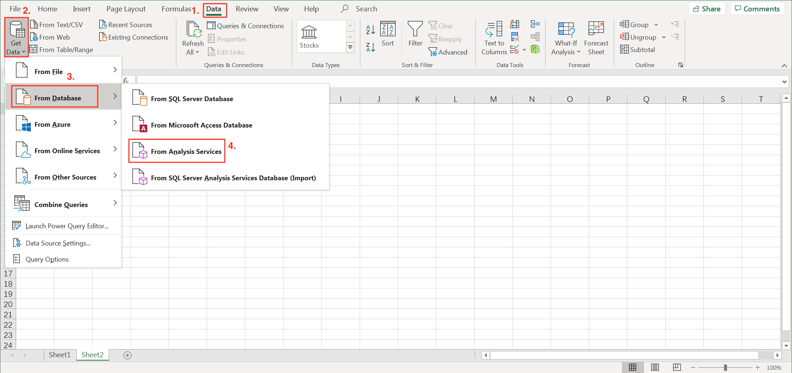
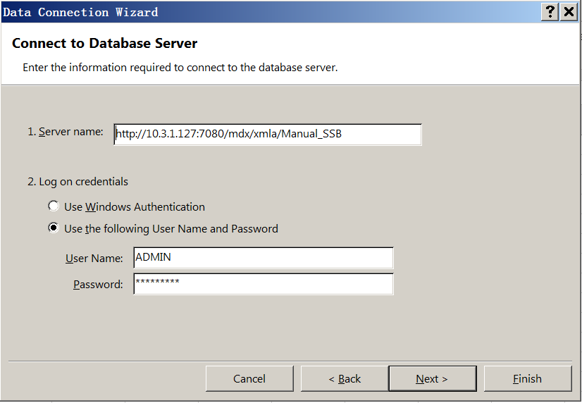
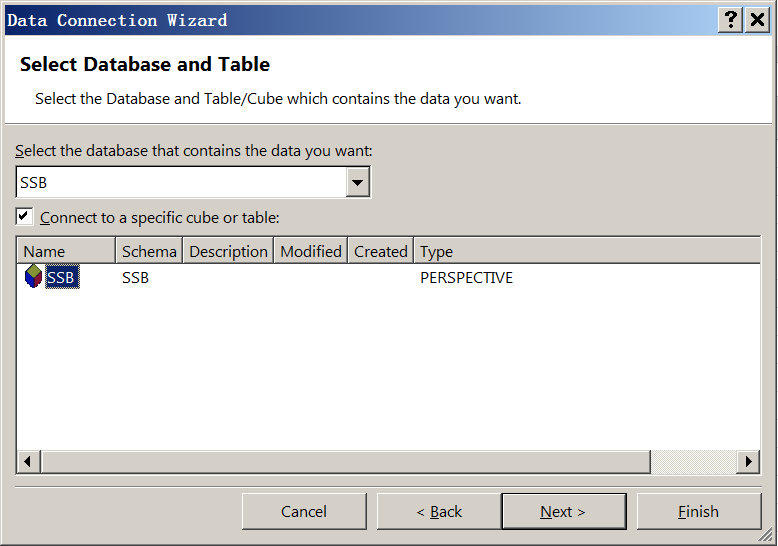
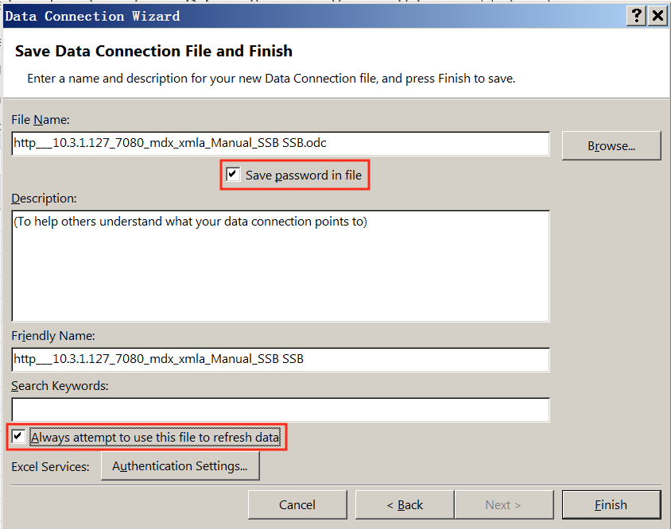
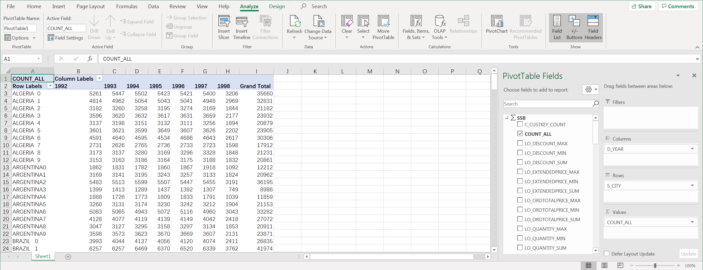

## Integrate with Excel

In this section, we will introduce you how to analyze data from MDX for Kylin using Excel. With this method, you will be able to query data in MDX for Kylin through MDX for Kylin without importing data to Excel.

- [Prerequisite](#prerequisite)
- [Excel connect to MDX for Kylin](#excel-connect-to-mdx-for-kylin)
- [Learn More](#learn-more)

### Prerequisite

1. Install MDX for Kylin.

2. Your Windows Excel version is 2007 or above.

### Excel connect to MDX for Kylin

1. Choose **Data -> Get Data -> From Database -> from Analysis Services**

   

2. Next, in the Server name you need to fill in the host information of MDX for Kylin, the sample is as follows:

   ```
   http://{host}:{port}/mdx/xmla/{project}
   ```

   MDX for Kylin default HTTP port is 7080. Change the project to the project you want to access in MDX for Kylin. Admin can find the port of MDX for Kylin under MDX for Kylin installation folder, in `conf/insight.properties` file, `insight.semantic.port configuration`. 

   

   If the configuration `insight.semantic.context-path` is set, you should enter the following information in the server field:

   ````
   http://{host}:{port}/{context-path}/mdx/xmla/{project}
   ````

   Both host and port should be written as information of Kylin. For example:

   ```shell
   # context-path configuration as follow:
   insight.semantic.context-path=/ws/testworkspace/mdx
   
   # Address of Kylin
   http://10.10.10.200:7070/kylin
   
   # The server information to enter in Excel
   http://10.10.10.200:7070/ws/testworkspace/mdx/mdx/xmla/test_project
   ```

   Choose **Use the following User Name and Password** and fill the username and password of MDX for Kylin.

   

3. Now you have successfully establish connection to MDX for Kylin, choose the dataset you want to analyze, click Next.

   

4. Check **Always attemp to use this file to refresh data** and **Save password in file**

    Check Save password in file, this way you don't need to refill the password later. This setting will only be effective in this machine. 

    

5. Now you can analyze Kylin's dataset using Excel PivotTable. 

   


### Learn more{#learn-more}

To learn more about the features MDX for Kylin supports in Excel, please read  [Supported Excel Functionality](excel_function_list.en.md)
