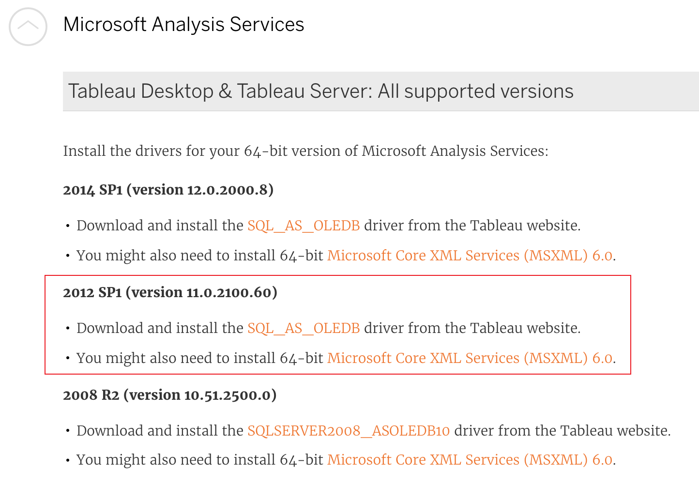
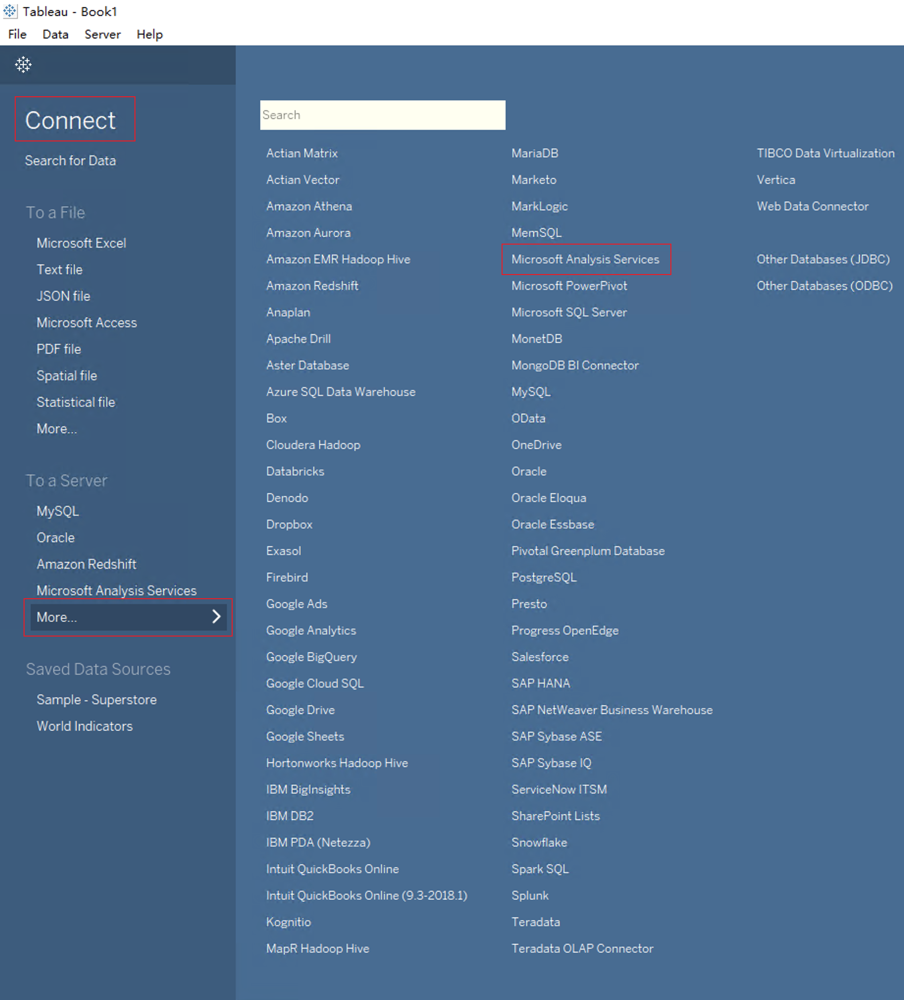
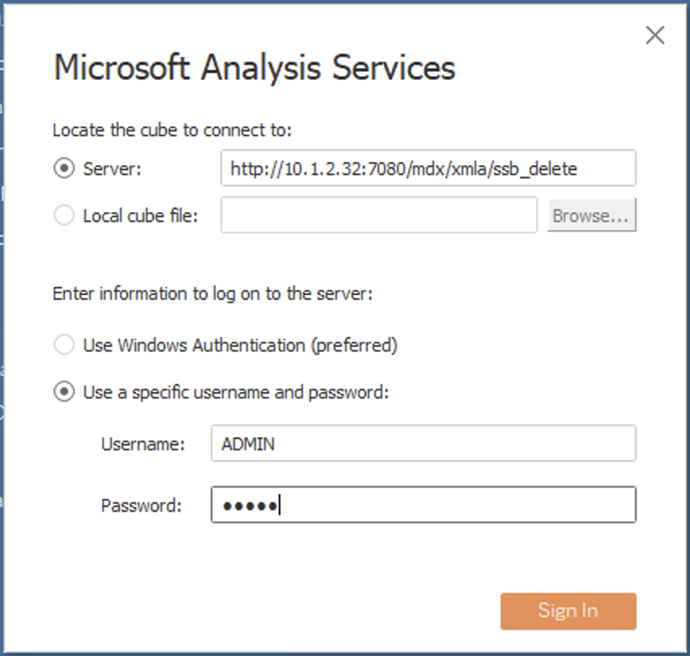
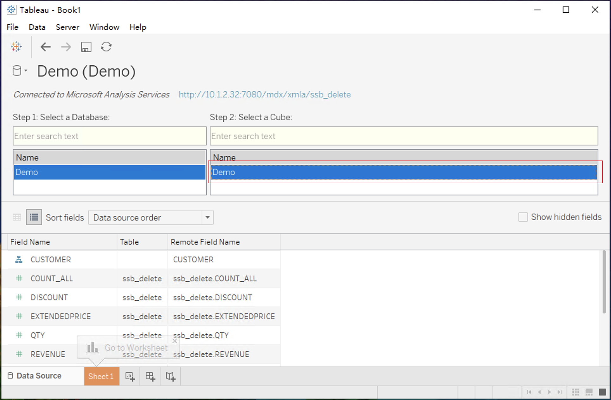
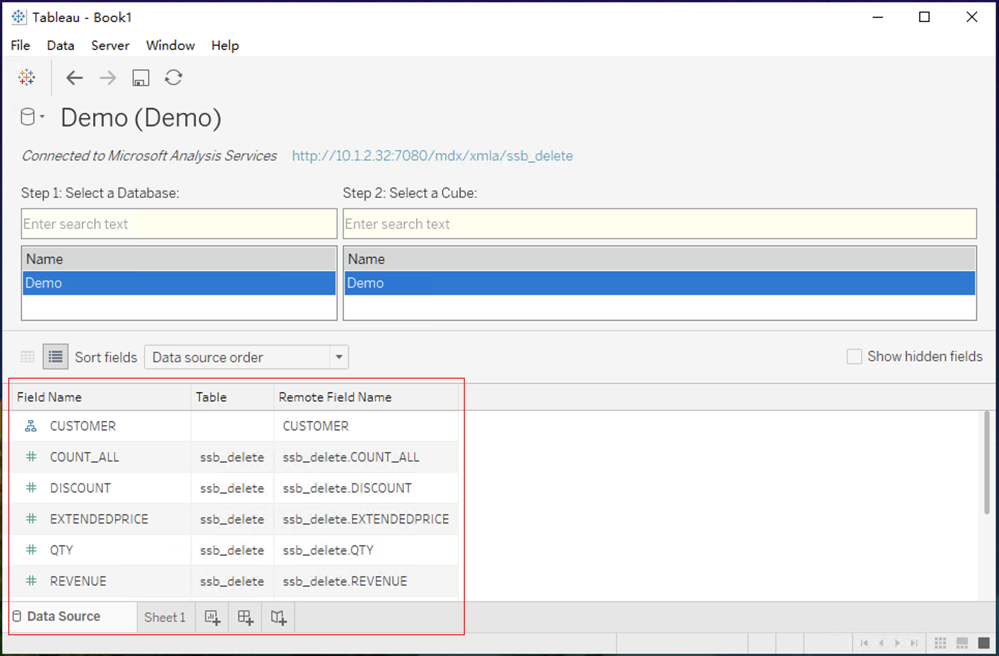
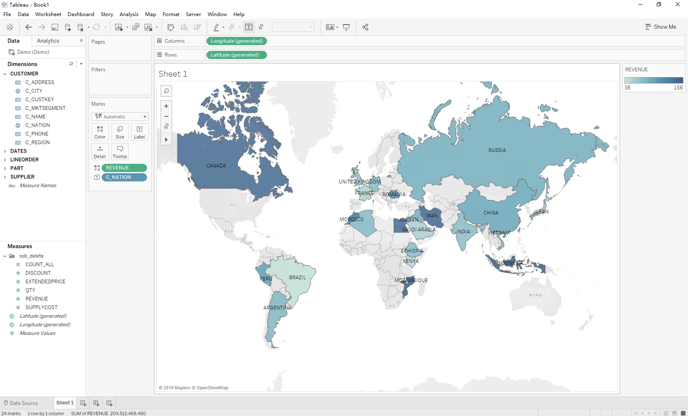

## Integrate with Tableau

In this section, we will introduce you how to analyze data from MDX for Kylin using Tableau. With this method, you will be able to query data in MDX for Kylin through MDX for Kylin without importing data to Tableau.

- [Prerequisite](#prerequisite)
- [Tableau connect to MDX for Kylin Semantic](#tableau-connect-to-mdx-for-kylin-semantic)

### Prerequisite

1. Install MDX for Kylin

2. Install Tableau's Microsoft Analysis Services driver, see [Microsoft Analysis Services Drivers](https://www.tableau.com/en-us/support/drivers)

   Recommended Download **2012 SP1 (Version 11.0.2100.60)**
   
   

### Tableau connect to MDX for Kylin Semantic

1. Choose **Connect -> Microsoft Analysis Services**

   

2. Next, you need to fill in the address information of the connection MDX for Kylin Semantic in the Server name column, the sample is as follows:

   ```
   http://{host}:{port}/mdx/xmla/{project}
   ```

   MDX for Kylin Semantic default HTTP port is 7080. The username and password are your MDX for Kylin login username and password.

   

   If the configuration `insight.semantic.context-path` is set, you should enter the following information in the server field:

   ````
   http://{host}:{port}/{context-path}/mdx/xmla/{project}
   ````

   Both host and port should be written as information of Kylin. For example:

   ```shell
   # context-path configuration as follow:
   insight.semantic.context-path=/ws/testworkspace/mdx
   
   # Address of Kylin
   http://10.10.10.200:7070/kylin
   
   # The server information to enter in Tableau
   http://10.10.10.200:7070/ws/testworkspace/mdx/mdx/xmla/test_project
   ```

    

3. Now that project is connected to tableau, please a dataset.

   

4. After selecting the dataset, Tableau can read the information about the dataset. Click on the workbook to start the analysis.

    

5. Now you can analyze Kylin's Cube using Excel PivotTable. So far, the measures: top, percentile and correlation are not supported.

   
