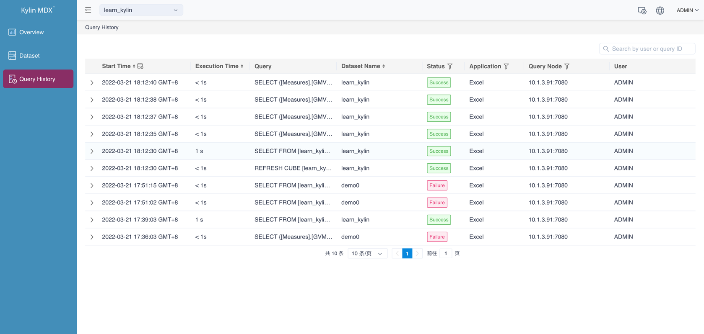
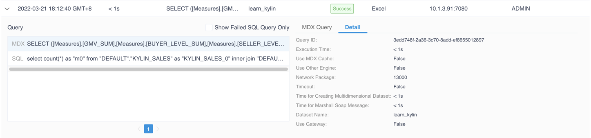
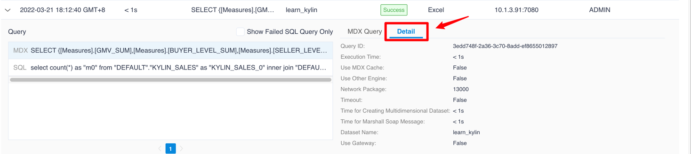
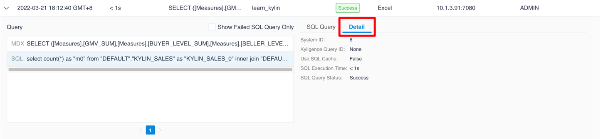

## Query History

All the queries that you executed in Kylin will be saved in query history, you can check it out in the left side navigation bar **Query -> History**. 

This page saves the basic information of queries, such as query time, SQL statement, query user, etc. This helps you to record query behaviors, which enables you to better manage and optimize the models. This chapter will presents you the content of query history page. 

### View Query History
Click the **Query History** button in the left navigator bar, you will see all the queries with basic information.

Each line in the list is a query history record. The meaning of the columns are as follows:
- **Start time**: The time the query was submitted.

- **Execution Time**: The time taken to complete the query. If the query fails, it is displayed as blank.

- **MDX Statement**: MDX statement that was executed.

- **Dataset Name**: The dataset used for the query.

- **Query Status**: There are several states as follows：

  Success

  Failure

- **Application**: The type of BI that submitted the query.

- **Query Node**: The service nodes that handle the query.

- **User**: MDX for Kylin user who submitted the query.

### History Details
When you click on the arrow icon on the left side of a query analysis, the details of the current MDX query will be expanded. The information is divided into two parts: query details and SQL statements. The query details show the basic information of MDX scripts and queries (such as: Session ID, query status, etc.), SQL statements show related SQL scripts.

> **Note**: Only the first 1000 rows of Query can be seen in the query details. You can click the copy button in the upper right corner of the query statement box to copy the complete statement.

**Query Details**

Click View in More Information to show more details:

Meaning of relevant details:
- **Query ID:** MDX query execution ID

- **Execution Time:** the total time of the entire MDX query (including the total time of preprocessing, SQL queries, etc.)

- **Use MDX Cache** : query whether to hit MDX cache

- **Use Other engine:** whether to use other syntax execution engine

- **Network Package:** the total bytes of network throughput

- **Timeout:** whether timeout in the query of processing

- **Time for Creating Multidimensional Dataset:** the time for creating multidimensional dataset

- **Time for Marshall Soap Message:** the time for marshall soap message

- **Dataset Name:** the dataset for query to hit

- **Use Gateway** : Whether the client side initiating the query uses MDX for Kylin Gateway.

**SQL Statement**

Select the SQL statement of query list, and then click the **Detail** tab to view the detailed information of the SQL query statement. As shown below:

Meaning of relevant details:

- **Query ID** : SQL query execution ID

- **Number of result rows** : Returns the number of rows in the result set

- **Whether to use cache** : query whether to hit cache

- **System ID** : internal increment number
