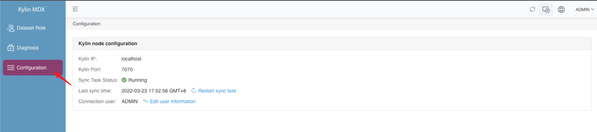
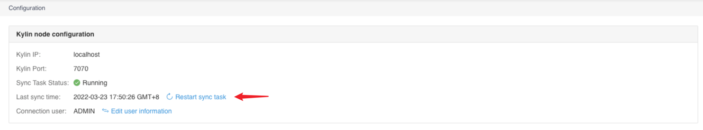
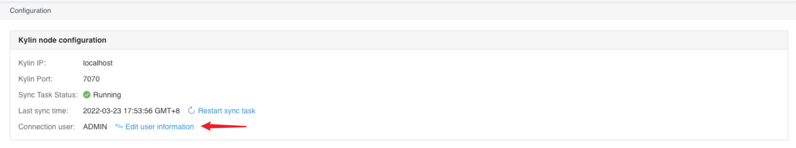

## Task configuration

Now MDX for Kylin will periodically synchronize data from its connected Kylin. You can use the system administrator account of Kylin to enter the administrator page to view the task status.

Enter the parameter page, you can synchronize the running status of the task and the last time the task ran.

If the task is stopped due to unexpected circumstances, such as Kylin is down, you can click the **Restart Sync Task** button to restart the Sync task.

If you modify the user name or password of the system administrator in Kylin that is also performing synchronization tasks, you can click the **Edit User Information** button to change the user name and password.

