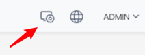
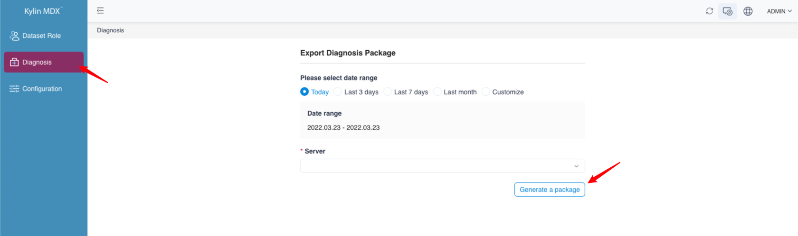
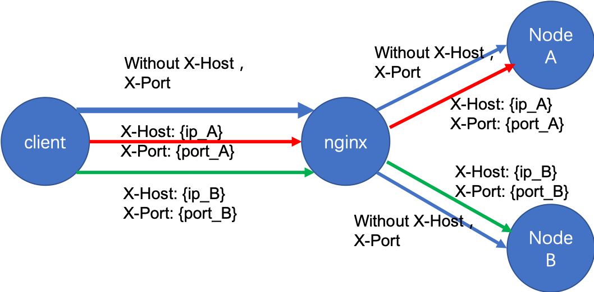

## Diagnostic Package

- [System Configuration](#system-configuration)
- [Generate diagnostic package from web page](#generate-diagnostic-package-from-web-page)
- [Generate diagnostic package from shell](#Generate-diagnostic-package-from-shell)
- [Multi-node deployment configuration example](#multi-node-deployment-configuration-example)
	- [MDX for Kylin configuration item](#mdx-for-kylin-configuration-item)
	- [Configuration requirements for Nginx routing rules](#configuration-requirements-for-nginx-routing-rules)
- [Diagnostic Package Content](#Diagnostic Package Content)
- [Attention information](#attention-information)

### System Configuration

MDX for Kylin requires you to properly configure each node during installation. For details, see the manual [Installing in Linux Environment](../installation/install_linux.en.md)

### Generate diagnostic package from web page

The system diagnostic package contains diagnostic information for the entire MDX for Kylin instance. To generate a system diagnostic package requires the following operations

+ Log in to MDX for Kylin with Kylin's administrator account

+ Click the **Enter Management** button in the upper right corner



+ Select time range, you can choose **Today**, **Last 3 days**, **Last 7 days**, **Last 1 month**, or custom time range

	> **Note:** The time range selected must include the time period during which MDX for Kylin experienced the problem.

	

+ Select server

	> **Note:** If MDX for Kylin is deployed on multiple nodes, you need to determine the problem node and choose the correct server name when generating the system diagnostic package, otherwise the system diagnostic package may not contain information about the problem.

+ You can then download the diagnostic package.

### Generate diagnostic package from shell

You may also generate a system diagnostic package by executing script with following operations

+ You can enter the following directory `$MDX_HOME/semantic-mdx/scripts/`, execute the following command

`./diagnose_package_offline.sh <Start time> <End time> <MDX ip> <MDX port> <whether dump mysql database> <Diagnostic package output path>`

- `Start time`: 13 bit timestamp;

- `End time`: 13 bit timestamp

- `MDX ip`: MDX ip;

- `MDX port`: MDX port;

- `whether dump mysql database`: Enter `y` to indicate that you need to dump mysql metadata database, enter `n` to indicate that you don’t need it;

- `Diagnostic package output path`: The diagnostic package output path;

- The following example of script execution shows that the mdx instance of port 7080 of localhost node is packaged, the time range is `2021-03-07 - 2021-03-08`, the MySQL database needs to be dump, and the diagnostic package output path is '/ usr / local/`:

`./diagnose_package_offline.sh 1615046400000 1615132800000  localhost 7080 y /usr/local/`

### Multi-node deployment configuration example

#### MDX for Kylin configuration item

+ You need to add the configuration item `insight.mdx.cluster.nodes=IP1:Port1,IP2:Port2` in the`[MDX installation directory]/conf/insight.properties` file of each MDX node, which will all in the cluster The IP and Port information of the MDX node is added to the configuration file.

#### Configuration requirements for Nginx routing rules

+ According to the custom `header`:`x-Host` and `x-Port` to forward the request to the specified node to ensure that multiple nodes can be notified on the page to generate a diagnostic package and download it.

+ You need to add routing rules in the Nginx configuration file: For example, for two MDX for Kylin nodes of A and B on two machines, whose IP and Port are `IP_A: Port_A` and` IP_B: Port_B`, you need to add them in Nginx Add the following configuration to the configuration file:

  ```properties
  upstream nodes {
  	server ip_A:port_A;
  	server ip_B:port_B;
  }
  server {
  	listen port_N;
  	server_name ip_N;
  	#charset utf-8;(Recommended Use)
  	#Enable custom header
  	underscores_in_headers on;
  	location / {
  		if ($http_x_host = '') {
  				#Requests without custom headers can be sent to any node
  				proxy_pass http://nodes;
  				break;
  		}
  		#For requests containing custom headers, forward them to the specified node
  		proxy_pass http://$http_x_host:$http_x_port;
  		break;
  	}
  }
  ```

+ The forwarding logic at this time is shown in the following figure:

	

### Diagnostic Package Content

The system diagnostic package contains following content：

+ **conf_{timestamp}** directory
  + **indicators.json** : MDX calculated measure template file, recording the template definitions of calculated measures
  + **insight.properties** : MDX configuration file
  + **set-jvm.sh** : MDX JVM parameter configuration file (which can also be modified in insight.properties file)
  + **startup.sh** : MDX boot script
+ **logs_{timestamp}** directory
  + **gc-{timestamp}.log** : MDX JVM GC activity log
  + **mdx.log** : MDX query log file，merging content from several MDX query log files in specified time period (Content is sorted by original log file last modified time, separated by  "Content above from file : ")
  + **semantic.log** : MDX API call log file, merging content from several MDX API call log files in specified time period (For example, synchronizing information from Kylin, accessing dataset from web GUI)
  + **Project-{project}_Dataset-{dataset}.json** : several files, json files of datasets which can be used to import dataset from web GUI (Requires MDX connecting to a proper Kylin)
  + **jstack.log** : MDX process ID, core file, Java stack information of remote debugging service
  + **jmap.log** : MDX process memory mapping information and heap space allocation
  + **top.log** : The resource usage status of each process in the system
  + **mos_scripts.out** : Distributed MDX startup logs information about the process of copying server Hadoop-related configuration files and replacing related conflicting jar packages
+ **mdx_env** ：MDX running environment information file, including detail information from versions of MDX, JDK to System
+ **sync_info** ：MDX synchronization task information file, including current connection user and current synchronization task status
+ **schema_{timestamp}** directory
  + **{user}_{project}.xml** : several files, the schema information of datasets (One dataset may appear to be inconsistent to different users due to visibility settings)
+ **dataset_{timestamp}** directory
  + **Project-{project}_Dataset-{dataset}.json** : several files, json files of datasets, which can be imported from the front-end interface (requires connection to the corresponding Kylin)
+ **spark\_logs_{timestamp}** directory
  + **app-{applicationId}** directory
    + **events\_{number}\_app-{applicationId}\_{startTime}_{endTime}** : several files, Spark related logs

### Attention information

+ In the multi-node deployment configuration example, Nginx is configured as an example configuration. The specific routing method and filtering range can be adjusted according to actual needs.

+ If the versions of multiple MDX for Kylin nodes are inconsistent, there may be problems in reading `js` and`css` files after Nginx forwarding, so you must ensure that **the MDX for Kylin version of each node is consistent**.

+ Because the IP and Port information given in the configuration file is used when requesting the diagnostic package, please do not use localhost, which may cause Nginx forwarding failure and the request to fail.

+ Each time a diagnostic package is newly generated, it will **clear the diagnostic package generated 7 days ago**.
