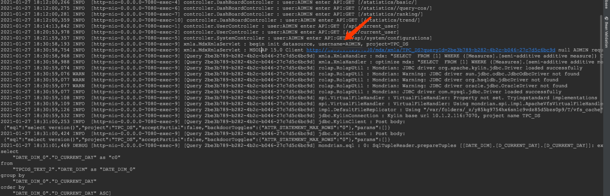
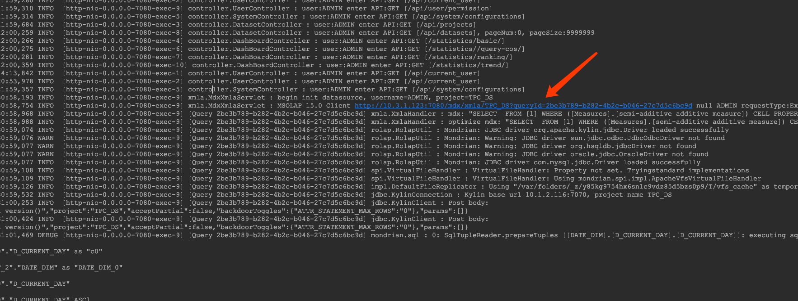

## System Log

After being successfully started, MDX for Kylin will create a directory named `logs/`. By default all logs generated during MDX for Kylin runtime will be stored in this directory.

### Log files

Log files generated by MDX for Kylin is as follows:

#### `mdx.log`

The file is MDX access log generated by Semantic server, whose default logging level is INFO.

#### `semantic.log`

Semantic main log file, whose default logging level is INFO.

#### `semantic.out`

The standard output of Semantic will be redirected to this file.

#### `gateway.log`

Gateway main log file, whose default logging level is INFO.

### Log Configuration

MDX for Kylin leverages log4j for logging configuration. Users can edit the `log4j.properties` file 
in the `$MDX_HOME/conf/` directory to configure the logging behavior, such as the splitting rule 
and the single file size limit. For example:

- The default appender type of `semantic.log` and `mdx.log` files is `org.apache.log4j.RollingFileAppender`, 
  which means creating a new file every time the old file reaches a designated size. To create a new file 
  every day instead, you can set `log4j.appender.file` and/or `log4j.appender.mdx` to 
  `org.apache.log4j.DailyRollingFileAppender`.

- `log4j.appender.file.MaxFileSize` and `log4j.appender.mdx.MaxFileSize` define the size limit mentioned above of 
  any `semantic.log` file or `mdx.log` file respectively, default 268435456, i.e. 256MB.

- `log4j.appender.file.MaxBackupIndex` and `log4j.appender.mdx.MaxBackupIndex` define the max 
  reserved amount of `semantic.log` files and of `mdx.log` files respectively, default 10.

After modifications on the `log4j.properties` file, you should restart MDX for Kylin to apply your changes.

### Log debugging

The MDX log contains the caller information of the query ID and API, which can be used to increase the debugging ability.

1. Query ID, MDX query issued by Business Intelligence tools, will generate a unique query ID in MDX, you can trace the relevant information according to the query ID.

2. The caller information of API can be used to locate the user.

