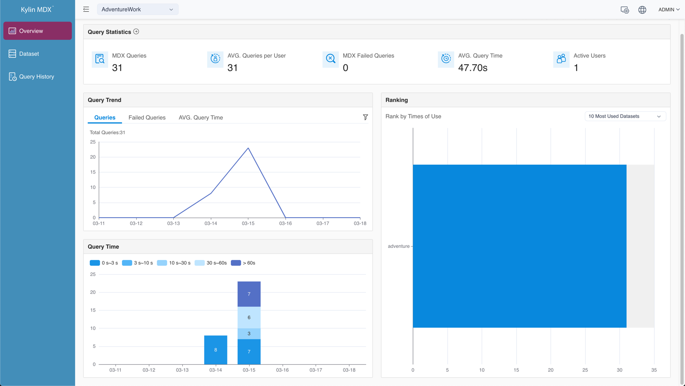
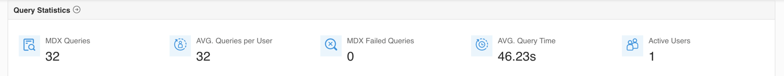
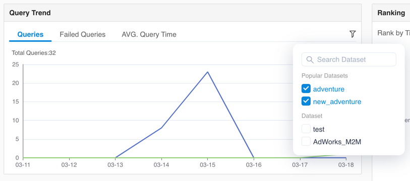
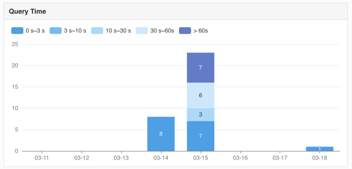
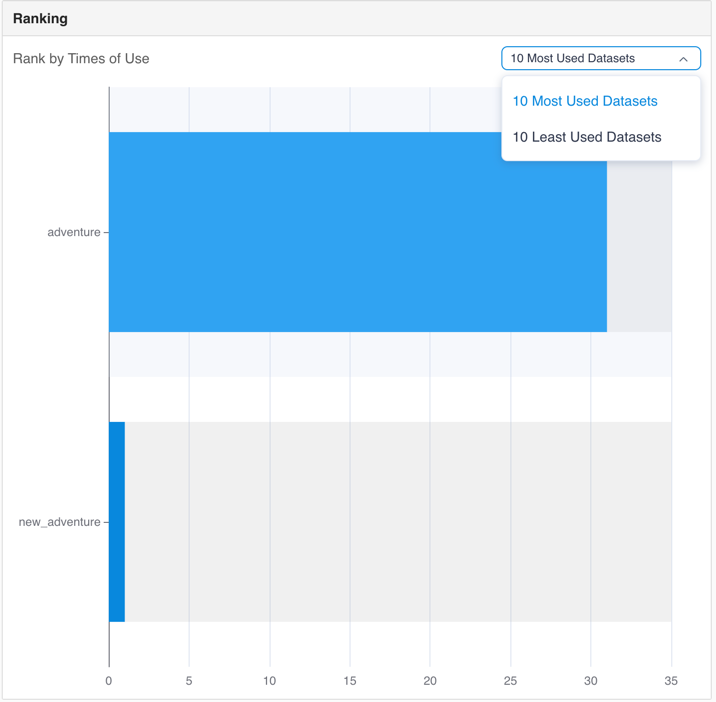

## Overview

In the overview module, you can monitor the MDX for Kylin system and have a glance of the core metrics and system status of each project, including the users served by the project, the queries and the dataset usage, etc.

In the upper right corner, you can change the time filtering (Last 7 days by default). The time filtering set here will affect all metrics in the current page.

### Query Statistics

In the query statistics area, you can view the following information about the current project:

- MDX Queries: the total number of historical MDX queries;
- AVG. Queries per User: the average number of queries per user;
- MDX Failed Queries: the total number of historical MDX failed queries;
- AVG. Query Time: the average response time of queries;
- Active Users: the number of users who queried.

You can click the button to jump to the query history module.

### Query Trend

In the query trend area, you can view the following information about the current project:

* Queries: the trend of queries amount;
* Failed Queries: the trend of failed queries amount;;
* AVG. Query Time: the trend of the average response time of queries.

Only five datasets are displayed in the chart by default. You can also specify other datasets by clicking the filter button in the upper right corner.

### Query Time

In the query time area, the changing trend of queries of different response time is displayed. The query time is divided into different levels: 0~3 seconds, 3~10 seconds, 10~30 seconds, 30~60 seconds and > 60 seconds.

### Ranking

In the ranking area, the most/least frequently used datasets are displayed according to the queries amount in descending order. The datasets that have not been queried are not displayed.

