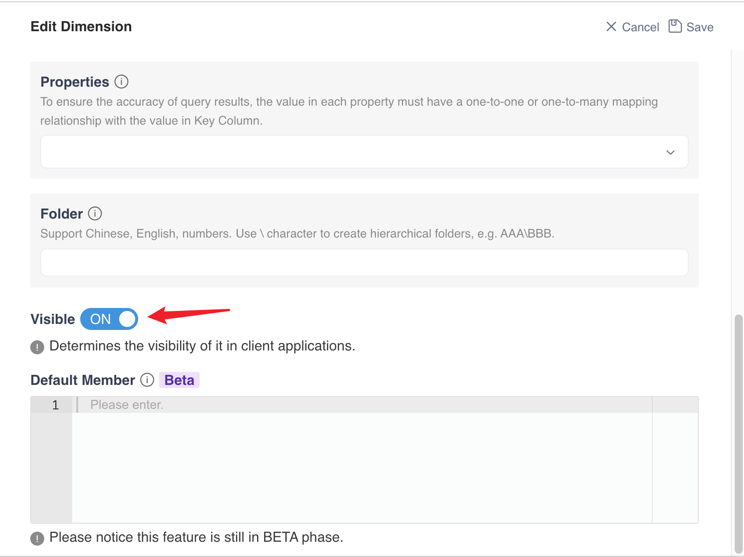

## Object-level Security

### Understand Object

There are several concepts that exist in MDX for Kylin that are considered as an object, such as **Dimension, Measure, Calculated Measure, Hierarchy, Named Set.** 

### Understand Object-level Security

In MDX for Kylin, you can configure the Object-level security for every single object in MDX for Kylin. some of these objects such as **Calculated Measure** or **Named Set** only exist in MDX for Kylin. that’s why their access needs to be controlled separately in MDX for Kylin. 

And there are use cases that user needs to control the **Measure** to be **NOT** accessible to a group of users but the **Calculated Measure** that references the **Measure** that rely on the measures are **accessible** to the same group of users.

### Status of Object-level Security

There are 3 status of the access control:

| **Status**         | Product Behavior                                             |
| ------------------ | ------------------------------------------------------------ |
| **Unspecified**    | By default, when access is not configured, user cannot see and query the object and the dataset. This default behavior can be modified by configuring the setting as mentioned in the next section below. |
| **Accessible**     | When set as accessible, user can view and query the object.  |
| **Not accessible** | When set as not accessible, user cannot view and query the object. |

### Apply Object-level Security at Different Level

User's access to a dataset is decided by the access collection of all objects on that dataset. User need to have access to at least one measure or calculated measure on a dataset to access that dataset. 

>  Note: Since Tableau has a built-in measure of count(*) by default, so user can access the dataset with only one dimension granted. But we do not recommend to use MDX for Kylin in this way.

A new setting is introduced to configure whether the dataset and object are accessible by default. Once this setting is set to true, all the newly created datasets will be accessible to all users by default.

| **Setting**                             | insight.dataset.allow-access-by-default             |
| :-------------------------------------- | :----------------------------------------------------------- |
| **Usage** | When true, all datasets are accessible by all users by default. When false, all datasets are not accessible by all users by default.|
| **Default Value** | False |
| **Server restart needed?** | Yes |

The existing dataset access list will remain the same. If insight.dataset.allow-access-by-default is set to true , newly dataset will be accessible by all users by default. Any objects that should not be exposed to certain users or groups should be restricted by Admin.

### Apply Object-level Access by Role

Object-level access can be applied by user or role. You can create a role and assign user the role, and then grant object-level access by role to batch process the permission control. To understand more about role, please read [Role](role.en.md).

When a user is assigned to multiple roles, the user access should be combined with all the access the user get from the user-level and role-level. For example, if the user is granted to access dimension 1 and measure 1 on a dataset, the role the user belongs to is granted to access dimension 2 and measure 2, the user belongs to this role. Then the user can access dimension 1, dimensions 2, measure1 and measure 2.

### Apply Object-level Access by Role

Object-level access can be applied by group. 

MDX for Kylin will periodically sync the user and group from Kylin, and the user in each group. If external user identity system is integrated with Kylin, for example, Azure Active Directory (Azure AD), the user and group in MDX for Kylin will come from external user identity system.

The objects user can acesss will be decided by combining all the access or restriction the user could get from him/herself and all groups he/she belongs to. For example, user A is in group U1. User A has been restricted access to dimension `D1` and measure `M1` on dataset `DA1`, group U1 has been restricted access to dimension `D2 `and measure `M2`. User A can access `DA1` with no access to `D1`,`D2`,`M1`,`M2`.

### Configure Object-level Access List

To configure object-level access list, please edit the dataset and go to access list to configure access list for Dimension, Measure, Calculated Measure and Named Set. Please read the step by step guide at [Configure Access List](../dataset/access_list.en.md)

### Understand Object Visibility

You can also configure the visibility of the object in the [Dimension](../dataset/design_dataset/s3_2_dimension.en.md), [Measure](../dataset/design_dataset/s3_3_measure.en.md), [Calculated Measure](../dataset/design_dataset/s3_6_calculated_measure.en.md), and [Named Set](../dataset/design_dataset/s3_5_namedset.en.md) editor. 

When the object is set to be **Not Visible**, all the user will not be able to access the object. And when configuring the access of the object for a user and role, the access is automatically restricted and cannot be modified.

### The Difference Between Object Visibility and Object-level Access List

Although the visibility and object-level access list may looks similar at first glance, they are effective in a different level. When a object is set to be Not Visible, it is hidden to all users when query from client tool, as if the object does not exist on the dataset. The object-level access list configured by user or role. So it gives admin the flexibility to restrict the access to certain sensible data to certain user or group of users. 

