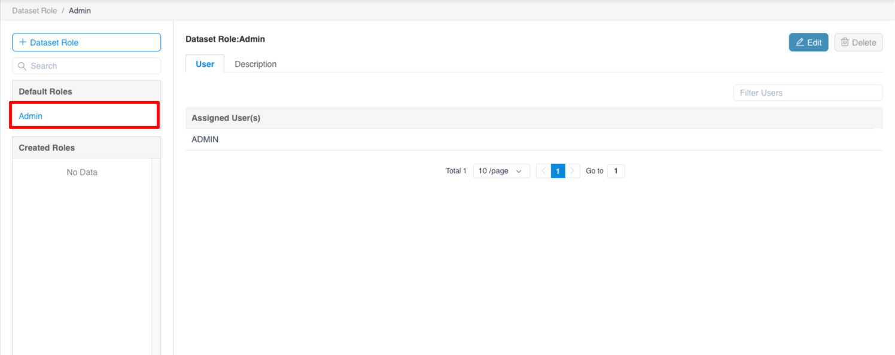
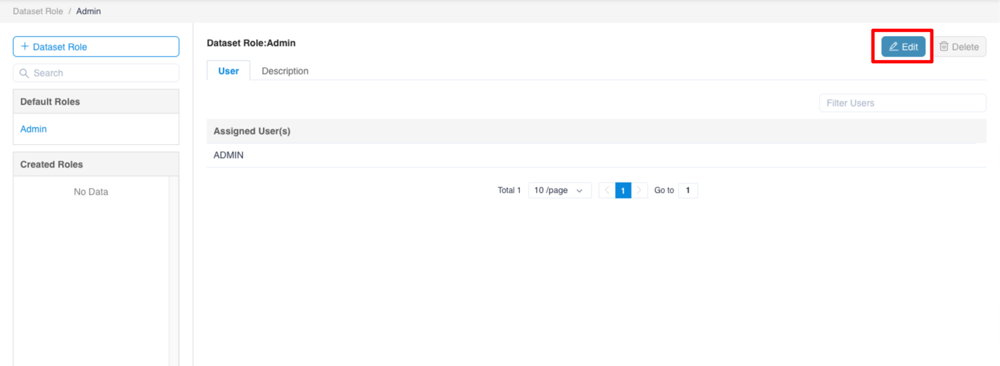
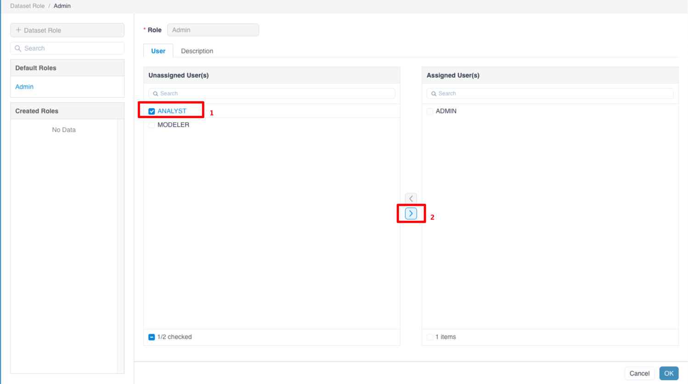
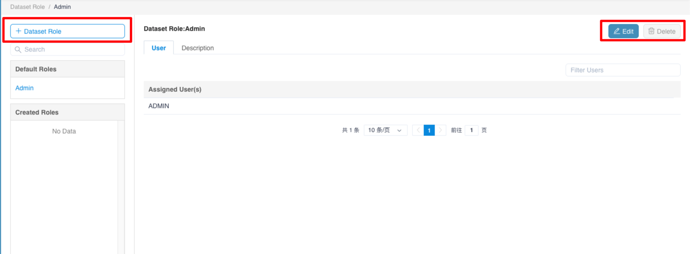

## Role

This chapter will introduce what a **Role** is, how the Role decides the permission in MDX for Kylin, and how you can assign roles to users.

- [User Role](#dataset-role)
- [Default Role](#default-role)
- [Assign Users to Role](#assign-users-to-role)
- [Manage Role](#manage-role)

### Dataset Role 

The original MDX for Kylin only provided user-level semantic information permission control. It provided role-level semantic information access control. The following information needs attention:

1. When a user is not assigned any dataset role or is configured with a user-level whitelist, the user does not have access to any dataset.
2. The user must have at least access to a metric or a calculated metric in the data set, otherwise the user cannot connect to the data set.
3. Users should have permissions on the items, tables in Kylin, otherwise they cannot connect to the dataset.
4. When a user is assigned multiple roles, the final authority is a collection of whitelists at each role level and user level. That is, if the access authority of user A in the dataset is dimension 1 and measure 1, the access authority of role A is dimension 2 and Measure 2, and user A belongs to role A, then the final access right of user A is dimension 1, dimension 2, measure 1, and measure 2.

### Default Role

- MDX for Kylin initially comes with a **default role**, namely the Admin, which has access to all semantic information of all data sets.

- Admin role assignments can be viewed on **Enter Management Page**-> **Dataset Roles** page.

### Assign Users to Role

You may go to **Enter Management Page**-> **Dataset Roles** to assign users to role in batch. A user will gain the permission as per role. When a user has multiple roles, the user will gain the union of permissions from all the roles.

### Manage Role

You may go to **Security - ->Role** to create, edit, clone and delete Role. When you change the permission of the role, you consequently change the permission the user having that role.

Note: Default Role cannot be edited or deleted.

