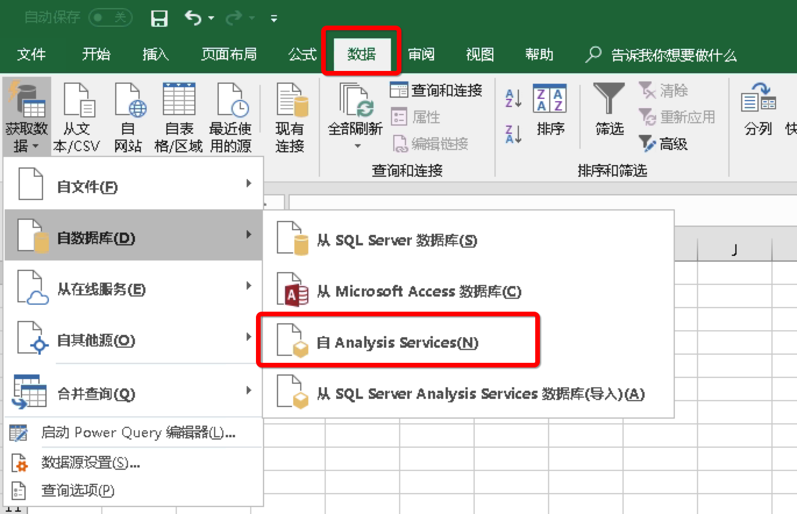
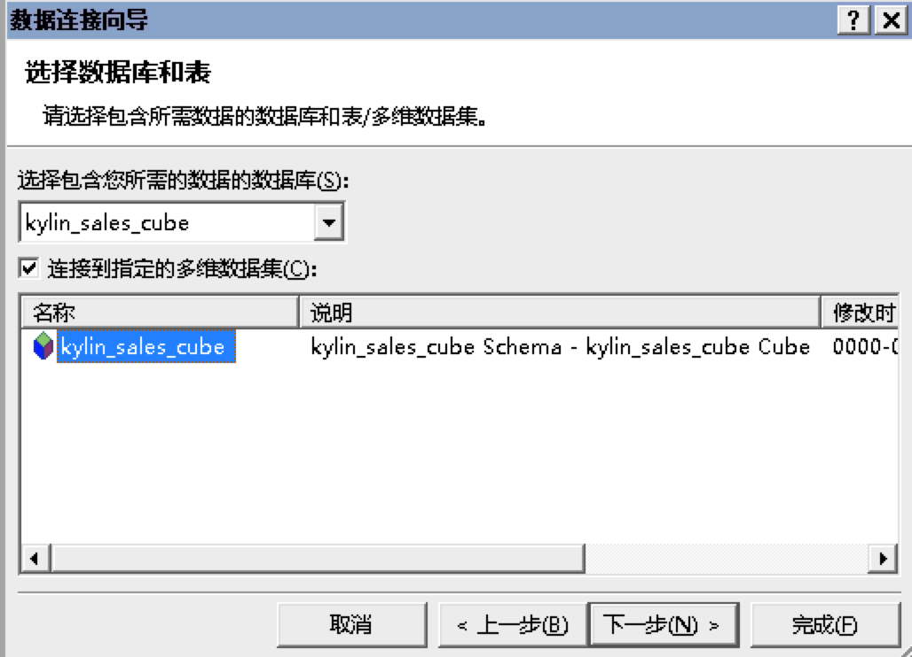
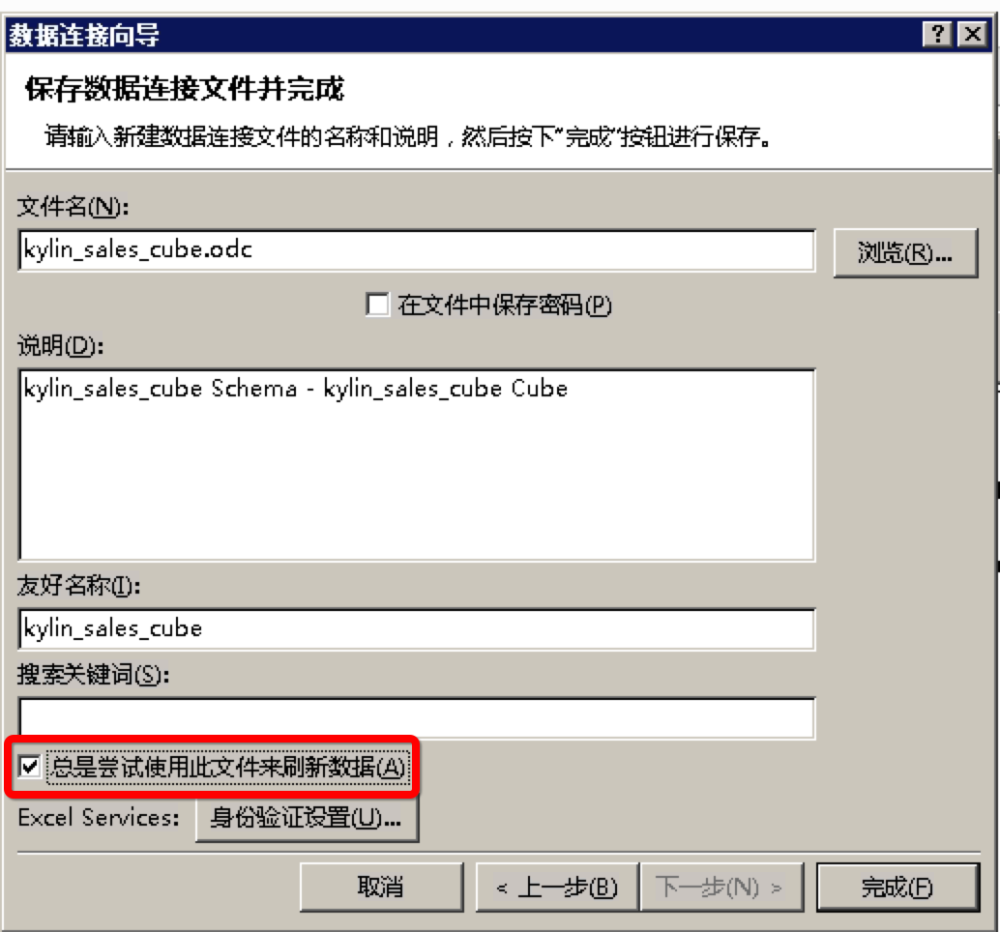
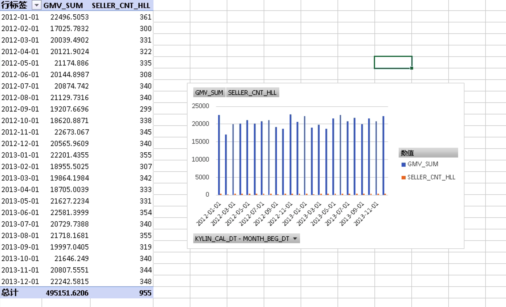
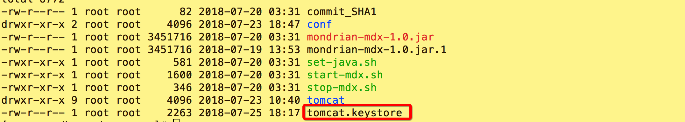
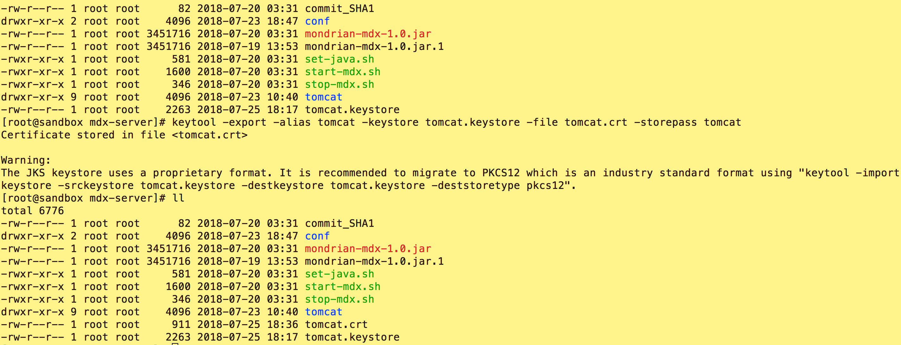
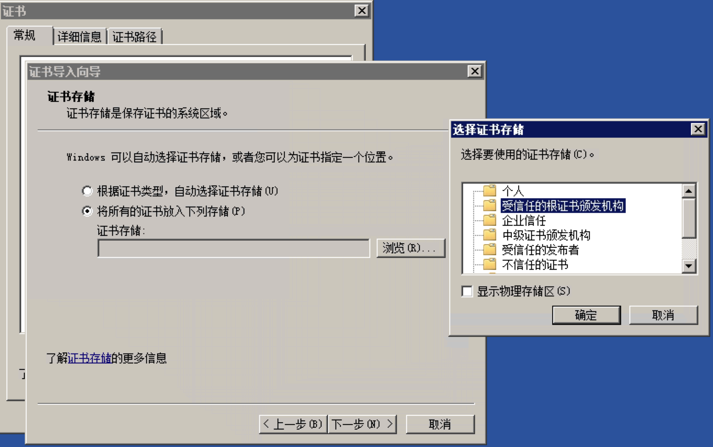
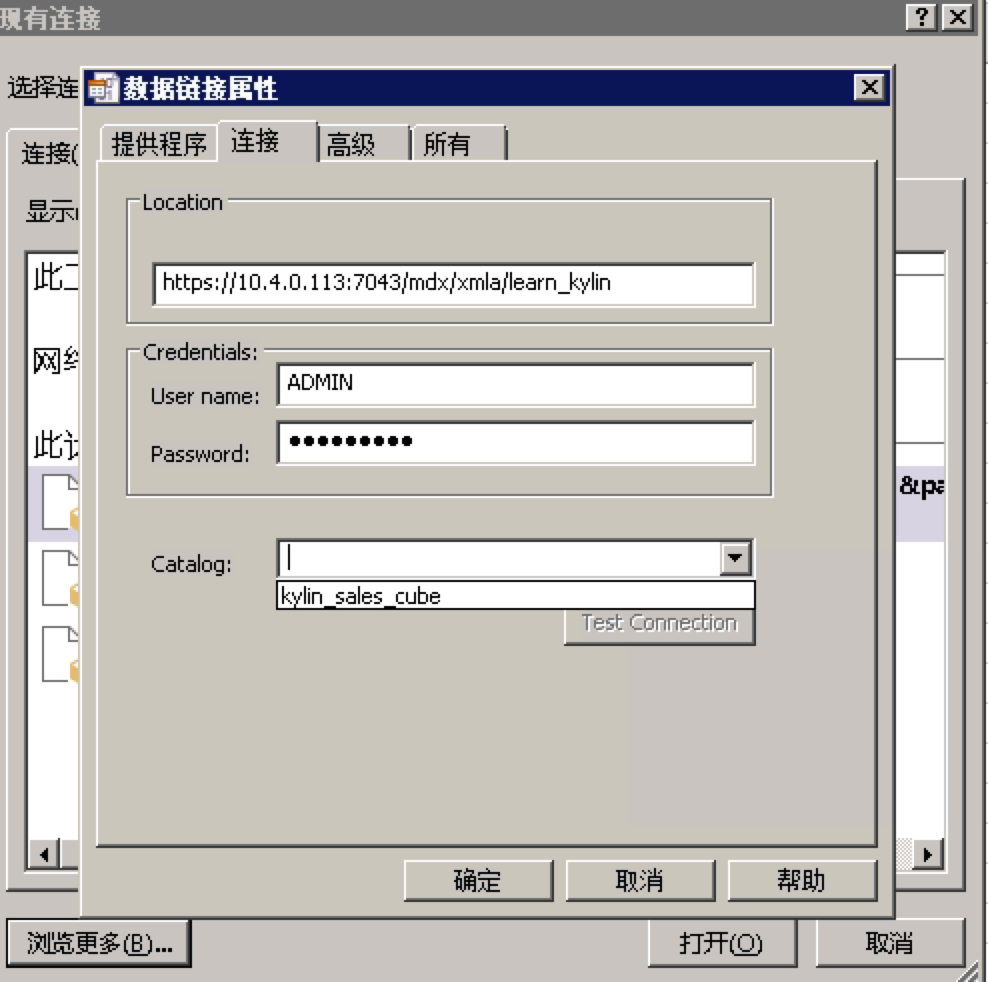

#### 下载mdx-service二进制包
    访问 http://download.kyligence.io 进行下载

#### 安装运行mdx-service
1. 解压 mdx-service-{version}.tar.gz

    `tar -xvf mdx-service-{version}.tar.gz`
    
2. 修改连接Kyligence服务器配置 (默认kyligence.host=localhost, kyligence.port=7070)
+ `cd mdx-server-{version}`
+ `vi conf/mdx.properties`
+ `修改kyligence.host和kyligence.port值`

3. 启动mdx-service
    `./start-mdx.sh`
    启动后默认端口为7080
> **Tip**
>
> mdx-service首次启动时，会通过网络下载mondrian jar包。如果运行环境无公网环境，请至http://repository.kyligence.io/repository/maven-releases/pentaho/mondrian/mdx-1.0/mondrian-mdx-1.0.jar下载,下载后把mondrian依赖放在 tomcat/webapps/mdx/WEB-INF/lib目录下，再次启动mdx即可
>

4. 关闭mdx-service
    `./stop-mdx.sh`
    
#### 使用excel连接mdx-service
##### 前置条件
1. 在windows OS中安装excel 2007及以上版本
2. 如果您使用的excel版本是2016，需要修改系统默认的MOLAP版本，修改方式如下：
+ ① 访问https://www.microsoft.com/zh-CN/download/details.aspx?id=35580，点击下载，选择下载项目QL_AS_OLEDB.msi
+ ② 在MDX解压目录下找到修改注册表程序 editMSOLAP.reg，将其复制到excel安装环境中运行 （还原注册表项目运行restoreMSOLAP.reg）

##### 连接指南
选择`数据` → `来自 Analysis Services`

接下来，您需要在`服务器名称`一栏中填写连接mdx-service的地址信息，样本如下：`http://{host}:{port}/mdx/xmla/{project}`, mdx默认端口号是7080
用户名和密码是您的**Kylin**登陆用户名和密码。

现在Cube已经被连接到Excel了，**下拉选择Cube**，点击下一步。

勾选总是尝试文件来刷新数据，点击完成。

现在，您可以使用Excel透视表分析Kyligence的Cube了。

##### 使用https连接mdx-service
###### 1.制作SSL秘钥和证书
在mdx-server目录下使用 如下命令生成秘钥, 密码使用tomcat, first name and last name 填写mdx服务器的ip

`keytool -genkeypair -alias "tomcat" -keyalg "RSA" -keystore "tomcat.keystore" -validity 9999`

秘钥生成后，保存在当前目录

生成秘钥后，使用如下命令生成一份证书

`keytool -export -alias tomcat -keystore tomcat.keystore -file tomcat.crt -storepass tomcat`

###### 2.在excel环境中安装证书
拷贝一份刚才生成的证书至安装了Excel的环境，双击证书，开始安装
 

###### 3.使用https连接
mdx-service的https默认端口为7043，所以连接样式为 `https://{host}:7043/mdx/xmla/{project}`

##### MDX配置项说明
MDX配置文件为 MDX解压目录下的conf目录下的mdx.properties
`kyligence.host`  mdx-serivce连接的Kylin 的服务器地址，默认为localhost
`kyligence.port`  mdx-serivce连接的Kylin 的端口号，默认为7080
`mdx.optimize.enable`  是否开启MDX语句优化功能，默认开启。如果在url中加入请求参数 enableOptimizeMdx=true, 同样也会打开MDX优化功能，并且会忽略配置文件对此项的配置。示例url(http://localhost:7080/mdx/xmla/learn_kylin?enableOptimizeMdx=true)
`mdx.calculate.total.need`  是否开启计算total/subtotal的功能，默认开启。关闭后，将返回结果将不会携带total/subtoal，查询速度更快。如果在url中加入请求参数 needCalculateTotal=false，将会关闭计算 total/subtotal 的功能，并且会忽略配置文件对此项的配置。示例url (http://localhost:7080/mdx/xmla/learn_kylin?needCalculateTotal=false)

#### 如何调试(供开发人员参考)
+ 1. 运行DebugTomcat
+ 2. 在idea中设置 work directory为mdx-service/mdx-webapp
+ 3. 设置项目环境变量 MDX_HOME=../mdx-core/src/main/resources
