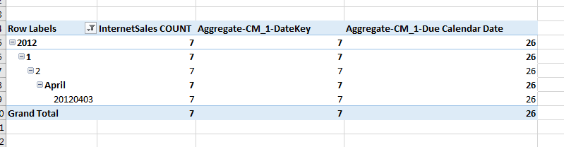

##  已知限制

以下记录了 MDX for Kylin 一些已知限制。

**限制 1:** 不同于 SQL Server Analysis Service，仅**层级结构**才可以在 Excel 中进行展开操作。详细操作如下图所示。

**限制 2:** 当在行列上添加层级结构并在其依赖的普通维度上做筛选时，使用 **CurrentMember** 的计算度量的总计、小记结果可能会不准确。

**限制 3:** Aggregate 函数的支持尚不完善，Aggregate 函数的值会受到外部筛选条件的影响。例如：图中计算度量 **Aggregate-CM_1-DateKey** 和 **Aggregate-CM_1-Due Calendar Date** 均为 Aggregate({[20120401], [20120402], [20120403], [20120404]}, [Measures].[InternetSales COUNT])，值应该均为 **26**，但在层级结构的筛选条件为 20120403，Aggregate-CM_1-DateKey 的值受到了筛选，变成了**7**。

**限制 4:** MDX 当前版本集群部署时的负载均衡策略只支持 Ip Hash ，不支持 Round Robin 等其他方式。设置为其他负载均衡策略时，可能会导致 Excel 在查询取消时 ，Excel 响应缓慢或者发生异常。

**限制 5:** MDX 当前版本对接的 Kylin 暂不支持多对多关系。
