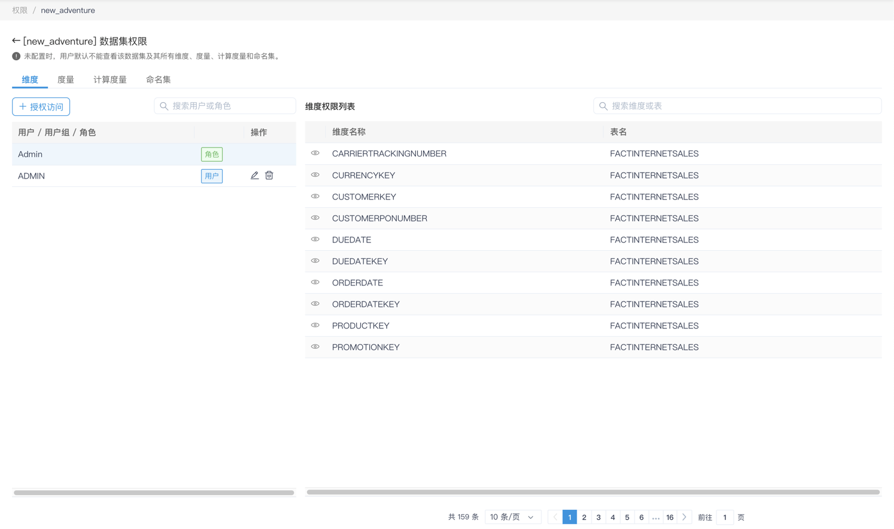
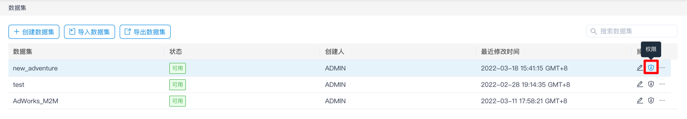
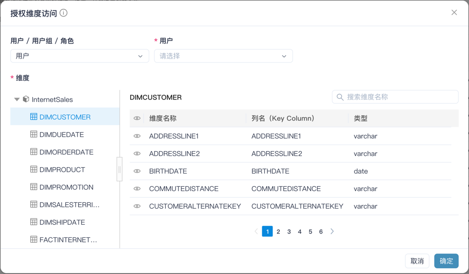

## 配置权限列表

创建数据集后，可以配置数据集的权限列表。用户可以在此进行对维度、度量、计算度量和命名集等进行权限列表设置。

通过以下步骤来设置权限列表：

1. 在数据集列表中，点击指定数据集右侧的权限按钮，进入权限配置的界面。

   

2. 选择在维度、度量、计算度量或者命名集的分页页面，点击 **+ 授权访问** 按钮。

3. 出现一个弹窗，在弹窗顶部选中进行权限配置的用户，用户组或者角色，关于如何创建数据集角色，您可以参考[数据集角色章节](../security/role.cn.md)，关于用户和用户组的权限生效机制，请参考[实体安全性](../security/object_level_security.cn.md)。

   

4. 在弹窗内左侧的导航栏中进行模型、表的切换，在右侧可以看到表内的维度或者是模型内的度量、计算度量、命名集。

5. 点击维度、度量或者计算度量前方的**眼睛**标志，当该标志上有一条斜线，代表对应的维度/度量/计算度量/命名集将会对被设置的用户，用户组或者角色不可访问。

6. 再次点击**眼睛**标志，则可以去掉可见性限制，使得用户可以访问。

7. 点击**提交**按钮。

保存成功的权限列表会出现在如下的表格中，用户可以点击表格右侧的**删除**按钮来删除权限列表，或者点击**编辑**按钮来再次编辑权限列表。

请参见[实体访问安全性](../security/object_level_security.cn.md)了解实体访问的产品设计。
