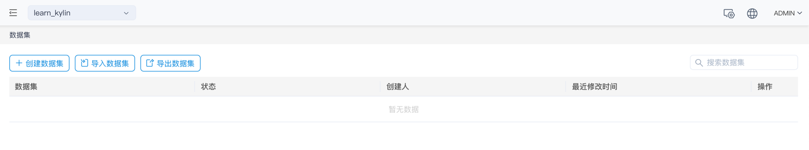
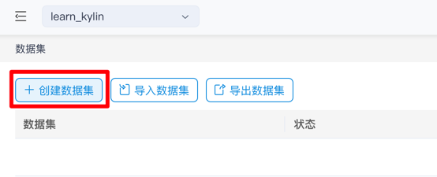
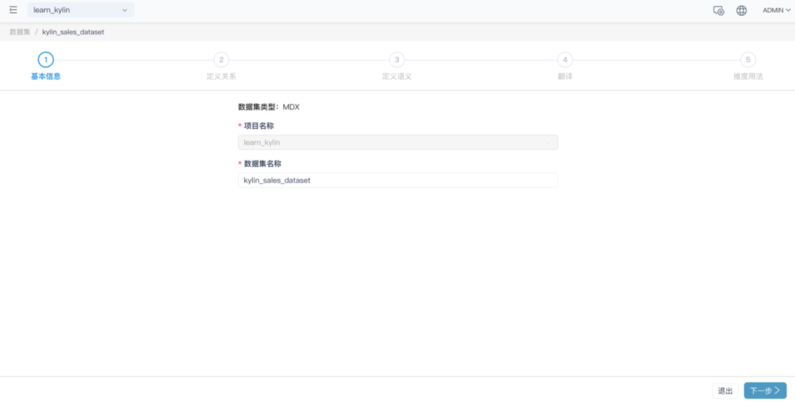

## 填写基本信息

此处将以产品自带的样例数据为例，介绍数据集的创建过程。

打开产品的 Web UI，点击数据集菜单，即可打开数据集列表

点击 **+ 数据集** 按钮，即可新增数据集。我们创建一个新的数据集，命名为 *kylin_sales_dataset* 。

接着，您将进入数据集设计向导。在设计界面的上方，您可以看到当前所在的步骤。

您可以在此处填写数据集的名称。

### 下一步

[定义关系](s2_relationship.cn.md)
