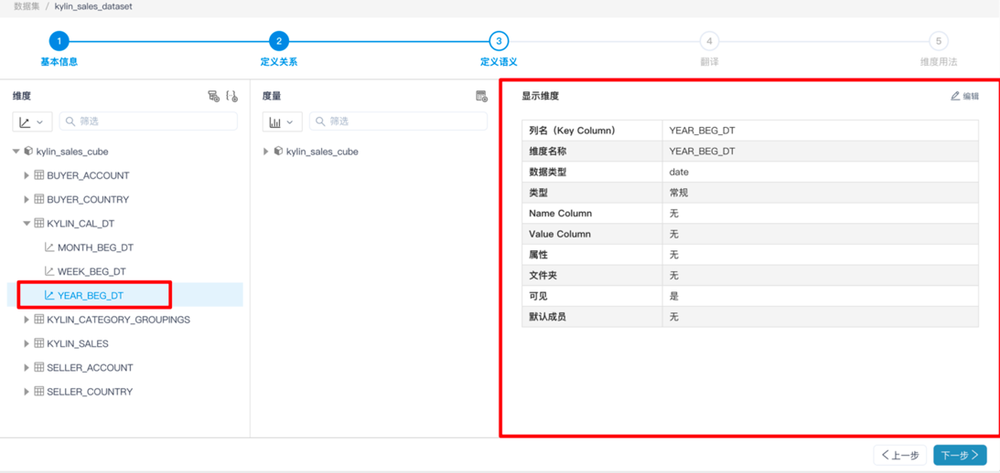
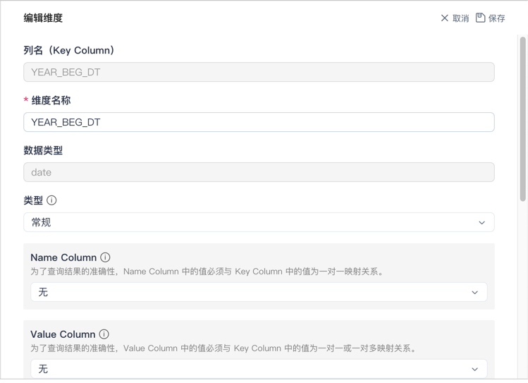
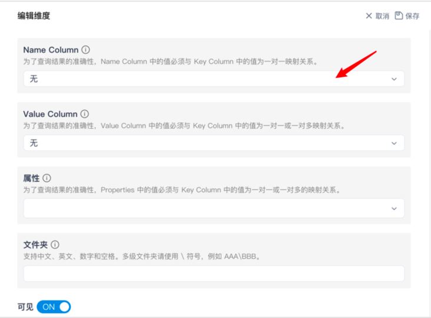
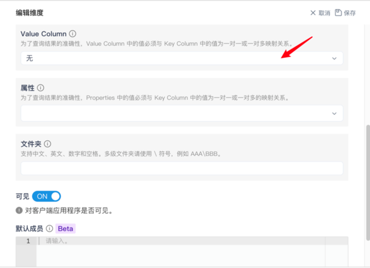
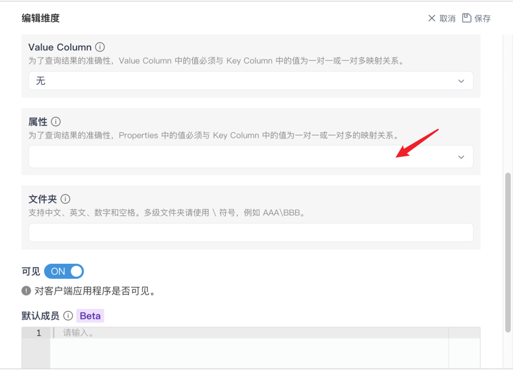
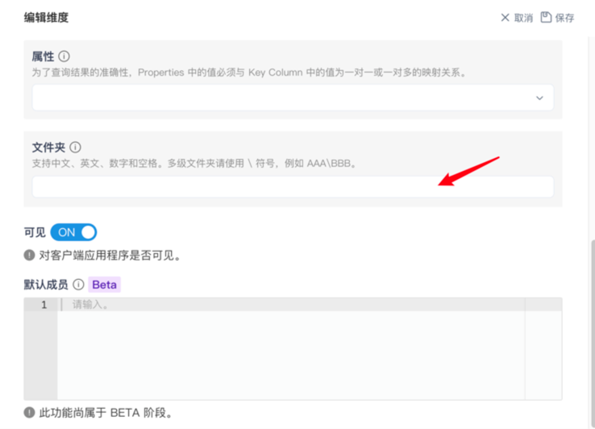
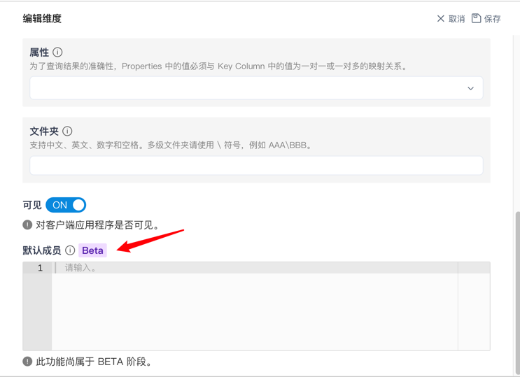
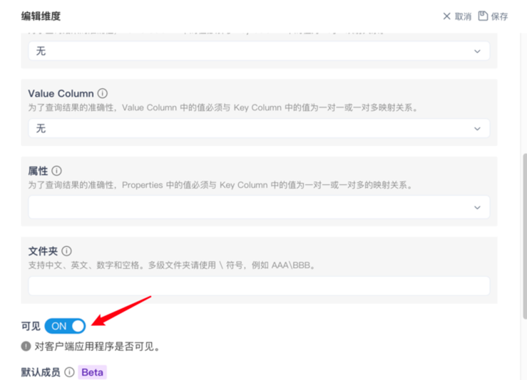

## 查看及编辑维度

点击 **维度名称** ，您可以查看维度的属性。

### 维度属性介绍

MDX 系统提供了一些维度的属性设置选项，用于控制这些维度的表现。下面的表格列出了每个属性的含义。

> 注意：为了确保查询性能，请在 Kylin 创建聚合组时，把作为维度属性的维度加入聚合组。例如 Name Column、属性等。

| 维度属性 | 描述                                   |
| -------------- | ------------------------------------------------------------ |
| Key Column     | 此维度对应的列，不可更改。                                   |
| 维度名称 | 维度的显示名称。 |
| 数据类型 | 维度对应的数据类型，不可更改。 |
| 类型         | 维度的属性。将维度设置为对应的时间属性后，可以用于时间相关的计算。例如计算 YTD，YOY 等。 |
| Name Column    | Name Column 指定了在分析时展示的值。设置 Name Column 能提高客户端中分析展示的友好性。 举例，将维度 Datekey （***20120101***）的 Name Column 设置为维度 Date_name（***2012 年 1 月 1 日***）。在使用维度 Datekey 分析时，报表中展示的值为 ***2012 年 1 月 1 日***。 Name Column 中的值必须仅与一个 Key Column 中的值对应，否则会引起 MDX 计算错误。 |
| Value Column   | 定义了 Value Column 后，可以在计算度量的表达式中使用 MemberValue 来返回指定的列。 对于日期相关的维度，可以将 Value Column 设置为日期类型的字段，便可以在客户端利用日期筛选器进行过滤，例如筛选**去年**、**上周**等。 注意：为了查询结果的准确性，Value Column 中的值必须与 Key Column 中的值为一对一或一对多映射关系。 |
| 属性       | 设置了一个或多个维度为属性后，可以在 MDX 表达式中引用显示属性关系。 注意：为了查询结果的准确性，属性中的值必须与 Key Column 中的值为一对一或一对多映射关系。 |
| 所属文件夹     | 用于定义维度所属的文件夹。 若您需要多级文件夹，请使用 \ 符号分隔。 例如，为一个维度的所属文件夹填写`文件夹1\文件夹2`，则此维度将会放置在**文件夹2**中，而**文件夹2**嵌套在**文件夹1**中。 |
| 可见 | 关闭可见后，所有用户都无法使用这个维度。 这个选项将会同步到权限列表中。 |
| 默认成员 | 使用表达式来指定此维度返回的默认单个成员。 此功能尚属于 BETA 阶段。 |

### 编辑维度

点击 **编辑** 按钮后，即可进入编辑页面，在该页面您可以更改维度名称、属性、Name Column 和 Value Column。

> 注意：维度中使用 Key Column, Name Column 和 Value Column 中的列仅支持 String, Int, Long, Double, Timestamp, Date, Boolean 类型

您可以在此处设置 Name Column。

> 注意：在 Name Column 为 none 时，使用 Name Column 相关的表达式时，会按照 Key Column 的内容处理；

您可以在此处设置 Value Column。

> 注意：在 Value Column 为 none 时，使用 Value Column 相关的表达式时，会按照 Name Column 的内容处理；

您可以在此处设置 Properties。

您可以在此处设置该维度所属的文件夹，若您需要多级文件夹，请使用 \ 分隔。

> 注意：多级文件夹仅在 Excel 中生效。

其次您也可以设置该度量的默认成员

> 注意：该功能现处于 BETA 阶段，现在仅能将默认成员设置该维度的一个成员，例如 [Dates].[Year].&[2019]

### 默认成员行为说明

1. 当层级中某个维度设置了默认成员，那么将层级放入在筛选器或者切片器时，默认值不会是默认成员。另外，将层级放入行列中时，将会进行默认成员的筛选。

2. 当没有勾选任何默认成员的维度时，其他维度的展示将会受默认成员的筛选。

**已知限制**: 

- 将设置了默认成员的维度放入透视表的筛选器后，筛选器界面上筛选状态为单选默认成员，但是下拉列表中将展示为全选。

- 若设置的默认成员不存在，可以正常保存，最终在 Excel 中等同于未设置默认成员。

最后，您可以设置维度在客户端应用中是否可见。

### 下一步

[查看及编辑度量](s3_3_measure.cn.md)
