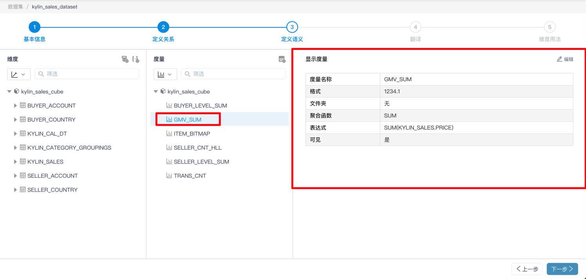
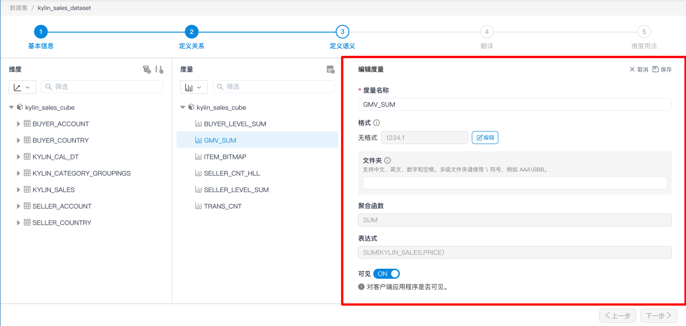
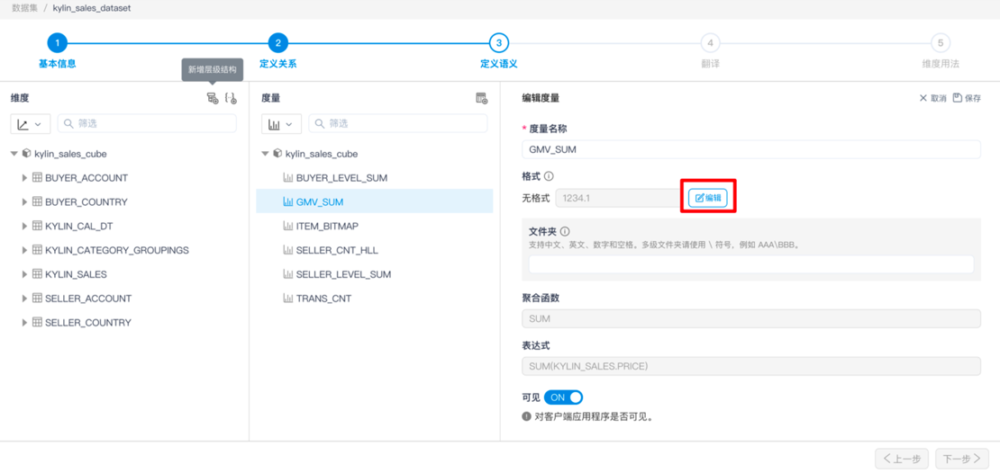
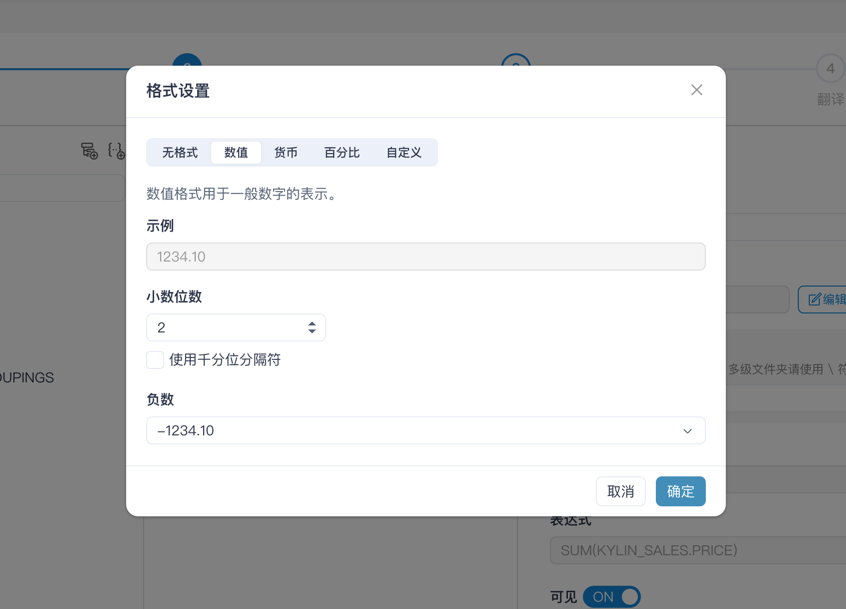
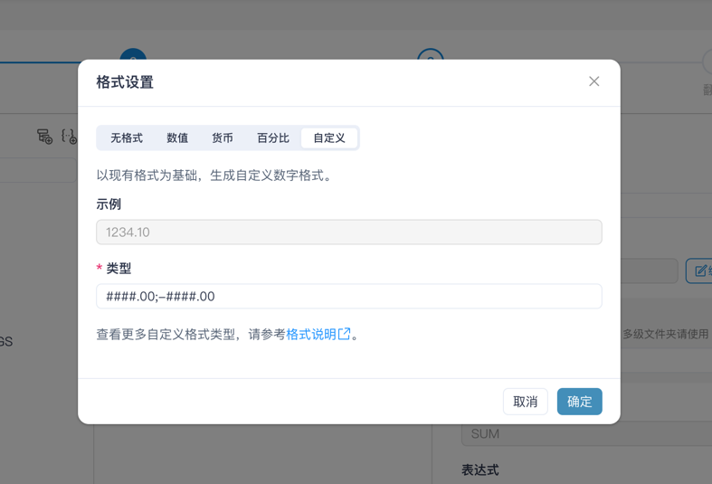
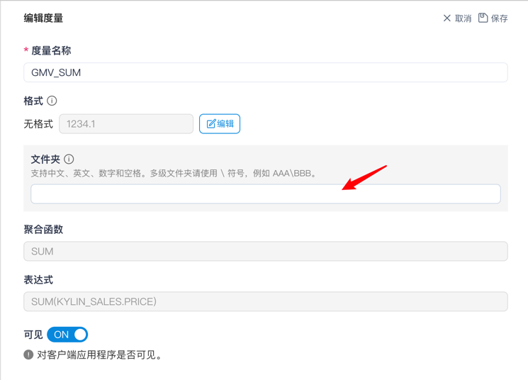
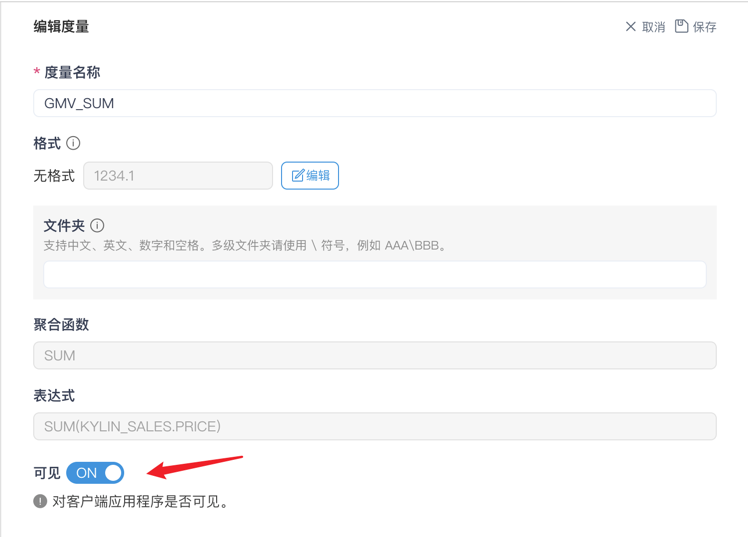

## 查看及编辑度量

点击 **度量名称** ，您可以查看度量的属性。

点击 **编辑** 按钮后，即可进入编辑页面，在该页面您可以更改度量名称、度量格式、设置文件夹和全局是否可见。

> 注意：
> 1. 现在 MDX 仅支持 Kylin 中的 SUM、MIN、MAX、COUNT、COUNT_DISTINCT 度量。
> 2. 现在仅支持  Kylin 中度量的返回类型为 String, Int, Long, Double。
> 3. 度量格式是为了提高度量值的可读性，您可以为任何度量指定需要的格式，系统支持选择和配置预定义格式，如：数值、货币、百分比，也支持利用格式字符配置自定义格式。查看[预定义度量格式和度量格式字符](/appendix/formatstring.cn.md)。

您可以在此处设置度量的度量格式：

**【打开度量设置页面】**

**【预定义格式 - 数值】**

**【自定义格式】**

您可以在此处设置度量所属的文件夹，若您需要多级文件夹，请使用 `\` 分隔。

> 注意：多级文件夹仅在 Excel 中生效。

同时，您可以设置度量在客户端应用中是否可见。

### 下一步

[新增、查看及编辑层级结构](s3_4_hierarchy.cn.md)

