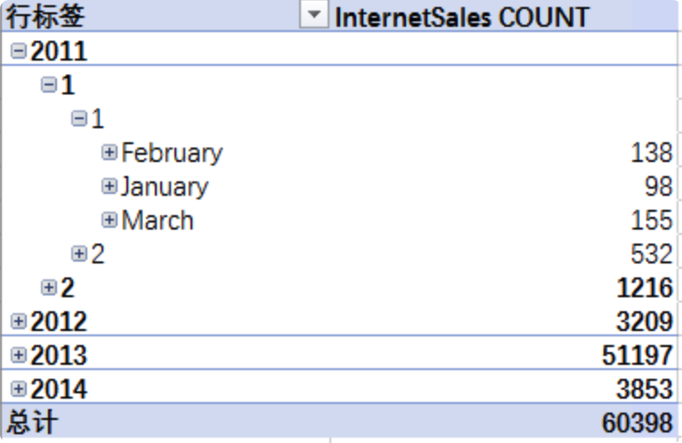
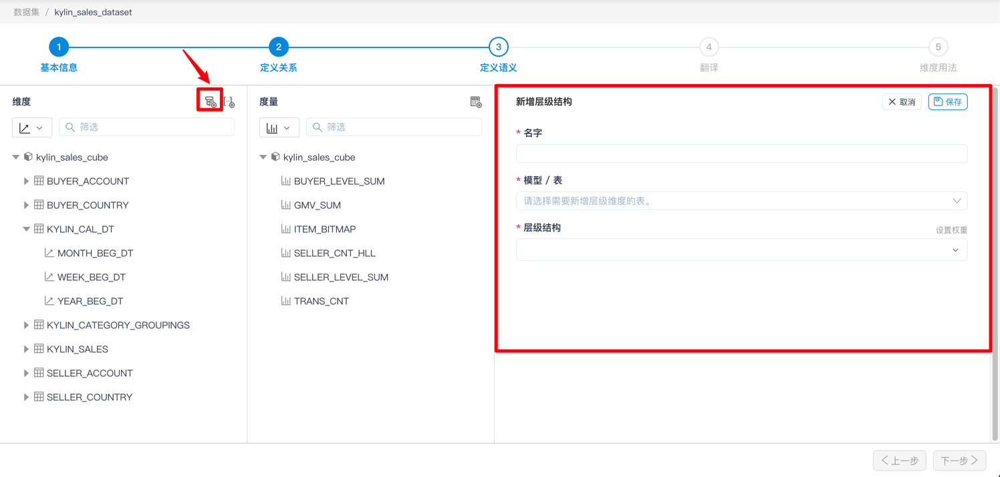
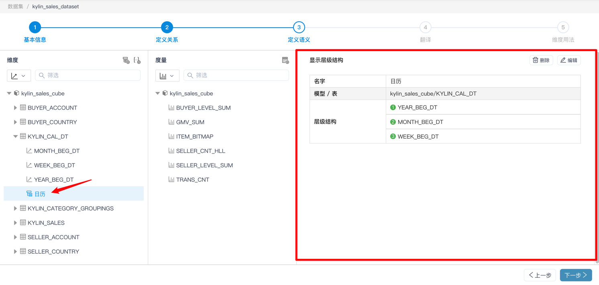
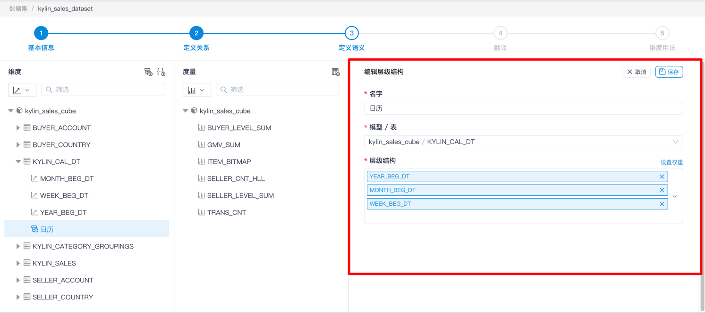
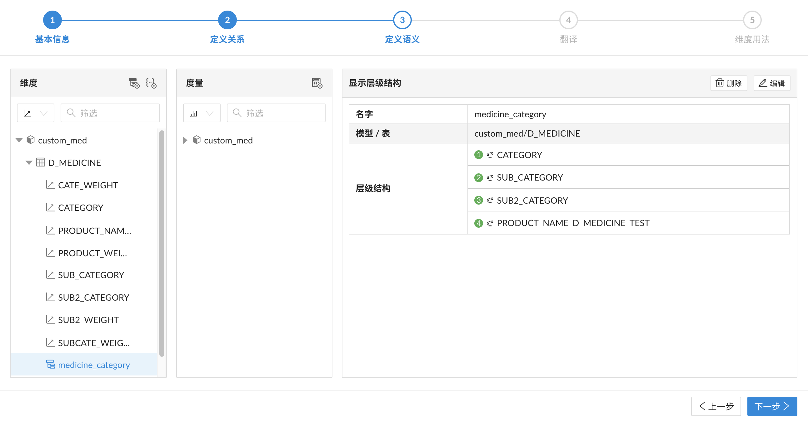
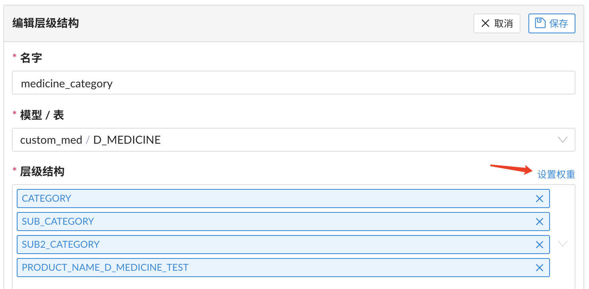
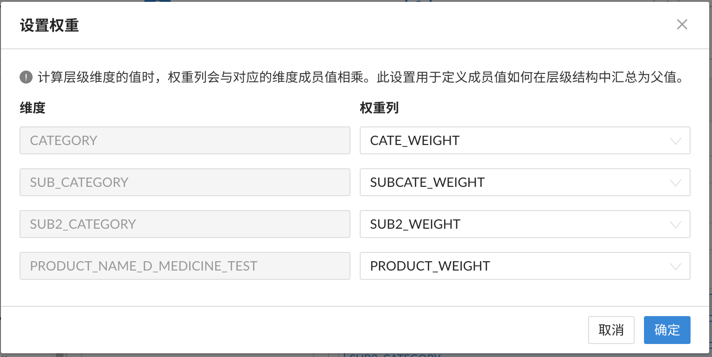

## 层级结构

你可以在 MDX for Kylin 中创建层级结构。层级结构是基于维度的级别集合，可用于提高数据分析人员的分析能力。 

例如，你可以创建一个时间层级结构，包含了年、季、月、周和日级别。这样分析人员在客户端中可以先逐年分析销售额，在需要时可以分别展开“季度 > 月 > 周 > 日”来进行更细粒度的分析。

### 新增、查看及编辑层级结构

点击 **+层级结构** 按钮，即可进入新增层级结构页面。

> 提示：
>
> 1. 不可创建跨维度表的层级结构
> 2. 在层级结构中添加维度时，请按照从粗到细的颗粒度来进行选择

点击 **层级结构名称** ，您可以查看层级结构的属性。

点击 **编辑** 按钮后，即可进入编辑页面，在该页面您可以编辑层级结构。

### 设置权重

根据不同的业务分析需求，用户可能需要在层级结构中设置自定义上卷，即指定汇总成员值的方式。 在层级结构中，您可以对指定的层级指定（权重）字段。每当计算父级成员的值时，该权重字段就会与子级成员相乘。 

权重字段一般为包含 -1 到 1 的值，例如 -1，-0.25、0、0.25、0.5、0.75、1 等值。 正数表示将值累加到父级，负数表示减去相应值，0 表示此子级不应用到父级。 用户可以对几乎所有层级结构使用自定义上卷。

下面用一个药房的例子来介绍这个功能。假设有一个药房的交易数据模型如下：

* 事实表 F_TRANS

| TRANS_ID | PRODUCT_NAME         | PRICE |
| -------- | -------------------- | ----- |
| 001      | polyenes             | 33    |
| 002      | 5-HTP                | 84    |
| 003      | Evening Primrose Oil | 53    |
| ...      | ...                  | ...   |

* 维度表 D_MEDICINE 包含以下维度：
   * CATEGORY：类别
   * SUB_CATEGORY：子类别
   * SUB2_CATEGORY：次级类别
   * PRODUCT_NAME：药品名称
   * 及以上维度对应的权重列，一共 4 个

   

配置要求：

> 请将配置 `insight.kylin.only.normal.dim.enable` 设置为 `false`。

步骤 1：新建 MDX 数据集，并在维度表中创建层级结构如下。

步骤 2：在编辑层级结构时，点击设置权重的按钮，进入权重设置的弹窗界面。

弹窗内容如下，用户可以对每一个层级设置权重列。设置结束后，点击确定提交。

步骤 3：保存此数据集的改动后，连接 Excel 进行分析。在透视表中放置层级结构和度量 SUM(PRICE)，并展开层级结构，即可根据权重字段的值来进行自定义上卷计算。

#### 已知限制

1. 仅支持聚合方式为 SUM 的度量与设置了权重字段的层级结构进行自定义的上卷计算。
2. 若需要筛选设置了权重字段的层级结构，可以在行标签或者列标签上进行筛选。若将此层级结构放入筛选器中，筛选的结果可能会不准确。
3. 对于时间类型的维度表，考虑到时间智能类的分析与自定义的上卷计算可能会冲突，用户暂时无法在时间类型的维度表定义的层级结构上设置权重字段。
4. 若在模型中，设置了权重字段的层级结构所在的维度表通过多个主键与事实表多对多连接，分析结果可能不准确。
5. 若在同一个维度表中，存在多个层级结构，且引用了相同的权重字段。在报表中添加了多个这样的层级结构时，查询结果可能不准确。

### 下一步

[新增、查看及编辑命名集](s3_5_namedset.cn.md)
