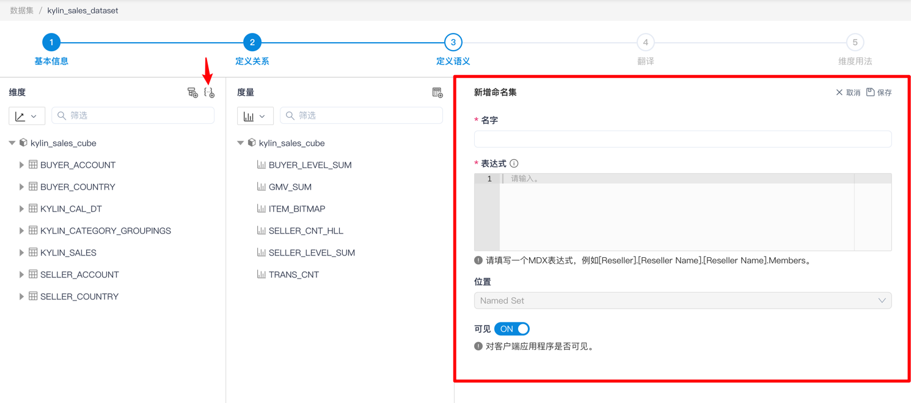
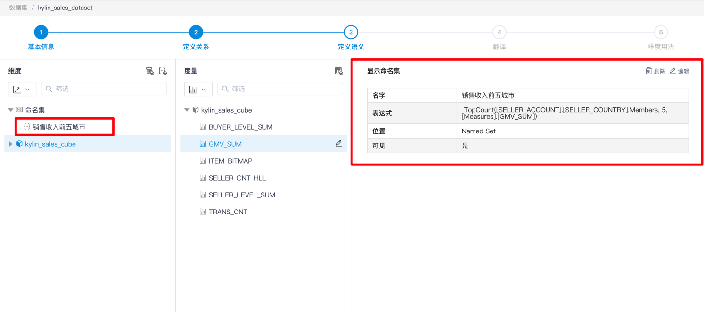
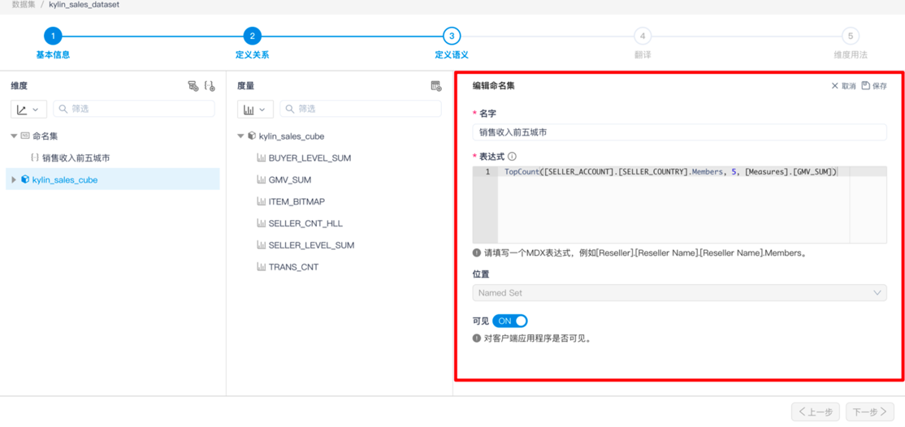
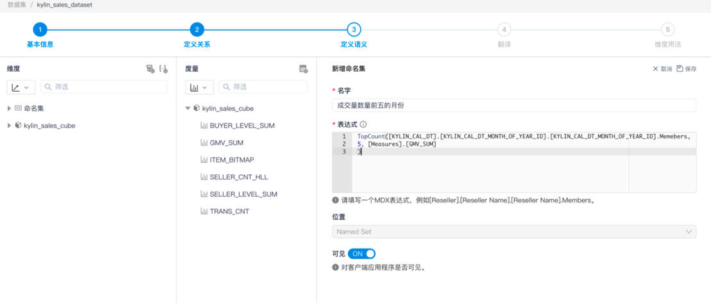
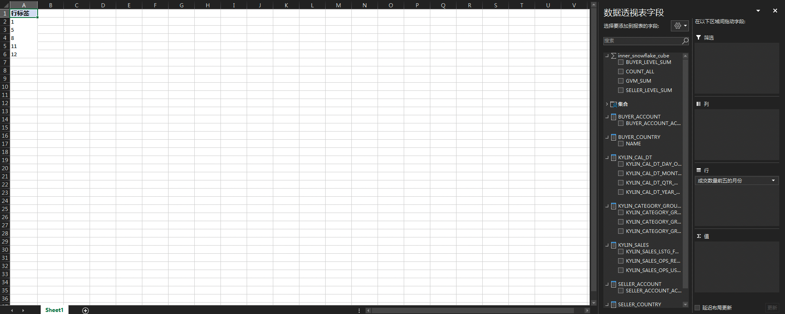
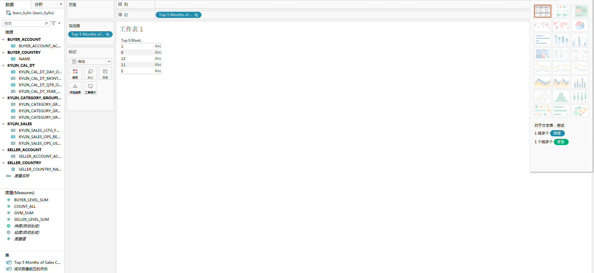

## 新增、查看及编辑命名集

### 介绍

在 MDX for Kylin 的使用中，经常会出现需要重复使用一组成员的需求，这种需求可以通过定义命名集来满足。命名集（NamedSet） 是根据指定的表达式
计算得到的一个成员Set，即一组成员的集合，命名集可以直接置于轴上用于展示，也可以在计算度量或其他命名集的表达式中使用。

### 备注

1. 目前命名集功能支持的 BI 工具包括 Excel 和 Tableau。

2. 目前仅支持成员Set，即一组成员的集合，不支持 Tuple Set，即一组 Tuple 的集合（每个 Tuple 由若干属于不同维度的成员组成）。

3. 命名集中的所有成员必须属于同一层级维度。

### 操作步骤

点击 **+命名集** 按钮，即可进入新增命名集页面。

点击 **命名集名称** ，您可以查看命名集的相关设置。

点击 **编辑** 按钮后，即可进入编辑页面，在该页面您可以编辑命名集。命名集的表达式支持 MDX 语言；命名集的所属位置
指示该命名集在 Excel 中将会出现在"数据透视表字段"列表的何处；命名集的可见性开关控制该命名集在 BI 工具中是否可见。

### 示例

1. 在一个数据集中新建命名集，其表达式与上述操作步骤中的"销售收入前五城市"命名集。

2. 在 Excel 中将新建的命名集置于行轴上，展示效果如下：

3. 在 Tableau 中将新建的命名集置于行轴上，展示效果如下：

### 下一步

[新增、查看及编辑计算度量](s3_6_calculated_measure.cn.md)

