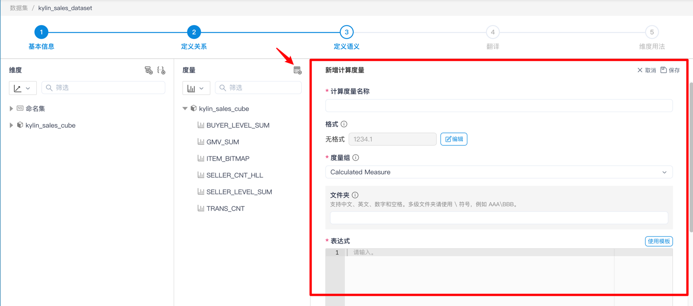
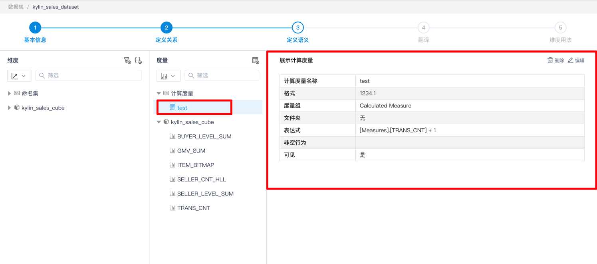
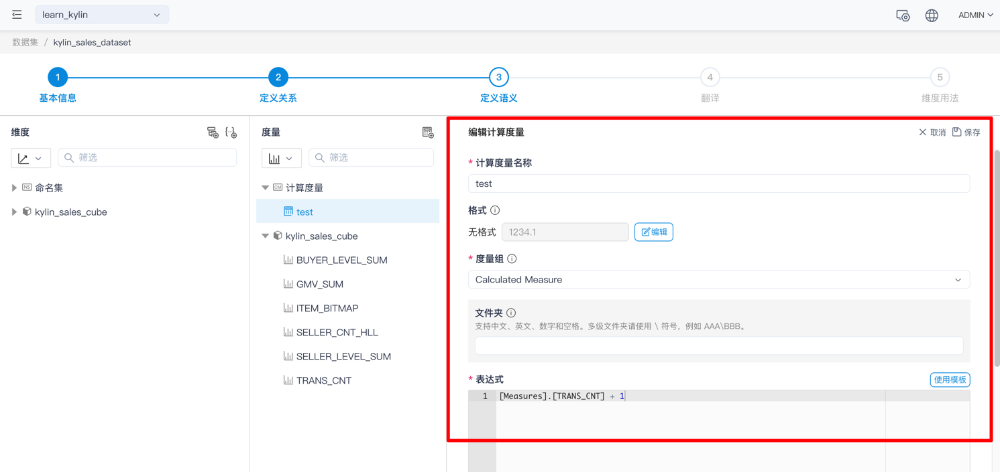
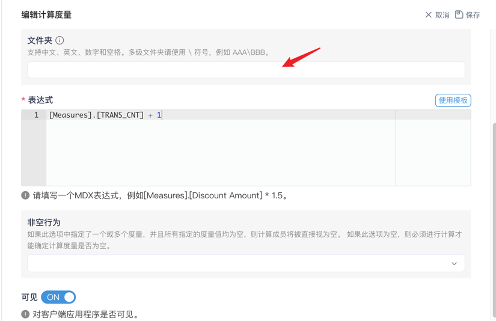
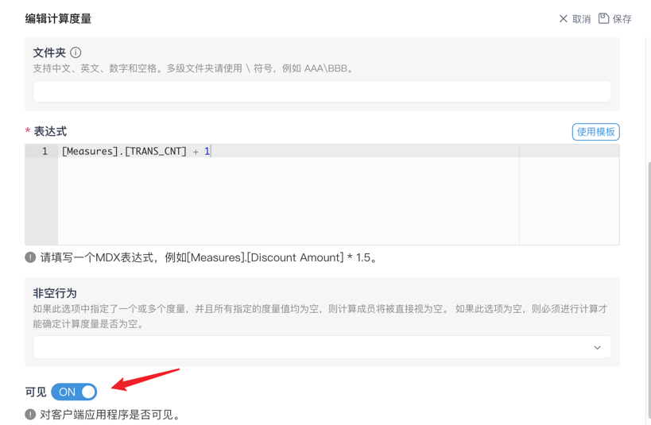

## 新增、查看及编辑计算度量

点击 **+计算度量** 按钮，即可进入新增计算度量页面。

> 提示：
>
> 1. 在此页面你可以设置计算度量的格式，格式处的下拉框既可以下拉选择，也可以人工填写
> 2. 表达式处需要填写 **MDX** 的查询语句

点击 **计算度量名称** ，您可以查看计算度量的属性。

点击 **编辑** 按钮后，即可进入编辑页面，在该页面您可以编辑计算度量。

您可以在此处设置该计算度量所属的文件夹，若您需要多级文件夹，请使用 \ 分隔。

> 注意：多级文件夹仅在 Excel 中生效。

同时，您可以设置计算度量在客户端应用中是否可见。

### 下一步

[定义翻译](s4_translate.cn.md)
