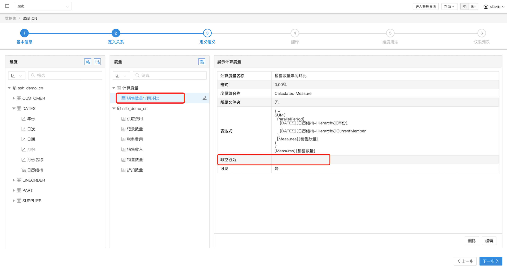
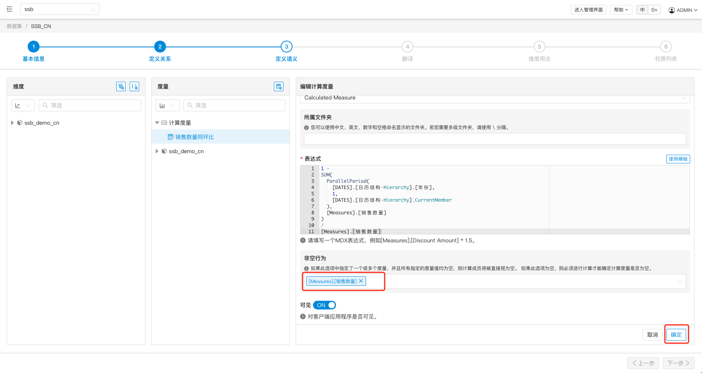
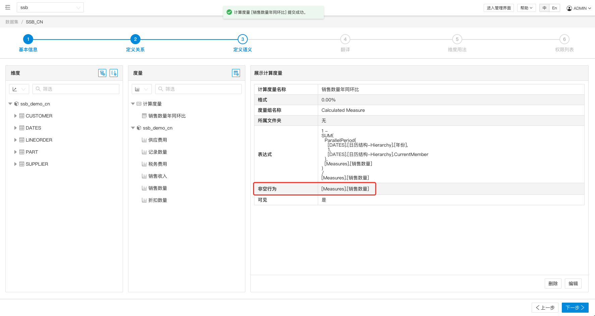

## 非空行为
非空行为是一组用于解析 MDX 中非空查询的基础度量的名称集合。当此选项为空时，必须对计算度量进行计算以确定度量值。但如果此属性包含一个或多个基础度量的名称，并且在某个单元格上所有指定的基础度量值均为空，那么该单元格的计算度量值将被直接视为空，跳过计算步骤。

### 为什么要设置非空行为？
非空行为是一个由用户指定的优化行为，使用该功能可提高包含计算度量的 NON EMPTY 查询性能。

### 如何设置非空行为？
给对应的计算度量设置非空行为，需要执行以下三步：

1. 在定义语义界面中，先找到对应的计算度量，点击编辑。

1. 然后在计算度量表单下面，找到非空行为选择框，选择可能为空的一个或多个基本度量。

1. 点击确定，保存该计算度量，可以在阅览界面中看到非空行为中有了选择的基本度量，最后保存数据集。

### 设置须知
- 目前为使单元格计算取得最佳性能，应尽可能只选一个成员，推荐不超过五个。
- 当 Kylin 模型发生变更后，在数据集中非空行为引用的基础度量若被删除，该数据集依旧可以连接，但数据集的状态会变成错误状态。该计算度量依旧可以正常使用，但被删除的基础度量不会产生任何影响。(当前版本进入数据集后，暂不会显式提示变更基础度量的计算度量。未来版本中将会有报错提示。)
