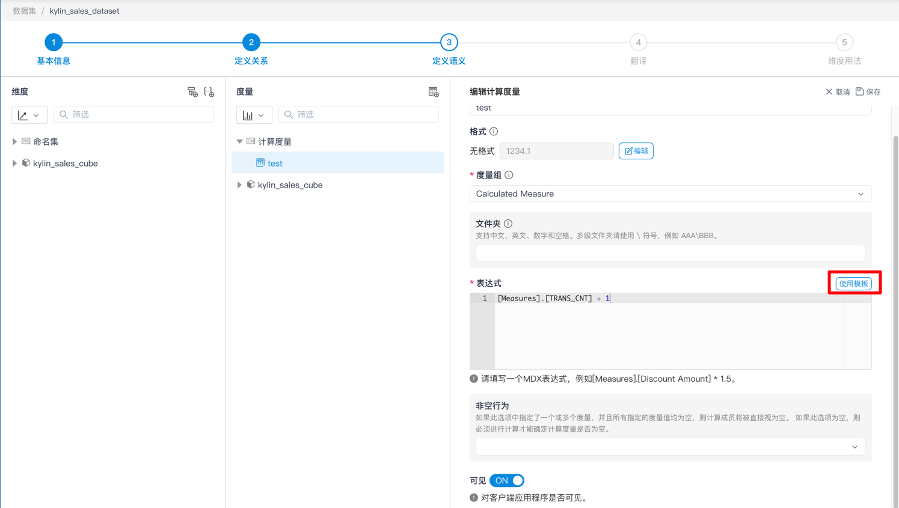
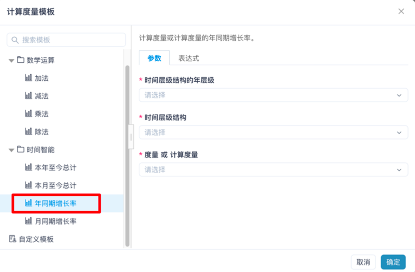
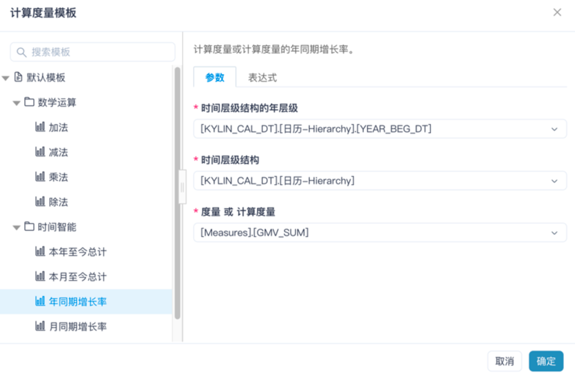
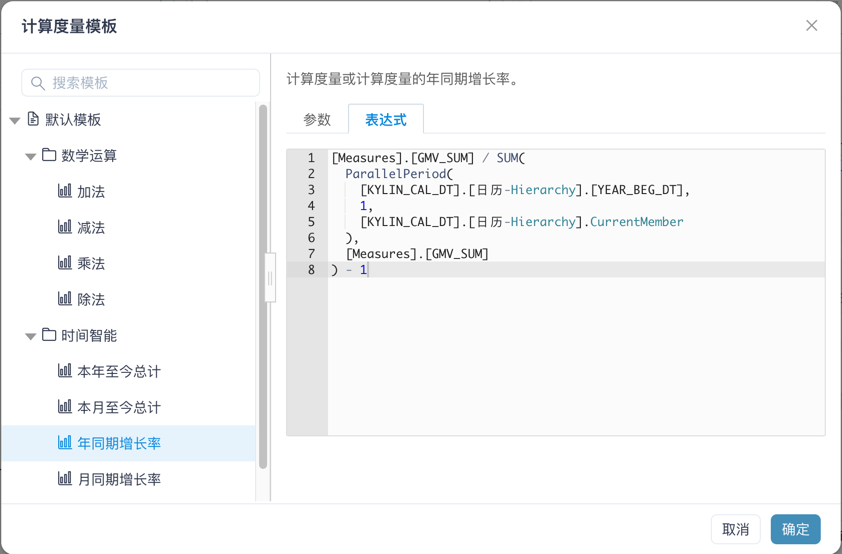
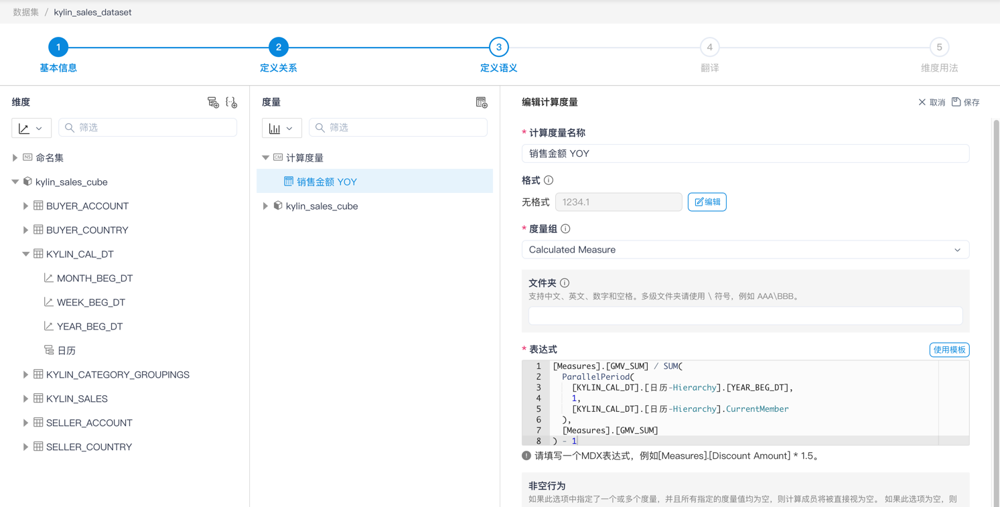
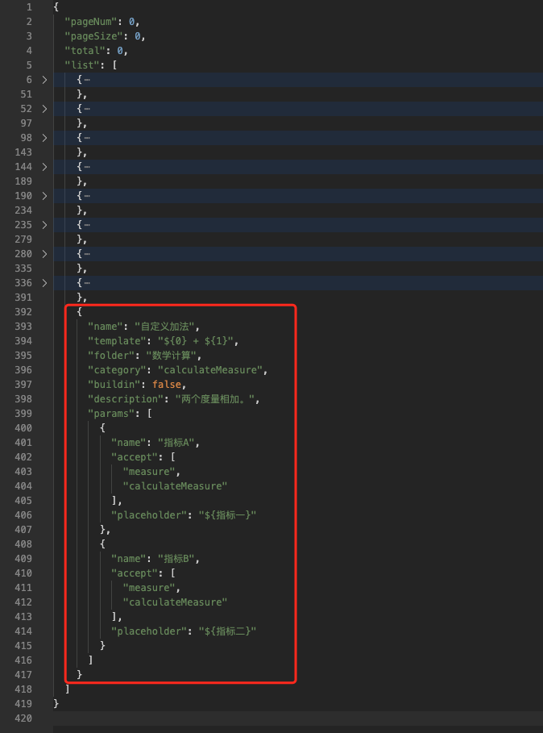
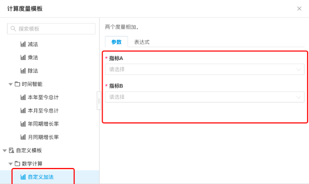

## 使用模板
使用模板就是指在编辑计算度量的时候，用户可以套用计算度量的模板，来快速生成复杂难写的表达式。
MDX系统在出厂时预定义了一些模板，用户也可以自定义一些常用的模板。

### 使用模板的目的
- 降低编辑计算度量的复杂度：让不会编写计算度量表达式、不熟悉MDX查询语法的用户也能定义出想要的计算度量。
- 降低表达式的编写错误：由于MDX语言体系较为复杂，撰写表达式难免容易写错。所以套用预先定义好正确的表达式模板，会减少计算度量定义错误的发生概率。
- 提高编辑计算度量的效率：用户可以预先定义好模板，减少重复编写相似且复杂的表达式，方便用户快速创建更多的常用计算度量。
- 快速浏览常用的模板指标：每个计算度量模板的描述都可以用户定义，且支持自定义翻译。用户仅需在列表中点选查看，就能明白其含义。

### 使用模板的方法
1. 打开`计算度量`编辑界面，点击表达式右边**使用模板**按钮。

1. 出现`计算度量模板`弹框，选择一个想要的模板。

1. 在`参数`标签页上，选取所有**必填**的`指标参数`。

1. [可选]点击`表达式`标签页，查看表达式最终结果。

1. 点击`确定`按钮，自动填入表达式。


### 出厂预定义的模板
MDX系统在出厂时内置了一套模板。他们分别是：
```
├── 默认模板
│
│ ├── 数学运算
│ │ ├── 加法：计算两个值之和。
│ │ ├── 减法：计算两个值之间的差值。
│ │ ├── 乘法：计算两个值的乘积。
│ │ ├── 除法：计算一个值与另一个值的比率。
│ │
│ ├── 时间智能
│ │ ├── 本年至今总计：计算从今年开始的度量或计算度量的总和。
│ │ ├── 本月至今总计：计算从本月开始的度量或计算度量的总和。
│ │ ├── 年同期增长率：计算度量或计算度量的年同期增长率。
│ │ ├── 月同期增长率：计算度量或计算度量的月同期增长率。
```

### 添加自定义计算度量模板
MDX系统提供用户自定义计算度量模板，该功能需要通过修改软件包中的配置文件`indicators.json`来实现。

在`insight.properties`同级目录下的`indicators.json`文件中，定义了一个JSON结构，往配置文件的`list`属性末尾添加计算度量模板JSON结构即可。

#### 快速上手自定义模板
如图是在`indicators.json`中，增加一个`自定义加法`模板的例子。


不需重启MDX，可以立即在弹框中看到定义后的模板

<br />
<br />

<details>
  <summary>样例代码，点击此处展开</summary>

  <p>注: `template`中的`${0}`代表指标A，`${1}`是指标B。</p>
  <code style="white-space: pre; display: block; padding: 20px;">{
  "name": "自定义加法",
  "template": "${0} + ${1}",
  "folder": "数学计算",
  "category": "calculateMeasure",
  "buildin": false,
  "description": "两个度量相加。",
  "params": [
    {
      "name": "指标A",
      "accept": [
        "measure",
        "calculateMeasure"
      ],
      "placeholder": "${指标一}"
    },
    {
      "name": "指标B",
      "accept": [
        "measure",
        "calculateMeasure"
      ],
      "placeholder": "${指标二}"
    }
  ]
}</code>
</details>

#### 计算度量模板JSON详解
添加模板时，需要注意每个计算度量模板JSON都用逗号分割，最后一个JSON末尾不需要加逗号。

```json
{
  "pageNum": 0,
  "pageSize": 0,
  "total": 0,
  "list": [
    ... // 其他模板
    {
      "name": "Month-over-month Change", // 最后一个模板
      "template": "模板表达式",
      "buildin": true,
      "params": [...]
    }, // 1. 此处添加逗号分割
    {
      "name": "新模板的名称", // 2. 在这里添加自定义模板
      "template": "新模板的表达式",
      ...
    } // 3. 最后一个模板末尾不要留逗号
  ]
}
```

计算度量模板JSON是使用计算度量模板的基础，有了JSON才可以定义模板。模板具体的含义如下：

注：`[翻译]`代表此处可被`translation`字段翻译，如果没有定义`translation`，则不进行翻译。

```json
{
  "name": "模板的名称 [可翻译]",
  "template": "模板的表达式：\n代表换行，${N}代表第N个参数",
  "folder": "模板所属文件夹：可用'\\'进行分割，生成多层文件夹 [可翻译]",
  "category": "calculateMeasure", // 默认参数
  "buildin": false, // 代表是否内建模板
  "description": "模板的描述 [可翻译]",
  // 参数列表
  "params": [
    {
      "name": "参数的名称",
      "accept": [
        // 参数可支持的参数类型，可任意组合
        "column",
        "namedSet",
        "measure",
        "calculateMeasure"
        "hierarchy",
        "hierarchyLevel"
      ],
      "placeholder": "参数在表达式中占位符"
    }
  ],
  // 以上为[必填]数据，以下为[选填]数据
  // 翻译列表
  "translation": {
    // 中文翻译列表
    "zh": {
      "name": "模板的名称",
      "folder": "模板所属文件夹",
      "description": "模板的描述",
      "params.0.name": "参数的名称",
      "params.0.placeholder": "参数在表达式中占位符"
    },
    // 英文翻译列表
    "en": {
      "name": "Template's name",
      "folder": "Template's folder",
      "description": "Template's description",
      "params.0.name": "Parameter's name",
      "params.0.placeholder": "Parameter's placeholder"
    }
  }
}
```

### 未来拓展
在目前看来，用户添加自定义计算度量模板可能略微复杂和繁琐，需要一定的学习成本。不过这对MDX未来发展是友好的，因为系统可以直接集成各种多样化复杂场景、模板文案翻译等。未来还有可能支持计算度量模板UI界面，通过UI界面来设计计算度量模板等更具体验的功能。
