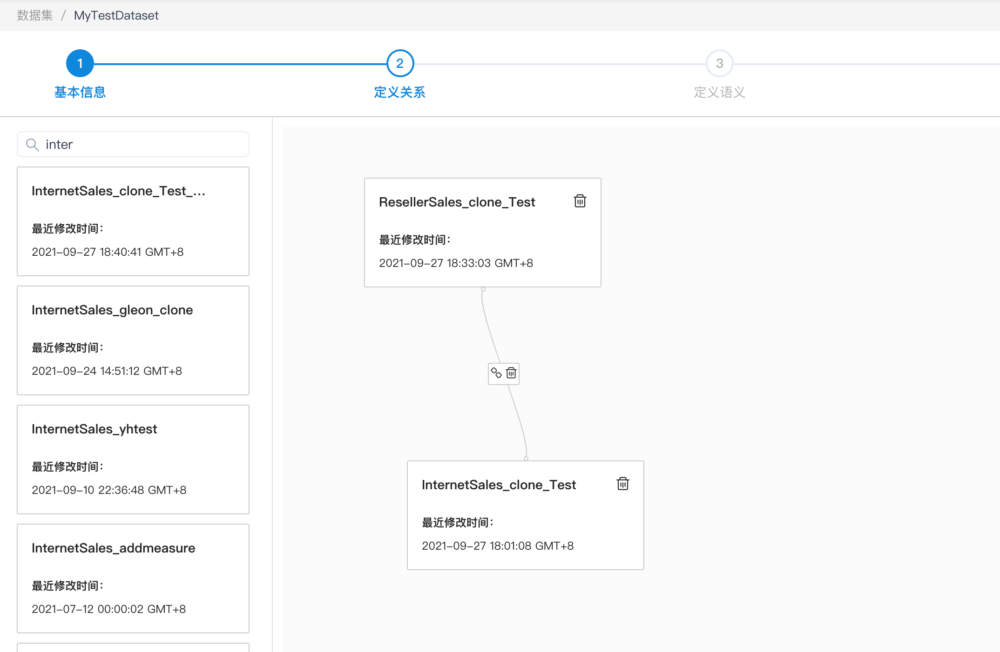
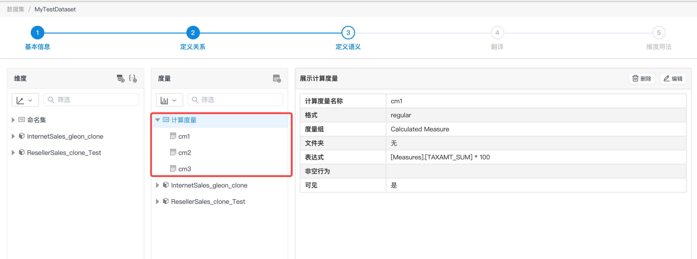
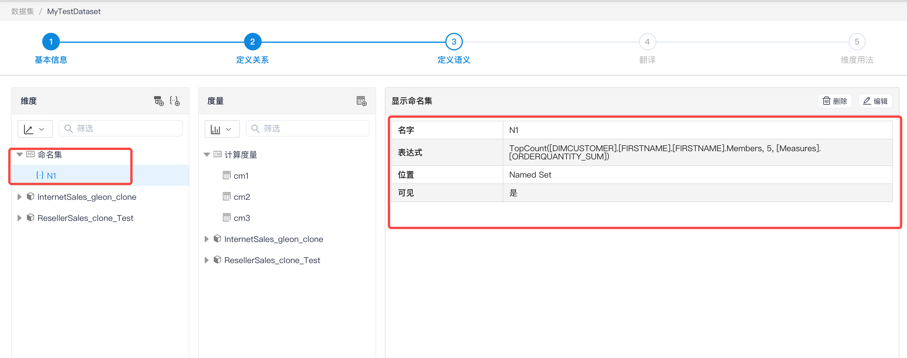
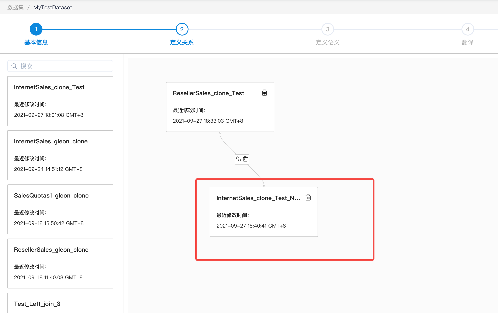
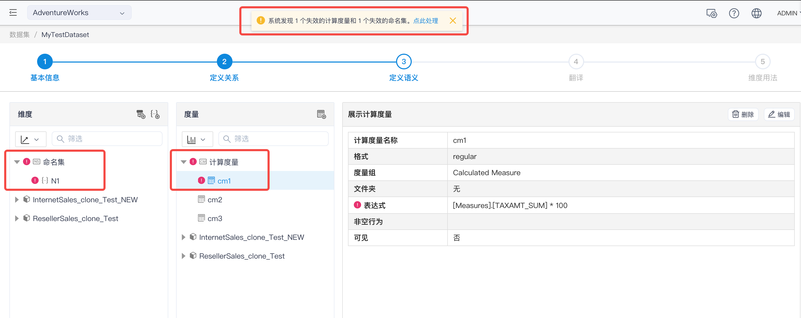
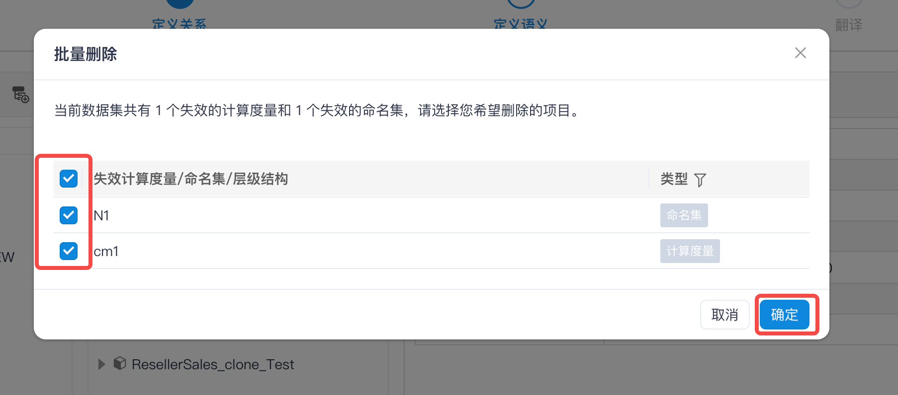
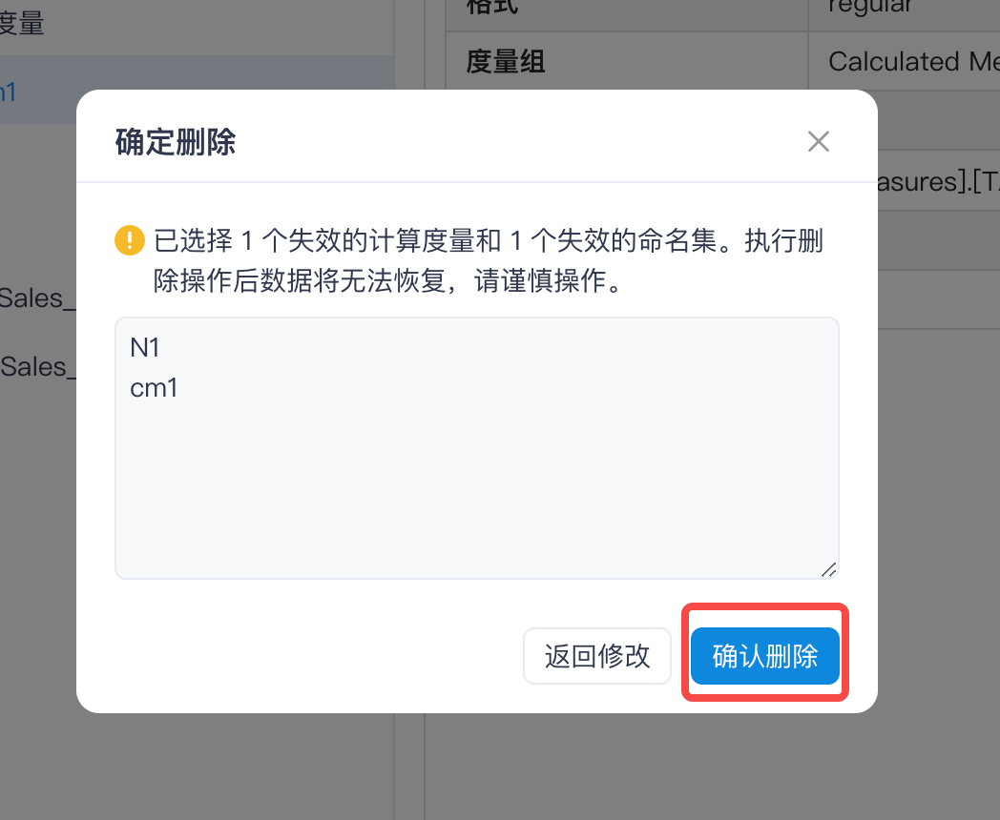
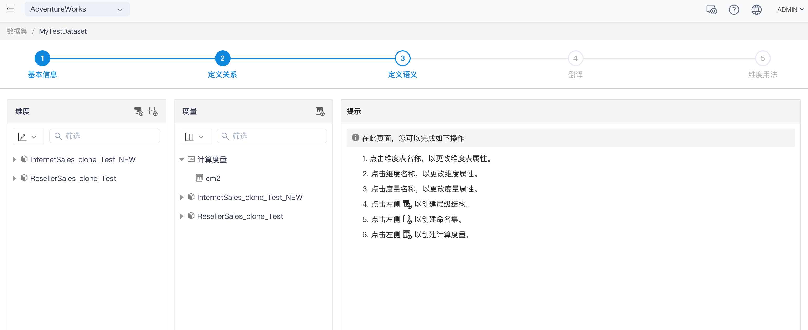
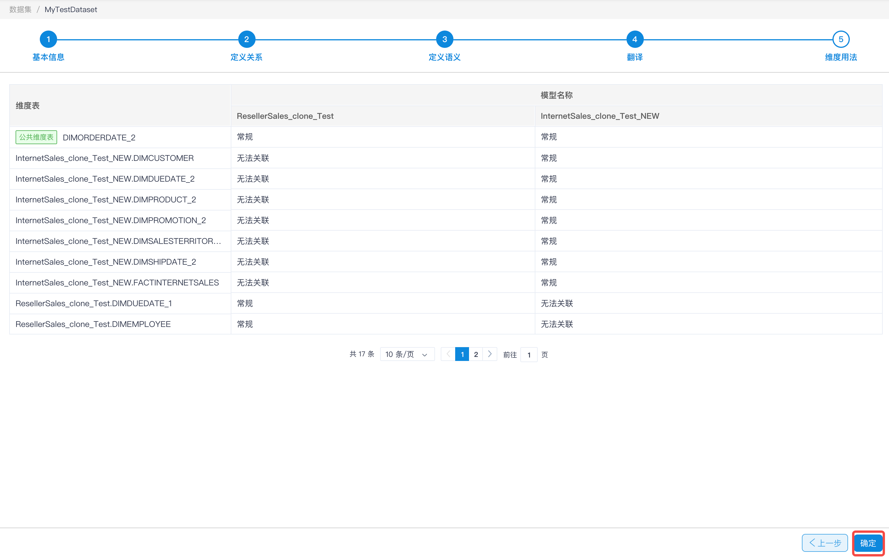

## 批量删除命名集/层级结构/计算度量

当发生数据集变更时，如：将某一个模型替换为另一个不同名称的新模型，此时如果数据集中的命名集/计算度量，有使用到被替换模型中的维度/度量/计算度量，则会造成数据集中出现失效的命名集/计算度量。又如：删除 Kylin 中模型的维度，则使用到该维度创建的层级结构都会失效。

在这种情况下，失效的命名集/层级结构/计算度量数量可能会非常多，可以使用批量删除操作来对失效内容进行删除。

下例会同时删除失效的命名集和计算度量

### 模型和数据集：

模型 **InternetSales_clone_Test **和模型 **ResellerSales_clone_Test **，组成数据集 **MyTestDataset **。其中含计算度量 cm1，使用模型 **InternetSales_clone_Test** 的度量、计算度量 cm2，使用模型 **ResellerSales_clone_Test **的度量、命名集 N1。

### 变更操作：

- 用模型 **InternetSales_clone_Test_NEW** 替换数据集中的模型 **InternetSales_clone_Test** 

  

  

### 计算度量和命名集失效：

计算度量 cm1 和命名集 N1失效：

### 批量删除操作：

点击上方的**点此处理**，在窗口中选择想要删除的计算度量和命名集，点击**确定**

再次确认删除

删除成功

保存数据集

