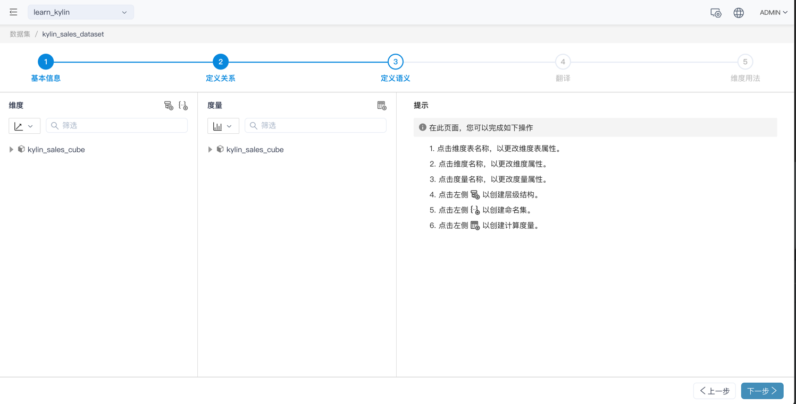

## 定义语义

点击下一步后，就进入了定义语义步骤，该页左侧显示了各个模型中的维度和度量

在该页面您可以完成如下操作：

- [查看及编辑维度表](s3_1_dimension_table.cn.md)
- [查看及编辑维度](s3_2_dimension.cn.md)
- [查看及编辑度量](s3_3_measure.cn.md)
- [新增、查看及编辑层级结构](s3_4_hierarchy.cn.md)
- [新增、查看及编辑命名集](s3_5_namedset.cn.md)
- [新增、查看及编辑计算度量](s3_6_calculated_measure.cn.md)

### 下一步

[查看及编辑维度表](s3_1_dimension_table.cn.md)

