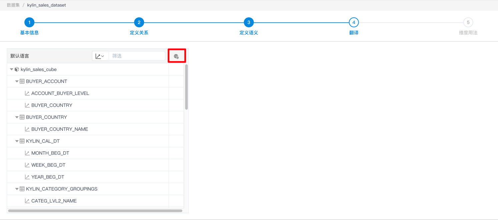
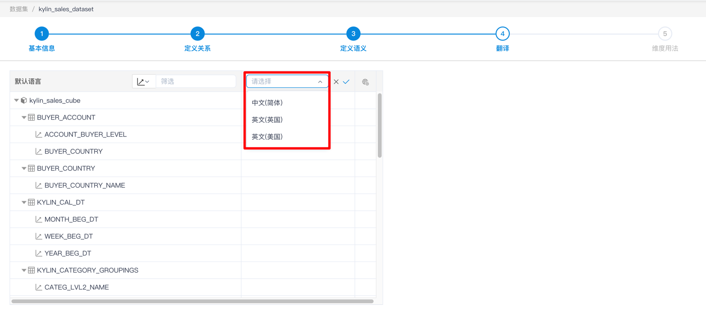
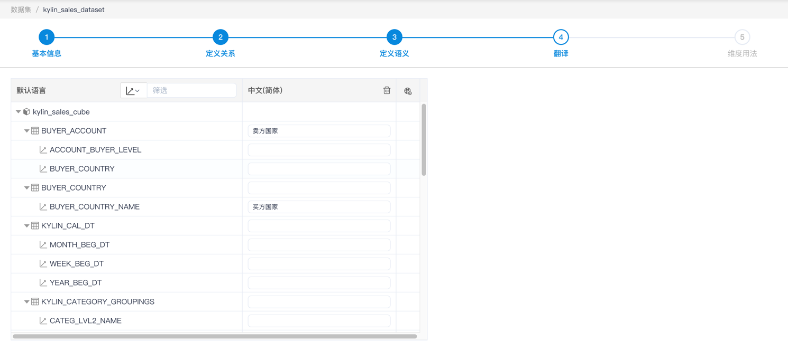
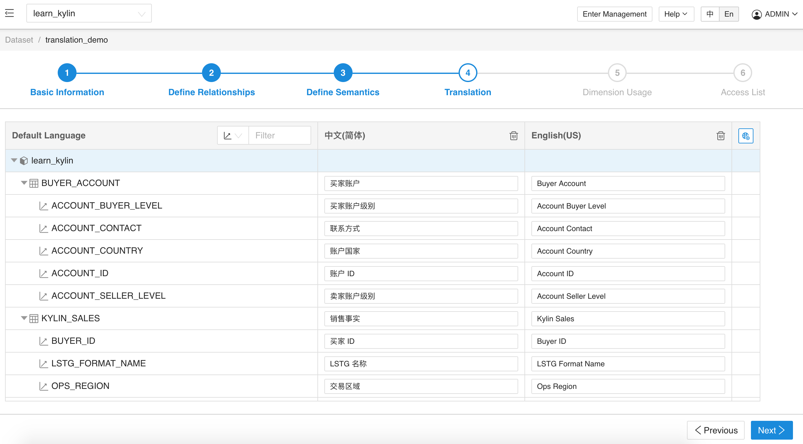
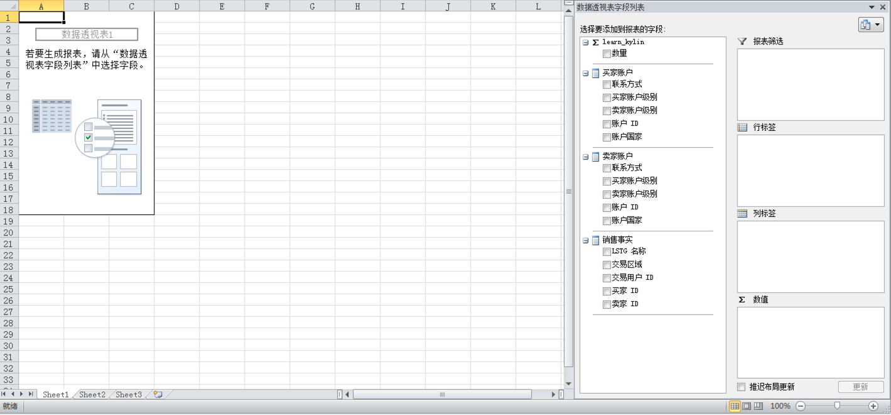
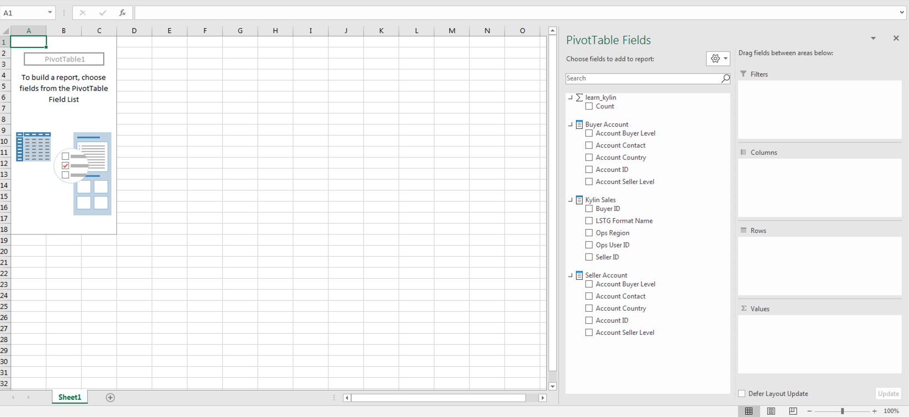

## 定义翻译

### 介绍

在 MDX for Kylin 中，您可以嵌入一个基于区域设置标识符 （LCID）来设置指定地域的信息来获取对应区域的语言设置，并展示对应数据集各项实体的名称

这项功能有助于国际化的团队分析同一份数据集，从而节省重复定义数据集的工作，同时也保证不同的团队使用的数据口径是统一的。

### 备注

1. 目前仅支持中国、美国、英国三种语言设置。
2. 目前可设置的实体为维表、维度、度量、计算度量和层级。如果某维度定义了翻译，那么包含该维度的层级也会使用翻译的名称。
3. 如果分析应用客户端使用的语言没有在数据集定义，那么数据集将采用默认语言。如果您使用是 Excel，不同语言设置的 Excel 将会使用不同的 LCID，如果您使用的是 Tableau，将会使用 Windows 系统的 LCID，您可以尝试更改 Windows 机器的语言设置来改变 LCID。
4. 在 MDX 表达式中引用维度，度量等实体时，请使用默认名称进行引用，而不要使用翻译的名称。

### 配置步骤

1. 点击添加翻译语言的按钮；

   

2. 在增加的一列中选择翻译对应的语言，并点击右侧的勾确定添加；

   

3. 在新增的翻译语言中根据需求，可以设置对应维表、维度、度量名称等的翻译。

   

### 使用示例

为一个数据集定义两种语言设置，包含中文和英文(美国)。

使用中文语言设置的 Excel 打开，展示如下：

使用英文语言设置的 Excel 打开，展示如下：

> 提示：可以在 Excel 中的 `选项` - `语言` 修改默认语言

### 下一步

[定义维度用法](s5_dimension_usage.cn.md)
