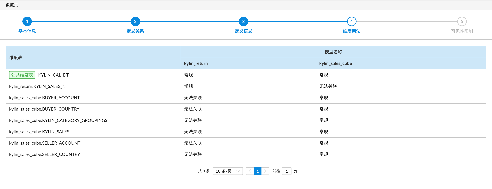
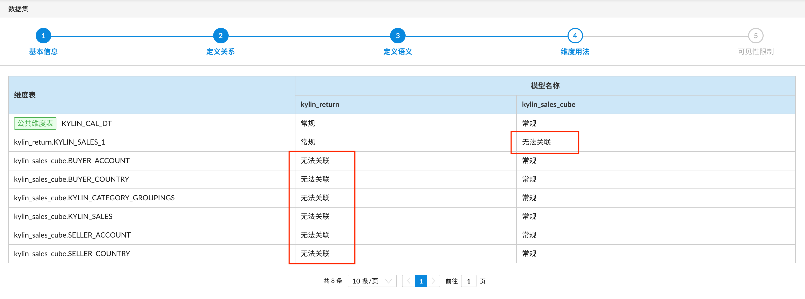
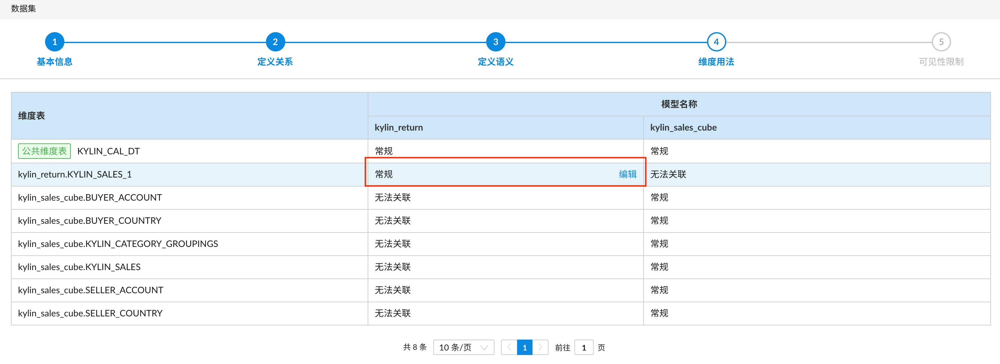
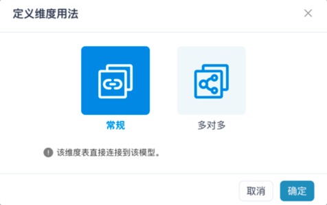

## 定义维度用法

该页面将会列出所有的维度表和模型，该页面用于查看和编辑各个模型中维度表和该模型中的度量值之间的维度关系。

若模型中不包含该维度表，系统将显示 **无法关联** 。

对于不是无法关联的关系，点击 **编辑** 按钮您可以编辑其关系类型。

可选择的维度用法共有两种：

1. 常规：表示该维度表直接连接到该模型的度量值。

2. 多对多：当前 Kylin 暂不支持多对多关系。

### 下一步

[保存](save.cn.md)
