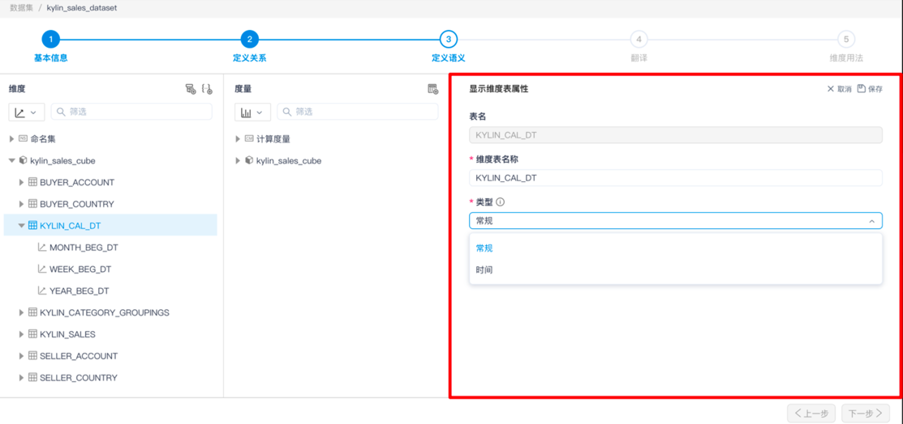
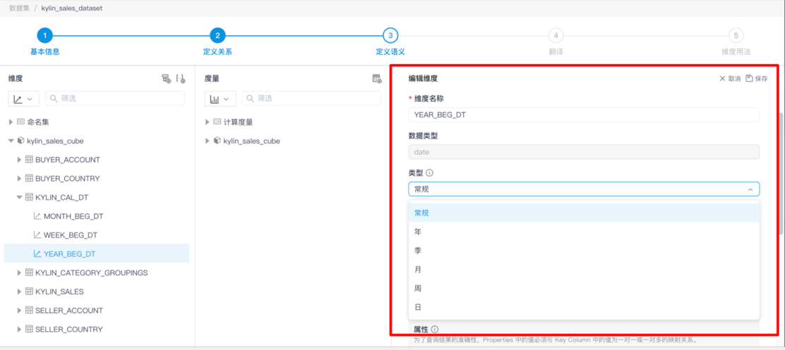

### YTD、QTD、MTD 使用说明

- 将时间维表定义为 time 类型。

  

- 创建一个包含年月日的 Hierarchy 命名为 `Date-Hierarchy`。**需要注意：**

  针对每个层级，依次设置相应的日期维度属性，例如对于层级中的 年 维度，需要设置此维度的属性为**年**。

  

- 创建 CM，格式如下:

  YTD : `SUM(YTD([DATE_DIM].[Date-Hierarchy].CurrentMember), [Measures].[XXX])`

  MTD : `SUM(MTD([DATE_DIM].[Date-Hierarchy].CurrentMember), [Measures].[XXX])`
