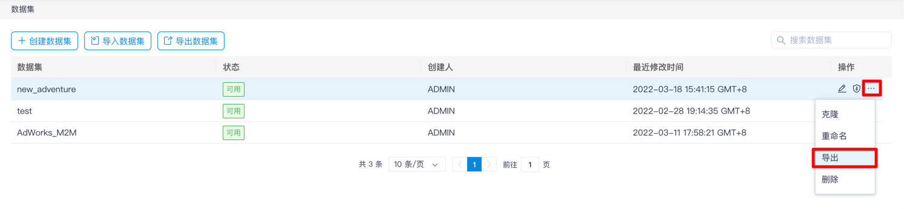
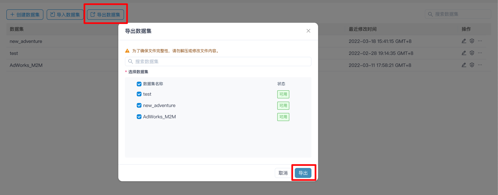
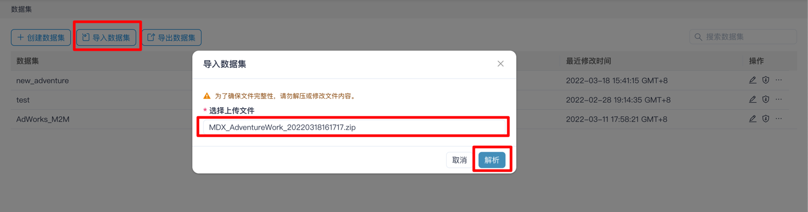
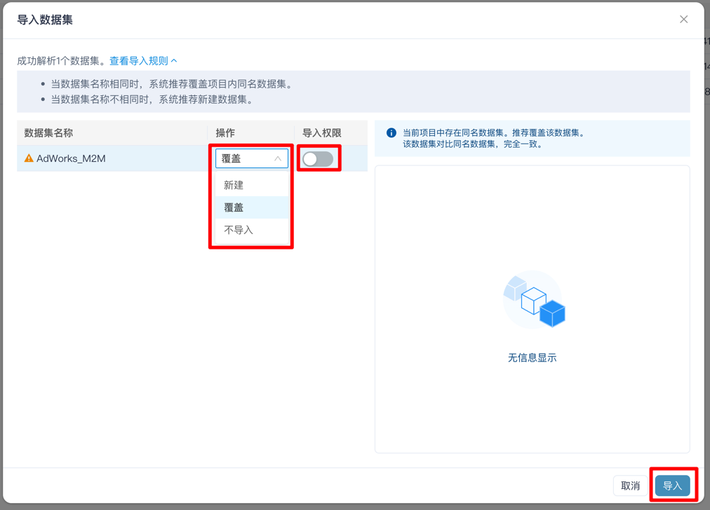
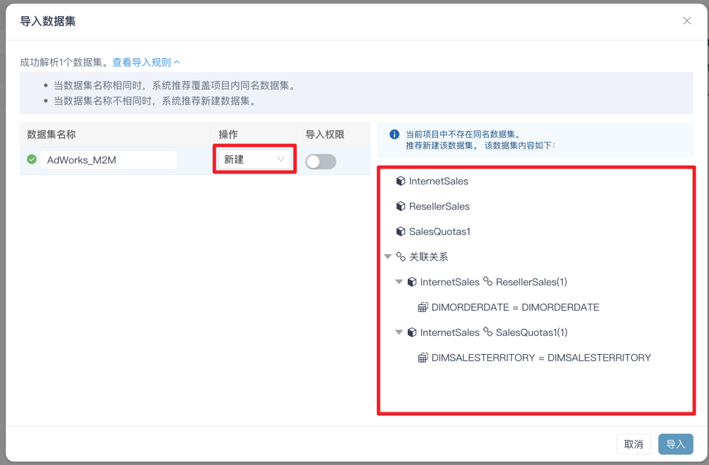
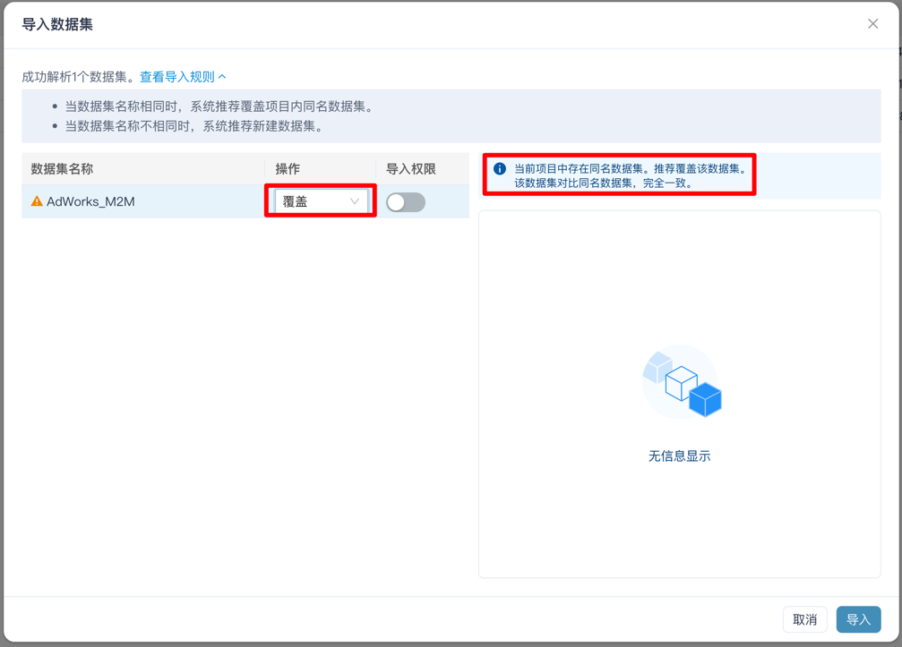
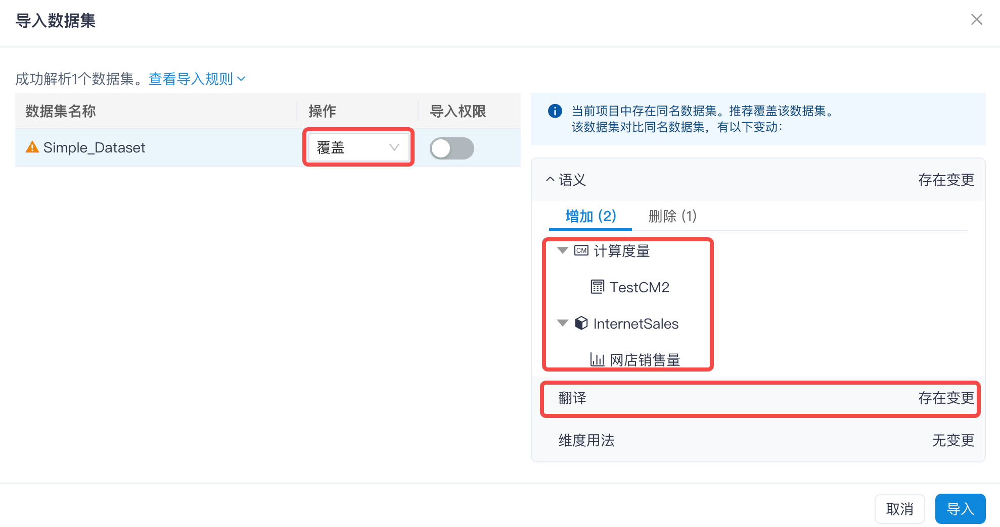
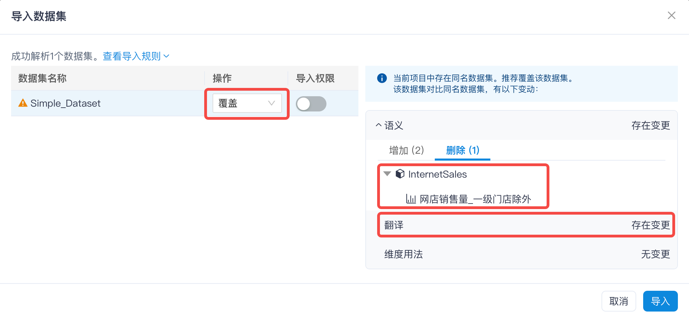
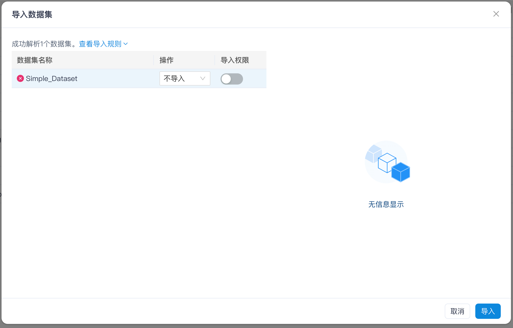

## 数据集导入导出

- [导出数据集](#导出数据集)

- [导入数据集](#导入数据集)

  

### 导出数据集

#### 导出单个数据集

进入数据集页面，在单个数据集的操作列中，点击 **省略号**->**导出**，即可导出该数据集对应的 ZIP 文件。

#### 导出多个数据集

进入数据集页面，点击**导出数据集**，在列表中勾选想要导出的数据集（可以先对数据集名称进行模糊搜索），点击**导出**，即可导出所有的数据集对应的 ZIP 文件。

### 导入数据集

进入数据集页面，点击**导入数据集**，选择数据集的 ZIP 文件，点击解析：

当解析成功之后，会弹出窗口，选择操作方式、是否导入权限，点击导入，完成导入。

### 关于新建/覆盖/不导入三种操作的说明

#### 新建

当目标项目中不存在和源数据集名称相同的数据集，则默认是新建操作，操作列的默认下拉选项是新建。

#### 覆盖

当目标项目中存在和源数据集名称相同的数据集，则默认是覆盖操作，操作列的默认下拉选项是覆盖。

#### 不导入

在任何情况下，用户可以选择不导入。

### 关于导入时数据集的信息显示

系统会根据不同的操作，在右侧显示对应的信息。

#### 新建

显示新数据集中的模型名称、模型之间的关联关系：

#### 覆盖

##### 源数据集和目标数据集完全一致

两个数据集完全一致的定义：模型名称、模型之间的关联关系、命名集、计算度量、模型下的维表/维度/度量、翻译（精确到每一种翻译语言下，对每一个对象的翻译内容）和维度用法都一致。

##### 源数据集和目标数据集不完全一致

系统会显示源数据集相对目标数据集，增加的对象（如：模型、度量、计算度量），也会显示被删除的对象（如：模型、度量、计算度量）。另外，当翻译或维度用法有不一致时，系统会做文字提示，但不列出详细差异。

#### 不导入

### 备注

- 支持跨环境（如从开发环境向生产环境）和跨项目导出/导入数据集
- 支持导入老版本中导出的 JSON 数据集文件