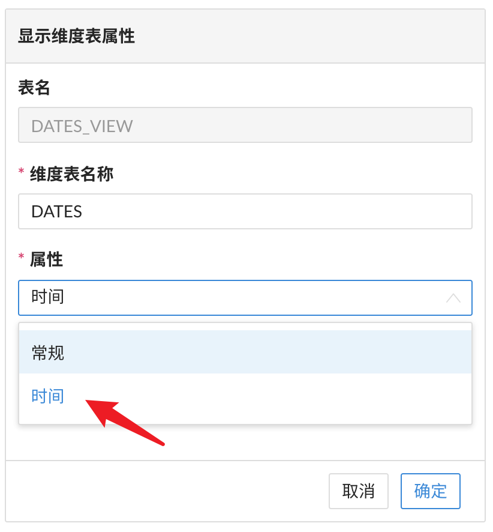

## MDX 函数列表

- [MDX 数据类型](#mdx-数据类型)
- [MDX 函数列表](#mdx-函数列表)
- [时间智能函数说明](#时间智能函数说明)

### MDX 数据类型

MDX 数据类型包含标量类型和非标量类型（元素类型），如下：

1. 标量类型

   * **Integer**，整数，表达式如 `1`，`3 * 7`，`CInt(1.2)`
   
   * **Numeric**，实数，表达式如 `1.0`，`2 + 3.5`，`SUM([Date].AllMembers, [Measures].[Count]) * 5`
   
   * **Boolean**，TRUE 或 FALSE，表达式如 `TRUE`，`"hello" <> "world"`，`SUM([Date].AllMembers, [Measures].[Count]) < 10`
   
   * **String**，字符串，表达式如 `"MDX Expression"`，`"hello" || "world"`
   
2. 非标量类型

   * **Member**，MDX成员，表达式如 `[Date].[Year].&[Y2019]`，`[Date].CurrentMember`
   
   * **Tuple**，MDX元组，由多个不同维度的 MDX 成员组合而成，表达式如 `([Date].[Year].&[Y2019]`，`[Country].CurrentMember)`
   
   * **Set**，MDX集合，MDX 成员的集合或者 MDX 元组的集合，表达式如 `[Date].AllMembers`，`CrossJoin([Date].Members, [Country].Members)`
   
   * **Dimension**，数据集中的维度表，如 `[Date]`，`[Country]`

   * **Hierarchy**，数据集中的层级，如 `[Date].[Time-Hierarchy]`
   
   * **Level**，数据集中的层级中某一级别，如 `[Date].[Time-Hierarchy].[Year]`，`[Date].[Time-Hierarchy].[Month]`
   
### MDX 函数列表

以下清单是当前版本中支持的 MDX 函数列表：

> 提示 :
>
> - 函数语法格式为 `<返回类型>: <MDX 表达式>
>
> - [ ,<MDX表达式>...] 表示包含0个或多个相同类型的 MDX 表达式，以逗号分隔

| 函数名称          | 描述与使用                                                   |
| :----------------- | :------------------------------------------------------------ |
| ()                | 构造一个元组。 `<Tuple>`:(`<Member>`[,`<Member>`...])  ([Date].[Day].&[1917-02-09],[Product].[Color].&[Blue]) |
| {}                | 构造一个集合。 `<Set>`:{`<Member>`[,`<Member>`...]}`<Set>`:{`<Tuple>`[,`<Tuple>`...]}  示例1：{[Customer].[BirthDate].&[1917-02-09]} 示例2：{[Customer].[BirthDate].[BirthDate].Members} 示例3：{([Customer].[BirthDate].&[1917-02-09],[Product].[Color].&[Blue])} |
| *                 | 两个数字相乘。 `<Numeric>`:`<Numeric>` `*` `<Numeric>`  [Measures].[Count]*5 |
| *                 | 返回两组的叉积，等同于CrossJoin。 `<Set>`:`<Set>` `*` `<Set>` `<Set>`:`<Member>` `*` `<Set>` `<Set>`:`<Set>` `*` `<Member>` `<Set>`:`<Member>` `*` `<Member>`  示例1：{[Customer].[BirthDate].[BirthDate].Members}`*`{[Customer]. [Education].[Education].Members} 示例2：{[Customer].[BirthDate].&[1917-02-19]}`*`{[Customer].[Education].[Education].Members} 示例3：{[Customer].[BirthDate].[BirthDate].Members}`*`{[Customer].[Education].&[Bachelors]} 示例4：{[Customer].[BirthDate].&[1917-02-19]}`*`{[Customer]. [Education].&[Bachelors]} |
| +                 | 两个数字相加。 `<Numeric>`:`<Numeric>`+`<Numeric>`  [Measures].[Count]+2 |
| -                 | 两个数字相减。 `<Numeric>`:`<Numeric>`-`<Numeric>`  [Measures].[Count]-2 |
| -                 | 返回数字的负值。 `<Numeric>`:-`<NumericExpression>`  -[Measures].[Count] |
| /                 | 两个数字相除。 `<Numeric>`:`<Numeric>`/`<Numeric>`  示例1：2/1 示例2：[Measures].[Count]/5 |
| <                 | 返回表达式是否小于另一个表达式。 `<Boolean>`:`<Numeric>`<`<Numeric>` `<Boolean>`:`<String>`<`<String>`  示例1：[Measures].[A]<[Measures].[B] 示例2：'kylin'<'kylingence' |
| <=                | 返回表达式是否小于或等于另一个表达式。 `<Boolean>`:`<Numeric>`<=`<Numeric>` `<Boolean>`:`<String>`<=`<String>`  示例1：[Measures].[A]<=10000 示例2：'kylin'<='kylingence' |
| <>                | 返回两个表达式是否不相等 `<Boolean>`:`<Numeric>`<>`<Numeric>` `<Boolean>`:`<String>`<>`<String>`  示例1：[Measures].[A]<=10000 示例2：'kylin'<='kylingence' |
| =                 | 返回两个表达式是否相等。 `<Boolean>`:`<Numeric>`=`<Numeric>` `<Boolean>`:`<String>`=`<String>`  示例1：1=2 示例2：'kylin'='kylingence' |
| >                 | 返回表达式是否大于另一个表达式。 `<Boolean>`:`<Numeric>`>`<Numeric>`  1>2 |
| >=                | 返回表达式是否大于或等于另一个表达式。 `<Boolean>`:`<Numeric>`>=`<Numeric>`  1>=2 |
| AND               | 返回两个逻辑表达式的与值。 `<Boolean>`:`<Boolean>`AND`<Boolean>`  ([Measures].[Count]>10000)AND(1=2) |
| Abs               | 返回数字的绝对值 `<Numeric>`:Abs(`<Numeric>`)  Abs(200.1-300) |
| Acos              | 返回数字的反余弦。 `<Numeric>`:Acos(`<Numeric>`)  Acos(0.540302)+acos(-1.000000) |
| Acosh             | 返回数字的反双曲余弦值。 `<Numeric>`:Acosh(`<Numeric>`)  Acosh(1)+Acosh(10) |
| Aggregate         | 根据查询的上下文，聚合MDX集合的值。 `<Numeric>`:Aggregate(`<Set>`) `<Numeric>`:Aggregate(`<Set>`,`<Numeric>`)  示例1：Aggregate({[Date].[CalendarYear].[2014], [Date].[CalendarYear].[2013]}) 示例2：Aggregate({[Date].[CalendarYear].[2014], [Date].[CalendarYear].[2013]},[Measures].[Count]) |
| AllMembers        | 返回包含指定维度的所有成员（包括计算成员）的集合。 `<Set>`:`<Dimension>`.AllMembers `<Set>`:`<Hierarchy>`.AllMembers `<Set>`:`<Level>`.AllMembers  示例1：[Date].[CalendarSemester].[CalendarSemester].Allmembers 示例2：[InternetDueDate].[DueFiscalDate-Hierarchy].Allmembers 示例3：[InternetDueDate].[DueFiscalDate-Hierarchy].[FiscalYear]. Allmembers |
| Asc               | 返回字符串中第一个字符的Ascii码。 `<Integer>`:Asc(`<String>`)  Asc("kylingence") |
| AscB              | 别名Asc函数。 `<Integer>`:AscB(`<String>`)  AscB("kylingence") |
| AscW              | 别名Asc函数。 `<Integer>`:AscW(`<String>`)  AscW("kylingence") |
| Ascendants        | 返回指定成员的祖先成员集合。 `<Set>`:Ascendants(`<Member>`)  Ascendants([Date].[DueFiscalDate-Hierarchy].[FiscalYear].&[2013].&[1]. &[1]) |
| Asin              | 返回数字的反正弦。 `<Numeric>`:Asin(`<Numeric>`)  Asin(-0.5) |
| Asinh             | 返回数字的反双曲正弦值。 `<Numeric>`:Asinh(`<Numeric>`)  Asinh(-5) |
| Atan2             | 返回指定的x坐标和y坐标的反正切。 `<Numeric>`:Atan2(`<Numeric>`,`<Numeric>`)  Atan2(-7,7) |
| Atanh             | 返回数字的反双曲正切值。 `<Numeric>`:Atanh(`<Numeric>`)  Atanh(0.76159416) |
| Atn               | 返回指定数字的反正切值。 `<Numeric>`:Atn(`<Numeric>`)  Atn(90) |
| Avg               | 返回在集合上计算的数值表达式的平均值。 `<Numeric>`:Avg(`<Set>`)`<Numeric>`Avg(`<Set>`,`<Numeric>`)  示例1：Avg({[Date].[CalendarQuarter].[CalendarQuarter].members}) 示例2：Avg({[Date].[CalendarQuarter].[CalendarQuarter].members}, [Measures].[Count]) |
| BottomPercent     | BottomPercent函数计算指定数值表达式对指定集求得的总和，并按升序对集进行排序。然后，该函数返回合计值累积百分比至少达到指定百分比的最小值元素。该函数返回累积合计至少达到指定百分比的最小子集。 `<Set>`:BottomPercent(`<Set>`,`<Numeric>`,`<Numeric>`)  BottomPercent({[Product].[Color].[Color].members},60,[Measures].[Count]) |
| BottomSum         | 对集合进行排序并返回其中累计总数至少为指定值的底部N个元素。 `<Set>`:BottomSum(`<Set>`,`<Numeric>`,`<Numeric>`)  BottomSum({[Product].[Color].[Color].members},5220,[Measures].[Count]) |
| CBool             | 返回已转换为子类型Boolean的Variant的表达式。 `<Boolean>`:CBool(`<Value>`)  CBool(100) |
| CDate             | 返回已转换为子类型DateTime的Variant的表达式。 `<DateTime>`:CDate(`<Value>`)  CDate("2020-07-2517:44:10") |
| CDbl              | 返回已转换为子类型Numeric的Variant的表达式。 `<Numeric>`:CDbl(`<Value>`)  CDbl(234.121231231) |
| CInt              | 返回已转换为子类型Integer的Variant的表达式。 `<Integer>`:CInt(`<Value>`)  CInt(234.121231231) |
| Cache             | 缓存MDX表达式结果 Cache(<`<Expression>`>)  Cache([Measures].[Count]) |
| Caption           | 返回标题。 `<String>`:`<Dimension>`.Caption `<String>`:`<Hierarchy>`.Caption `<String>`:`<Level>`.Caption `<String>`:`<Member>`.Caption  示例1：[Customer].[EmailAddress].Caption 示例2：[Date].[DueCalendarDate-Hierarchy].Caption 示例3：[Date].[DueCalendarDate-Hierarchy].[CalendarYear].Caption 示例4：[Product].[Class].&[M].caption |
| Cast              | 将值转换为另一种类型。 `<Type>`:Cast(`<Expression>`AS`<Type>`)  Cast(1+2ASSTRING) |
| Children          | 返回成员的子级。 `<Set>`:`<Member>`.Children  [Date].[DueCalendarDate-Hierarchy].[CalendarYear].&[2010].children |
| Chr               | 返回包含与指定字符代码关联的字符的字符串。 `<String>`:Chr(`<Integer>`)  chr(48) |
| ChrB              | 别名Chr函数 `<String>`:ChrB(`<Integer>`)  ChrB(48) |
| ChrW              | 别名Chr函数 `<String>`:ChrW(`<Integer>`)  ChrW(48) |
| ClosingPeriod     | 返回某个级别成员的最后一个后代。 `<Member>`:ClosingPeriod() `<Member>`:ClosingPeriod(`<Level>`) `<Member>`:ClosingPeriod(`<Level>`,`<Member>`) `<Member>`:ClosingPeriod(`<Member>`)  示例1：[Customer].[person-Hierarchy].[Education].closingperiod 示例2：ClosingPeriod([Date].[DueFiscalDate-Hierarchy].[FiscalYear]) 示例3：ClosingPeriod([Date].[DueFiscalDate-Hierarchy].[FiscalYear], [Date].[DueFiscalDate-Hierarchy].[FiscalYear].&[2010]) 示例4：ClosingPeriod([Date].[DueFiscalDate-Hierarchy].[FiscalYear].&[2010]) |
| CoalesceEmpty     | 将空单元格值合并为不同的值。 所有表达式必须是相同的类型（数字或字符串）。 CoalesceEmpty(`<ValueExpression>`[,`<ValueExpression>`...])  CoalesceEmpty(88) |
| Correlation       | 返回在集合上计算的两个序列的相关性。 `<Numeric>`:Correlation(`<Set>`,`<Numeric>`) `<Numeric>`:Correlation(`<Set>`,`<Numeric>`,`<Numeric>`)  示例1：Correlation({[Customer].[Education].&[Bachelors], [Customer].[Education].&[HighSchool]},[Measures].[Count]) 示例2：Correlation({[Customer].[Education].&[Bachelors], [Customer].[Education].&[HighSchool]},[Measures].[SalesAmout], [Measures].[Count]) |
| Cos               | 返回指定角度余弦值。 `<Numeric>`:Cos(`<Numeric>`)  Cos(60*Pi()/180) |
| Cosh              | 返回数字的双曲余弦值。 `<Numeric>`:Cosh(`<Numeric>`)  Cosh(4) |
| Count             | 除非使用可选的EXCLUDEEMPTY标志，否则返回集合中的元组数， 包括空单元格。 `<Numeric>`:Count(`<Set>`)`<Numeric>`:Count(`<Set>`,`<Symbol>`)  示例1：Count({[InternetProduct].[COLOR].[COLOR].members}) 示例2：Count({[InternetProduct].[COLOR].[COLOR].members},EXCLUDEEMPTY) |
| Count             | 返回包含空单元格的集合中的元组数。 `<Integer>`:`<Set>`.Count  [Product].[Class].[Class].members.Count |
| Covariance        | 返回在集合（有偏差）上计算的两个序列的协方差。 `<Numeric>`:Covariance(`<Set>`,`<Numeric>`) `<Numeric>`:Covariance(`<Set>`,`<Numeric>`,`<Numeric>`)  示例1：Covariance([Product].[Class].[Class].Members,[Measures]. [ProductStandardCost]) 示例2：Covariance([Product].[Class].[Class].Members,[Measures]. [ProductStandardCost],[Measures].[Freight]) |
| CovarianceN       | 返回在集合（无偏）上评估的两个序列的协方差。 `<Numeric>`:CovarianceN(`<Set>`,`<Numeric>`) `<Numeric>`:CovarianceN(`<Set>`,`<Numeric>`,`<Numeric>`)  示例1：Covariancen([Product].[Class].[Class].Members,[Measures]. [ProductStandardCost]) 示例2：Covariancen([Product].[Class].[Class].Members,[Measures]. [ProductStandardCost],[Measures].[Freight]) |
| Crossjoin         | 返回两个集合的叉积。 `<Set>`:Crossjoin(`<Set>`,`<Set>`)  Crossjoin([Product].[Color].[Color].members,[Product].[Size].[Size].members) |
| CurrentDateMember | 以format参数指定的格式返回与当前日期对应的指定维度内的确切成员。 如果没有这样的日期，则返回NULL成员。 格式字符串与MDX格式函数使用的相同，即VisualBasic格式字符串。 `<Member>`:CurrentDateMember(`<Hierarchy>`,`<String>`)  CurrentDateMember([Date].[Calendar-Hierarchy],'yyyymmdd') |
| CurrentDateMember | 以format参数指定的格式返回与当前日期对应的指定维度内的最近或确切成员。格式字符串与MDX格式函数使用的相同，即VisualBasic格式字符串。 `<Member>`:CurrentDateMember(`<Hierarchy>`,`<String>`,`<Symbol>`)  CurrentDateMember(Date].[OrderFiscalDate-Hierarchy],"20050402",BEFORE) |
| CurrentDateString | 返回format参数指定格式的当前日期。 `<String>`:CurrentDateString(`<String>`)  CurrentDateString('yyyymmdd') |
| CurrentMember     | 在迭代期间返回维度中的当前成员。 `<Member>`:`<Dimension>`.CurrentMember  [Product].[Class].CurrentMember |
| CurrentMember     | 在迭代期间返回层次结构中的当前成员。 `<Member>`:`<Hierarchy>`.CurrentMember  [Date].[OrderFiscalDate-Hierarchy].CurrentMember |
| DDB               | 返回使用双倍余额递减法或您指定的其他方法指定特定时间段内资产的折旧。 `<Numeric>`:DDB(`<Numeric>`,`<Numeric>`,`<Numeric>`,`<Numeric>`, `<Numeric>`)  DDB(24000,3000,10,2,1.5) |
| DataMember        | 返回与维度的非叶成员关联的系统生成的数据成员。 `<Member>`:`<Member>`.DataMember  [Customer].[CustomerKey].&[11001].DataMember |
| Date              | 返回包含当前系统日期的日期。 `<DateTime>`:Date()  Date() |
| DateAdd           | 返回一个日期，其中包含已添加指定时间间隔的日期。 `<DateTime>`:DateAdd(`<String>`,`<Numeric>`,`<DateTime>`)  示例1：DateAdd("h",1,date()) 示例2：DateAdd("h",1,[DUEDATE].[DateKey].&[2011-11-23]) |
| DateDiff          | 返回指定两个指定日期之间的时间间隔数。 `<Numeric>`:DateDiff(`<String>`,`<DateTime>`,`<DateTime>`,`<Integer>`, `<Integer>`) String类型有：yyyy,q,m,y,d,ww,w,hh,n,s,ms,mcs,ns 字段4指定一周的第一天。如果未指定，则假定为星期日。 字段5指定一年的第一周。如果未指定，则第一周假定为1月1日所在的一周。  示例1：DateDiff("yyyy",Date(),Date()) 示例2：DateDiff("yyyy",[Date].[DateKey].&[2011-11-23], [Date].[DateKey].&[2012-11-24]) 示例3：DateDiff("yyyy",Date(),Date(),1) 示例4：DateDiff("yyyy",Date(),Date(),1,1) |
| DatePart          | 返回包含给定日期的指定部分的整数。 `<Integer>`:DatePart(`<String>`,`<DateTime>`,`<Integer>`,`<Integer>`) 字段3指定一周的第一天。如果未指定，则假定为星期日。 字段4指定一年的第一周。如果未指定，则第一周假定为1月1日所在的一周。  示例1：DatePart("yyyy",[Date].[DateKey].&[2011-11-23]) 示例2：DatePart("yyyy",[Date].[DateKey].&[2011-11-23],1) 示例3：DatePart("yyyy",[Date].[DateKey].&[2011-11-23],1,1) |
| DateSerial        | 返回指定年，月和日的日期。 `<DateTime>`:DateSerial(`<Integer>`,`<Integer>`,`<Integer>`)  DateSerial(2020,3,5) |
| DateValue         | 返回Variant(Date)。 `<DateTime>`:DateValue(`<DateTime>`)  DateValue(CDate('2020-08-27')) |
| Day               | 返回1到31之间的整数，包括1和31，表示月中的某天。 `<Integer>`:Day(`<DateTime>`)  Day(CDate('2010-09-23')) |
| DefaultMember     | 返回对象的默认成员。 `<Member>`:`<Dimension>`.DefaultMember `<Member>`:`<Hierarchy>`.DefaultMember  示例1：[Product].[Class].DefaultMember 示例2：[Date].[OrderFiscalDate-Hierarchy].DefaultMember |
| Degrees           | 将弧度转换为度数。 `<Numeric>`:Degrees(`<Numeric>`)  Degrees(0.5*Pi()) |
| Descendants       | 返回指定级别的成员的后代集合，可选地包括或排除其他级别中的后代。 `<Set>`:Descendants(`<Member>`) `<Set>`:Descendants(`<Member>`,`<Level>`) `<Set>`:Descendants(`<Member>`,`<Level>`,`<Symbol>`) `<Set>`:Descendants(`<Member>`,`<Numeric>`) `<Set>`:Descendants(`<Member>`,`<NumericExpression>`,`<Symbol>`) `<Set>`:Descendants(`<Member>`,`<Empty>`,`<Symbol>`)  示例1：Descendants([Date].[DueCalendarDate-Hierarchy].[CalendarYear]. &[2010]) 示例2：Descendants([Date].[DueCalendarDate-Hierarchy].[CalendarYear]. &[2010],[Date].[DueCalendarDate-Hierarchy].[DateKey]) 示例3：Descendants([Date].[DueCalendarDate-Hierarchy].[CalendarYear]. &[2010],[Date].[DueCalendarDate-Hierarchy].[CalendarYear],SELF) |
| Dimension         | 返回包含指定对象的维度。 `<Dimension>`:`<Dimension>`.Dimension `<Dimension>`:`<Hierarchy>`.Dimension `<Dimension>`:`<Level>`.Dimension `<Dimension>`:`<Member>`.Dimension  示例1：[Date].[CalendarYear].[CalendarYear].Dimension 示例2：[Date].[DueCalendarDate-Hierarchy].Dimension 示例3：[Date].[DueFiscalDate-Hierarchy].[FiscalYear].Dimension 示例4：[Date].[CalendarYear].&[2010].Dimension |
| Dimensions        | 返回多维数据集中从零开始的位置由数值表达式指定的维。 `<Dimension>`:Dimensions(`<Numeric>`)  Dimensions(2) |
| Dimensions        | 返回由字符串指定名称的维度。 `<Dimension>`:Dimensions(`<String>`)  Dimensions('[Customer].[AddressLine]') |
| Distinct          | 消除集合中的重复元组。 `<Set>`:Distinct(`<Set>`)  Distinct({[Date].[FiscalYear].&[2005],[Date].[FiscalYear].&[2005], [Date].[FiscalYear].&[2006]}) |
| DrilldownLevel    | 将指定级别的集合成员向下钻取到下一级，或者向下钻取集合中的指定维度。根据多级别分层数据结构，你可显式选择要深化的级别。有两种独占方式可指定级别。第一种方法是使用返回级别的MDX表达式来设置level_expression参数，另一种方法是指定索引参数，使用数值表达式指定级别的按数字。 `<Set>`:DrilldownLevel(`<Set>`) `<Set>`:DrilldownLevel(`<Set>`,`<Level>`) `<Set>`:DrilldownLevel(`<Set>`,`<Empty>`,`<Numeric>`) `<Set>`:DrilldownLevel(`<Set>`) `<Set>`:DrilldownLevel(`<Set>`,`<Level>`) `<Set>`:DrilldownLevel(`<Set>`,`<Empty>`,`<Numeric>`) 表达式2是设置Level_expression参数方式 表达式3是指定索引参数方式  示例1：DrillDownLevel([Date].[DueCalendarDate-Hierarchy].[CalendarQuarter].Members) 示例2：DrilldownLevel([Date].[DueCalendarDate-Hierarchy].[CalendarQuarter].Members,[Date].[DueCalendarDate-Hierarchy].[EnglishMonthName]) 示例3：DrilldownLevel([Date].[DueCalendarDate-Hierarchy].[CalendarYear].Members,,1) |
| DrilldownMember   | 向下钻取第二个指定集合中存在的集合中的成员。指定了RECURSIVE，则函数将继续以递归方式将结果集的成员与第二个集的成员进行递归比较，并为结果集中每个成员检索每个成员的子成员 `<Set>`:DrilldownMember(`<Set>`,`<Set>`)`<Set>` DrilldownMember(`<Set>`,`<Set>`,`<Symbol>`)  示例1：DrillDownMember([Date].[DueFiscalDate-Hierarchy].Members, [Date].[DueCalendarDate-Hierarchy].Members) 示例2：DrilldownMember([Date].[DueFiscalDate-Hierarchy].Members, [Date].[DueCalendarDate-Hierarchy].Members,RECURSIVE) |
| Except            | 找出两组之间的差异，可选择保留重复项。如果指定ALL，则函数将保留在第一组中发现的重复项;在第二个集中找到的重复项仍将被删除。 `<Set>`:Except(`<Set>`,`<Set>`) `<Set>`:Except(`<Set>`,`<Set>`,`<Symbol>`) Symbol类型：ALL  Except({[Date].[CalendarYear].&[2005],[Date].[CalendarYear].&[2006]}, {[Date].[CalendarYear].&[2005]}) |
| Exclude           | 限定度量计算的详细级别，例如表达式为`Exclude([Product]`,`[Measures]`. `[Qty])`，表示计算[Measures].[Qty]时不受维度表[Product]中的维度的筛选条件影响。 `<Value>`:Exclude([`<Dimension>`&#124;`<Hierarchy>`,...]`<MeasureExpression>`)  Exclude([Date].[DueFiscalDate-Hierarchy],[Measures].[Count]) |
| Exists            | 返回与第二组的一个或多个元组一起存在的第一组元组的集合。 `<Set>`:Exists(`<Set>`,`<Set>`)  Exists({[Customer].[Education].&[Bachelors]},{[Customer].[Education]. &[Bachelors],[Customer].[Education].&[HighSchool]}) |
| Exp               | 返回指定e（自然对数的基数）的幂。 `<Numeric>`Exp(`<Numeric>`)  [Measures].[Count]*exp(1) |
| Extract           | 从提取的维度元素返回一组元组，与Crossjoin相反。 `<Set>`:Extract(`<Set>`,`<Dimension>`[,`<Dimension>`...])  Extract([Customer].[Education].[Education].Members`*` {[Date].[CalendarYear].&[2011],[Date].[CalendarYear].&[2013]}, [Customer].[Education]) |
| FV                | 返回指定基于定期，固定付款和固定利率的年金的未来价值。 `<Numeric>`:FV(`<Numeric>`,`<Numeric>`,`<Numeric>`,`<Numeric>`,`<Boolean>`) 字段1为每期利率，字段2为年金付款总期数， 字段3为每期付款数字段4为一系列付款的现值，如果省略,则假定为0。 字段5用于指定付款到期时间的Variant。 如果付款期结束时付款到期,则使用0,或者在期初付款到期时使用1。 如果省略,则假定为0。  示例1：FV(0.12,4,10000) 示例2：FV(0.01,48,1000,1) 示例3：FV(0.01,48,1000,1,1) |
| Filter            | 返回根据搜索条件过滤集合而得到的集合。 `<Set>`:Filter(`<Set>`,`<Boolean>`)  Filter([Customer].[CustomerKey].[CustomerKey].Members, [Measures].[Count]>6) |
| FirstChild        | 返回成员的第一个子节点。 `<Member>`:`<Member>`.FirstChild  [Date].[DueCalendarDate-Hierarchy].[CalendarYear].&[2013].FirstChild |
| FirstQ            | 返回在集合上计算的数值表达式的第一个四分位数值。 `<Numeric>`:FirstQ(`<Set>`) `<Numeric>`:FirstQ(`<Set>`,`<Numeric>`)  FirstQ([Date].[CalendarYear].[CalendarYear].Members, [Measures].[SalesAmout]) |
| FirstSibling      | 返回成员父级的第一个子级。 `<Member>`:`<Member>`.FirstSibling  [Date].[CalendarYear].&[2009].FirstSibling |
| Fix               | 返回数字的整数部分。如果为负数，则返回大于或等于该数字的负数。 `<Integer>`:Fix(`<Numeric>`)  [Measures].[Count]*fix(1.3) |
| Fixed             | 限定度量计算的详细级别，例如表达式为`Fixed([Product]`,`[Measures]`. `[Qty])`，表示计算`[Measures].[Qty]`时忽略`[Product]`以外任何维度表中的维度的筛选。 `<Value>`:Fixed([`<Dimension>`&#124;`<Hierarchy>`,...]`<MeasureExpression>`)  Fixed([Product].[Class].[Class],[Measures].[Count]) |
| Format            | 格式化字符串的数字或日期。 `<String>`:Format(`<Member>`,`<String>`) `<String>`:Format(`<Numeric>`,`<String>`) `<String>`:Format(`<DateTime>`,`<String>`)  format([Measures].[Count],"#,##0.00") |
| FormatCurrency    | 使用系统控制面板中定义的货币符号返回格式为货币值的表达式。 `<String>`:FormatCurrency(`<Value>`,`<Integer>`,`<Integer>`, `<Integer>`,`<Integer>`) 字段1为需要被格式化的表达式。字段2为小数点右侧显示位数的数值。 字段3指示是否显示小数值的前导零。默认值为-1。 字段4指示是否将负值置于括号中。 字段5指示是否使用计算机区域设置中指定的数字分组符号将数字分组。 -2=TristateUseDefault-使用计算机区域设置中的设置。 -1=TristateTrue-True 0=TristateFalse-False  示例1：FormatCurrency([Measures].[Unitprice]) 示例2：FormatCurrency([Measures].[Unitprice],2) 示例3：FormatCurrency([Measures].[Unitprice],2,-1) 示例4：FormatCurrency([Measures].[Unitprice],2,-1,-2) 示例5：FormatCurrency([Measures].[Unitprice],2,-1,-2,-1) |
| FormatDateTime    | 返回格式化为日期或时间的表达式。 `<String>`:FormatDateTime(`<DateTime>`,`<Integer>`)  示例1：FormatDateTime(Date()) 示例2：FormatDateTime(Date(),2) |
| FormatNumber      | 返回格式为数字的表达式。 `<String>`:FormatNumber(`<Value>`,`<Integer>`,`<Integer>`, `<Integer>`,`<Integer>`) 字段1为需要被格式化的表达式。字段2为小数点右侧显示位数的数值。默认值为-1（使用的是计算机的区域设置）。 字段3指示是否显示小数值的前导零。 字段4指示是否将负值置于括号中。 字段5指示是否使用计算机区域设置中指定的数字分组符号将数字分组。 -2=TristateUseDefault-使用计算机区域设置中的设置。 -1=TristateTrue-True 0=TristateFalse-False  示例1：FormatNumber([Measures].[Freight]) 示例2：FormatNumber([Measures].[Freight],2) 示例3：FormatNumber([Measures].[Unitprice],2,-1) 示例4：FormatNumber([Measures].[Unitprice],2,-1,-2) 示例5：FormatNumber([Measures].[Unitprice],2,-1,-2,-1) |
| FormatPercent     | 返回格式为百分比（乘以100）的表达式，其尾部为％字符。 `<String>`:FormatPercent(`<Value>`,`<Integer>`,`<Integer>`,`<Integer>`, `<Integer>`) 字段1为需要被格式化的表达式。字段2为小数点右侧显示位数的数值。 字段3指示是否显示小数值的前导零。 字段4指示是否将负值置于括号中。默认值为-1。 字段5指示是否使用计算机区域设置中指定的数字分组符号将数字分组。 -2=TristateUseDefault-使用计算机区域设置中的设置。 -1=TristateTrue-True 0=TristateFalse-False  示例1：FormatPercent([Measures].[Count]/60398) 示例2：FormatPercent([Measures].[Count]/60398,2) 示例3：FormatPercent([Measures].[Count]/61000,2,-1) 示例4：FormatPercent([Measures].[Count]/61000,2,-1,-2) 示例5：FormatPercent([Measures].[Count]/61000,2,-1,-2,-1) |
| Generate          | 将一个集合应用于另一个集合的每个成员，并通过union连接生成的集合。如果指定ALL，则函数将在结果集中保留重复项。 `<Set>`:Generate(`<Set>`,`<Set>`) `<Set>`:Generate(`<Set>`,`<Set>`,`<Symbol>`) Symbol类型：ALL  Generate([Date].[CalendarYear].[CalendarYear].Members, TopCount([Date].[CalendarYear].CurrentMember`*` [Product].[ProductLine].[ProductLine].Members,3,[Measures].[SalesAmout)) |
| Generate          | 将一个集合应用于字符串表达式，并通过字符串连接来连接结果集。 `<String>`:Generate(`<Set>`,`<String>`) `<String>`:Generate(`<Set>`,`<String>`,`<String>`)  示例1：Generate([Date].[CalendarYear].[CalendarYear].Members"AND") 示例2：Generate([Date].[CalendarYear].[CalendarYear].Members,[Date].[CalendarYear].CurrentMember.Name,"AND") |
| Head              | 返回集合中第一个指定数量的元素。 `<Set>`:Head(`<Set>`) `<Set>`:Head(`<Set>`,`<Numeric>`)  示例1：Head([Customer].[CustomerKey].[CustomerKey].Members) 示例2：Head([Customer].[CustomerKey].[CustomerKey].Members,3) |
| Hex               | 返回表示数字的十六进制值的字符串。 `<String>`:Hex(`<Value>`)Hex([Measures].[Count]) |
| Hierarchize       | 在层次结构中对集合的成员进行排序。如果指定了post，Hierarchize函数将使用后自然顺序对级别中的成员进行排序。也就是说，子成员优先于他们的父级。 `<Set>`:Hierarchize(`<Set>`) `<Set>`:Hierarchize(`<Set>`,`<Symbol>`) Symbol类型：POST  Hierarchize({[Customer].[Education].&[HighSchool], [Customer].[Education].&[Bachelors]}) |
| Hierarchy         | 返回对象的层次结构。 `<Hiearchy>`:`<Level>`.Hierarchy `<Hiearchy>`:`<Member>`.Hierarchy  示例1：[Date].[DueFiscalDate-Hierarchy].[FiscalYear].Hierarchy 示例2：[Date].[DueFiscalDate-Hierarchy].[FiscalYear].&[2010].Hierarchy |
| Hour              | 返回0到23之间的整数，包括0和23，表示一天中的小时。 `<Integer>`:Hour(`<DateTime>`)  Hour(Cdate('2020-08-1209:30:45')) |
| IIf               | 返回由逻辑测试确定的两个对象之一。 `<Tuple>`:IIf(`<Boolean>`,`<Tuple>`,`<Tuple>`) `<Dimension>`:IIf(`<Boolean>`,`<Dimension>`,`<Dimension>`) `<Hierarchy>`:IIf(`<Boolean>`,`<Hierarchy>`,`<Hierarchy>`) `<Level>`:IIf(`<Boolean>`,`<Level>`,`<Level>`) `<Boolean>`:IIf(`<Boolean>`,`<Boolean>`,`<Boolean>`) `<Member>`:IIf(`<Boolean>`,`<Member>`,`<Member>`) `<Numeric>`:IIf(`<Boolean>`,`<Numeric>`,`<Numeric>`) `<Set>`:IIf(`<Boolean>`,`<Set>`,`<Set>`) `<String>`:IIf(`<Boolean>`,`<String>`,`<String>`)  示例1：IIF([Measures].[Count]>80000,([Customer].[Education]. &[Bachelors],[Date].[CalendarYear].&[2011]),([Customer].[Education]. &[HighSchool],[Date].[CalendarYear].&[2011])) 示例2：IIF([Measures].[Count]>80000,[Customer].[CustomerKey], [Customer].[FirstName]) 示例3：IIF([Measures].[Count]>80000,[Date].[DueFiscalDate-Hierarchy], [Customer].[person-Hierarchy]) 示例4：IIF([Measures].[Count]>80000,[Date].[DueFiscalDate-Hierarchy]. [FiscalYear],Date].[DueFiscalDate-Hierarchy].[DateKey]) 示例5：IIF([Measures].[Count]>80000,[Measures].[SalesAmout]<10000, [Measures].[SalesAmout]>10000) 示例6：IIF([Measures].[Count]>80000,[Customer].[Education].[Bachelors], [Customer].[Education].&[HighSchool]) 示例7：IIF([Measures].[Count]>80000,[Measures].[Unitprice]/3, [Measures].[Unitprice]/4) 示例8：IIF([Measures].[Count]>80000,{[Customer].[Education].&[Bachelors]},{[Customer].[Education].&[Bachelors],[Customer].[Education].&[HighSchool]}) 示例9：IIF([Measures].[SalesAmout]>10000,"SalesAreHigh","SalesAreLow") |
| IPmt              | 返回指定基于定期固定付款和固定利率的特定年金期间的利息支付。 `<Numeric>`:IPmt(`<Numeric>`,`<Numeric>`,`<Numeric>`,`<Numeric>`, `<Numeric>`,`<Boolean>`) 字段1为利率。 字段2为计算其利息数额的期数。字段3为该项投资的付款期总数。 字段4为现值，即本金。 字段5为未来值，或在最后一次付款后希望得到的现金余额。 字段6为数字0或1，用以指定各期的付款时间是在期初还是期末。（默认为0）  示例1：IPmt(0.12,1,3,80000) 示例2：IPmt(0.01,1,36,80000,50000) 示例3：IPmt(0.01,1,36,80000,50000,1) |
| IS                | 返回两个对象是否相同。 `<Boolean>`:`<Member>`IS`<Member>` `<Boolean>`:`<Level>`IS`<Level>` `<Boolean>`:`<Hierarchy>`IS`<Hierarchy>` `<Boolean>`:`<Dimension>`IS`<Dimension>` `<Boolean>`:`<Tuple>`IS`<Tuple>`  示例1：[Customer].[Education].&[Bachelors] IS  [Customer].[Education].&[Bachelors] 示例2：[Date].[DueFiscalDate-Hierarchy].[FiscalYear] IS  [Date].[DueFiscalDate-Hierarchy].[DateKey] 示例3：[Date].[DueFiscalDate-Hierarchy] IS  [Date].[DueCalendarDate-Hierarchy] 示例4：[Customer].[BirthDate] IS [Customer].[BirthDate] 示例5：([Customer].[BirthDate],[Customer].[AddressLine]) IS  ([Customer].[BirthDate],[Customer].[AddressLine]) |
| IS EMPTY          | 确定表达式是否计算为空单元格值。 `<Boolean>`:`<Member>`IS EMPTY `<Boolean>`:`<Tuple>`IS EMPTY  示例1：[Customer].[Education].&[PrimarySchool] IS EMPTY 示例2：([Customer].[AddressLine],[Date].[CalendarQuarter])IS EMPTY |
| IS NULL           | 返回对象是否为null。 `<Boolean>`:`<Member>` IS NULL `<Boolean>`:`<Level>` IS NULL `<Boolean>`:`<Hierarchy>` IS NULL `<Boolean>`:`<Dimension>` IS NULL  示例1：[Customer].[Education].&[PrimarySchool] IS NULL 示例2：[Date].[DueCalendarDate-Hierarchy].[CalendarYear] IS NULL 示例3：[Customer].[person-Hierarchy] IS NULL 示例4：[Customer].[Education].[Education] IS NULL |
| InStr             | 返回一个字符串在另一个字符串中第一次出现的位置。 实现非常基本的InStr形式`<Numeric>`:InStr(`<String>`,`<String>`)  InStr("kylingence","e") |
| InStrRev          | 从字符串的末尾返回一个字符串在另一个字符串中出现的位置。 `<Integer>`:InStrRev(`<String>`,`<String>`,`<Integer>`,`<Integer>`) 字段1为要对其进行搜索的字符串表达式。字段2为要搜索的字符串表达式。 字段3规定每次搜索的起始位置。默认的搜索起始位置是最后一个字符（-1）。 字段4规定要使用的字符串比较类型。默认是0。 可采用下列的值：0-执行二进制比较1-执行文本比较  示例1：InStrRev("kylingence","e") 示例2：InStrRev("kylingence","e",2) 示例3：InStrRev("kylingence","e",2,1) |
| Int               | 返回数字的整数部分。如果为负数，则返回小于或等于该数字的负数。 `<Integer>`:Int(`<Value>`)  Int(1.3) |
| Intersect         | 返回两个输入集的交集，可选择保留重复项。可选的ALL标志保留重复项。 指定的两个集合必须具有相同的维度 `<Set>`:Intersect(`<Set>`,`<Set>`,`<Symbol>`) `<Set>`:Intersect(`<Set>`,`<Set>`) Symbol:ALL  示例1：Intersect({[Customer].[Education].&[Bachelors] ,[Customer].[Education]. &[HighSchool]},{[Customer].[Education].&[Bachelors]},All) 示例2：Intersect({[Customer].[Education].&[Bachelors], [Customer].[Education]. &[HighSchool]},{[Customer].[Education].&[Bachelors]}) |
| IsDate            | 返回一个布尔值，指示表达式是否可以转换为日期。 `<Boolean>`:IsDate(`<Value>`)  IsDate(Date()) |
| IsEmpty           | 确定表达式是否计算为空单元格值。 `<Boolean>`:IsEmpty(`<String>`) `<Boolean>`:IsEmpty(`<Numeric>`)  示例1：IsEmpty("") 示例2：IsEmpty(2) |
| Item              | 返回`<Tuple>`中指定的元组的成员。要返回的成员由`<Index>`中的成员中 从零开始的位置指定。 `<Member>`:`<Tuple>`.Item(`<Numeric>`)  ([Customer].[Education].&[Bachelors],[Date].[CalendarYear].&[2010]).Item(0) |
| Item              | 从`<Set>`中指定的集合返回一个元组。要返回的元组由`<Index>`中集合中元组的从零开始的位置指定。 `<Member>`:`<Set>`.Item(`<Numeric>`)  {[Customer].[BirthDate].[BirthDate].Members}.Item(1) |
| Item              | 从`<Set>`中指定的集合返回一个元组。要返回的元组由`<String>`中的成员名称（或多个名称）指定。 `<Set>`.Item(`<String>`[,`<String>`...])  ([InternetCustomer].[EDUCATION].[Bachelors], [InternetDueDate].[CalendarYear].&[2010]).Item(0) |
| LCase             | 返回已转换为小写的字符串。 `<String>`:LCase(`<String>`)  LCase("KYLINGENCE") |
| LTrim             | 返回包含不带前导空格的指定字符串的副本。 `<String>`:LTrim(`<String>`)  LTrim("kylingence") |
| Lag               | 返回沿指定成员维度进一步的成员。 `<Member>`:`<Member>`.Lag(`<Numeric>`)  [Customer].[Education].[HighSchool].Lag(1) |
| LastChild         | 返回成员的最后一个子节点。 `<Member>`:`<Member>`.LastChild  [Date].[DueCalendarDate-Hierarchy].[CalendarYear].&[2013].LastChild |
| LastSibling       | 返回成员父级的最后一个子级。 `<Member>`:`<Member>`.LastSibling  [Date].[CalendarYear].&[2010].LastSibling |
| Lead              | 返回沿指定成员维度进一步的成员。 `<Member>`:`<Member>`.Lead(`<NumericExpression>`)  [Customer].[Education].&[HighSchool].Lead(1) |
| Left              | 从字符串的左侧返回指定数量的字符。 `<String>`:Left(`<String>`,`<Integer>`)  Left("kylingence",2) |
| Len               | 返回字符串中的字符数。 `<Numeric>`:Len(`<String>`)  Len("kylingence") |
| Level             | 返回成员的级别。 `<Level>`:`<Member>`.Level  [Date].[DueFiscalDate-Hierarchy].[FiscalYear].&[2010].Level |
| Levels            | 返回层次结构中的位置由数值表达式指定的级别。 `<Level>`:`<Hierarchy>`.Levels(`<NumericExpression>`)  [Date].[DueFiscalDate-Hierarchy].levels(1) |
| Levels            | 返回其名称由字符串表达式指定的级别。 `<Level>`:`<Hierarchy>`.Levels(`<String>`) `<Level>`:Levels(`<String>`)  示例1：[Date].[DueFiscalDate-Hierarchy].Levels("DateKey") 示例2：Levels('[Customer].[person-Hierarchy].[Education]') |
| LinRegIntercept   | 计算集合的线性回归，并在回归线y=ax+b中返回b的值。 `<Numeric>`:LinRegIntercept(`<Set>`,`<Numeric>`) `<Numeric>`:LinRegIntercept(`<Set>`,`<Numeric>`,`<Numeric>`) 字段1为集的有效多维表达式，字段2表示Y轴值的数字的有效数值表达式，字段3通常是单元坐标（返回代表X轴的值的数字）的多维表达式(MDX)的有效数值表达式  LinRegIntercept(LastPeriods(3,[Date].[CalendarYear].&[2014]), [Measures].[Count],[Measures].[ResellerCount]) |
| LinRegPoint       | 计算集合的线性回归，并在回归线y=ax+b中返回y的值。 `<Numeric>`:LinRegPoint(`<Numeric>`,`<Set>`,`<Numeric>`) `<Numeric>`:LinRegPoint(`<Numeric>`,`<Set>`,`<Numeric>`,`<Numeric>`) 字段1为一个数值（该数值表示切片轴的值）的单元坐标的多维表达式，字段2为集的有效多维表达式，字段3表示Y轴值的数字的有效数值表达式，字段4通常是单元坐标（返回代表X轴的值的数字）的多维表达式(MDX)的有效数值表达式  LinRegPoint([Measures].[Count],LastPeriods(3,[Date].[CalendarYear].&[2014]),[Measures].[Count],[Measures].[ResellerCount]) |
| LinRegR2          | 计算集合的线性回归并返回R2（确定系数）。 `<Numeric>`:LinRegR2(`<Set>`,`<Numeric>`) `<Numeric>`:LinRegR2(`<Set>`,`<Numeric>`,`<Numeric>`) 字段1为集的有效多维表达式，字段2表示Y轴值的数字的有效数值表达式，字段3通常是单元坐标（返回代表X轴的值的数字）的多维表达式(MDX)的有效数值表达式  LinRegR2(LastPeriods(3,[Date].[CalendarYear].&[2014]), [Measures].[Count],[Measures].[ResellerCount]) |
| LinRegSlope       | 计算集合的线性回归并返回回归线y=ax+b中的a值。 `<Numeric>`:LinRegSlope(`<Set>`,`<Numeric>`) `<NumericExpression>`:LinRegSlope(`<Set>`,`<Numeric>`,`<Numeric>`) 字段1为集的有效多维表达式，字段2表示Y轴值的数字的有效数值表达式，字段3通常是单元坐标（返回代表X轴的值的数字）的多维表达式(MDX)的有效数值表达式  LinRegSlope(LastPeriods(3,[Date].[CalendarYear].&[2014]), [Measures].[Count],[Measures].[ResellerCount]) |
| LinRegVariance    | 计算集合的线性回归并返回与回归线y=ax+b相关联的方差。 `<Numeric>`:LinRegVariance(`<Set>`,`<Numeric>`) `<Numeric>`:LinRegVariance(`<Set>`,`<Numeric>`,`<Numeric>`) 字段1为集的有效多维表达式，字段2表示Y轴值的数字的有效数值表达式，字段3通常是单元坐标（返回代表X轴的值的数字）的多维表达式(MDX)的有效数值表达式  LinRegVariance(LastPeriods(3,[Date].[CalendarYear].&[2014]), [Measures].[Count],[Measures].[ResellerCount]) |
| Log               | 返回指定数字的自然对数。 `<Numeric>`:Log(`<Numeric>`)  Log(Exp(2)) |
| Log10             | 返回数字的以10为底的对数。 `<Numeric>`:Log10(`<Numeric>`)  Log10(100) |
| Max               | 返回在集合上计算的数值表达式的最大值。 `<Numeric>`:Max(`<Set>`) `<Numeric>`:Max(`<Set>`,`<Numeric>`)  示例1：max({[Date].[CalendarYear].[CalendarYear].Members}) 示例2：max({[Date].[CalendarYear].[CalendarYear].Members}, [Measures].[Count]) |
| Median            | 返回在集合上计算的数值表达式的中值。 `<Numeric>`Median(`<Set>`) `<Numeric>`:Median(`<Set>`,`<Numeric>`)  示例1：Median({[Date].[CalendarYear].[CalendarYear].Members}) 示例2：Median({[Date].[CalendarYear].[CalendarYear].Members}, [Measures].[Count]) |
| Members           | 返回对象中的成员集。 `<Set>`:`<Dimension>`.Members `<Set>`:`<Hierarchy>`.Members `<Set>`:`<Level>`.Members  示例1：[Date].[CalendarYear].[CalendarYear].Members 示例2：[Customer].[person-Hierarchy].Members 示例3：[Date].[DueFiscalDate-Hierarchy].[FiscalYear].Members  |
| Mid               | 从字符串返回指定数量的字符。 `<String>`:Mid(`<String>`,`<Integer>`,`<Integer>`) 字段1为搜索的字符串。字段2规定起始位置。如果设置为大于字符串中的字符数目，则返回空字符串("")。字段3为要返回的字符数目。如果省略或length超过文本的字符数（包括start处的字符），将返回字符串中从start到字符串结束的所有字符。  示例1：Mid("kylingence",3) 示例2：Mid("kylingence",2,4) |
| Min               | 返回在集合上计算的数值表达式的最小值。 `<Numeric>`:Min(`<Set>`) `<Numeric>`:Min(`<Set>`,`<Numeric>`)  min([Date].[CalendarYear].[CalendarYear].Members, [Measures].[Count]) |
| Minute            | 返回0到59之间的整数，包括0和59，表示小时的分钟。 `<Integer>`:Minute(`<DateTime>`)  Minute(CDate('2019-05-2320:49:28')) |
| Month             | 返回1到12之间的整数，包括1和12，表示一年中的月份。 `<Integer>`:Month(`<DateTime>`)  Month(CDate('2012-03-2418:39:28')) |
| Mtd               | PeriodsToDate函数的快捷函数，指定级别为Month。[时间智能函数说明](#时间智能函数说明) `<Set>`:Mtd()`<Set>`:Mtd(`<Member>`)  MTD([Date].[Calendar-Hierarchy].currentmember) |
| NOT               | 返回条件的否定。 `<Boolean>`:NOT`<Boolean>`  NOT[Measures].[Count]>80000 |
| Name              | 返回名称。 `<String>`:`<Dimension>`.Name `<String>`:`<Hierarchy>`.Name `<String>`:`<Level>`.Name `<String>`:`<Member>`.Name  示例1：[Customer].[Education].[Education].Name 示例2：[Customer].[person-Hierarchy].name 示例3：[Date].[DueFiscalDate-Hierarchy].[FiscalYear].name 示例4：[Date].[DueFiscalDate-Hierarchy].[FiscalYear].[2010].name |
| NextMember        | 返回包含指定成员的级别中的下一个成员。 `<Member>`:`<Member>`.NextMember  [Customer].[Education].[HighSchool].NextMember |
| NonEmptyCrossJoin | 返回两个集合的叉积，不包括空元组和没有关联事实表数据的元组。 `<Set>`:NonEmptyCrossJoin(`<Set>`,`<Set>`)  NonEmptyCrossJoin([Customer].[LastName].[LastName].Members, [Customer].[GENDER].[GENDER].Members) |
| Now               | 返回根据计算机的系统日期和时间指定当前日期和时间。 `<DateTime>`:Now()  Now() |
| OR                | 或 `<Boolean>`:`<Boolean>`OR`<Boolean>`  [Measures].[Count]>80000OR[Measures].[SalesAmout]>30000000 |
| Oct               | 返回表示数字八进制值的字符串。 `<String>`:Oct(`<Value>`)  Oct([Measures].[Count]) |
| OpeningPeriod     | 返回某个级别成员的第一个后代。 `<Member>`:OpeningPeriod() `<Member>`OpeningPeriod(`<Level>`) `<Member>`:OpeningPeriod(`<Level>`,`<Member>`)  示例1：OpeningPeriod([Date].[DueFiscalDate-Hierarchy].[FiscalYear]) 示例2：OpeningPeriod([Date].[DueFiscalDate-Hierarchy].[FiscalYear], [Date].[DueFiscalDate-Hierarchy].[FiscalYear].&[2010]) 示例3：[Date].[DueFiscalDate-Hierarchy].[FiscalYear].openingperiod |
| Order             | 排列集合的成员，可选地保留或破坏层次结构。如果指定了ASC或DESC，Order函数将根据成员在层次结构中的位置对其进行排列，然后对每个级别进行排序。如果指定了BASC或BDESC，则Order函数将排列集中的成员，而不考虑层次结构。在未指定标志的情况下，ASC为默认值。 `<Set>`:Order(`<Set>`,`<Value>`,`<Symbol>`) `<Set>`:Order(`<Set>`,`<Value>`)  示例1：Order([Date].[CalendarYear].[CalendarYear].members, [Measures].[Count],DESC) 示例2：Order([Date].[DueCalendarDate-Hierarchy].[CalendarYear]. members,[Measures].[Count]) |
| Ordinal           | 返回与级别关联的从零开始的序数值。 `<Integer>`:`<Level>`.Ordinal  [Date].[CalendarYear].[CalendarYear].Ordinal |
| PPmt              | 返回指定基于定期固定付款和固定利率的特定年金期间的本金。 `<Numeric>`:PPmt(`<Numeric>`,`<Numeric>`,`<Numeric>`,`<Numeric>`, `<Numeric>`,`<Boolean>`) 字段1为利率。字段2为计算其利息数额的期数。 字段3为该项投资的付款期总数。 字段4为现值，即本金。 字段5为未来值，或在最后一次付款后希望得到的现金余额。如果省略fv，则假定其值为0（零），即贷款的未来值是0。 字段6为数字0或1，用以指定各期的付款时间是在期初还是期末  示例1：PPmt(0.1,1,30,100000) 示例2：PPmt(0.1,15,30,100000,0) 示例3：PPmt(0.1,1,30,100000,0,CBool(0)) |
| PV                | 返回指定基于将来要支付的定期固定付款和固定利率的年金现值。 `<Numeric>`:PV(`<Numeric>`,`<Numeric>`,`<Numeric>`,`<Numeric>`, `<Boolean>`) PV(0,3,2,7,CBool(1)) |
| ParallelPeriod    | 返回前一句点中与指定成员处于相同相对位置的成员。 `<Member>`:ParallelPeriod() `<Member>`:ParallelPeriod(`<Level>`) `<Member>`:ParallelPeriod(`<Level>`,`<Numeric>`) `<Member>`:ParallelPeriod(`<Level>`,`<Numeric>`,`<Member>`)  示例1：ParallelPeriod([Date].[Calendar-Hierarchy].[CalendarYear]) 示例2：ParallelPeriod([Date].[Calendar-Hierarchy].[CalendarQuarter],1) 示例3：ParallelPeriod([Date].[Calendar-Hierarchy].[CalendarYear],1, [Date].[Calendar-Hierarchy].currentMember |
| Parameter         | 返回参数的默认值。 `<String>`:Parameter(`<String>`,`<Symbol>`,`<String>`,`<String>`) `<String>`:Parameter(`<String>`,`<Symbol>`,`<String>`) `<Numeric>`:Parameter(`<String>`,`<Symbol>`,`<Numeric>`,`<String>`) `<Numeric>`:Parameter(`<String>`,`<Symbol>`,`<Numeric>`) `<Member>`:Parameter(`<String>`,`<Hierarchy>`,`<Member>`,`<String>`) `<Member>`:Parameter(`<String>`,`<Hierarchy>`,`<Member>`)  使用场景较少 |
| Parent            | 返回成员的父级。 `<Member>`:`<Member>`.Parent  [Date].[DueFiscalDate-Hierarchy].[FiscalYear].&[2013].&[1].&[1].Parent |
| Percentile        | 返回位于给定百分位数的元组的值。 `<Numeric>`:Percentile(`<Set>`,`<Numeric>`,`<Numeric>`) 字段1为定义相对位置的元组。字段2为查询的值， 字段3为0到1之间的百分点值，包含0和1。  Percentile([Date].[CalendarQuarter].[CalendarQuarter].members, [Measures].[Count],1) |
| PeriodsToDate     | 返回从第一个句点开始并以指定成员结束的指定级别的一组句点（成员）。 `<Set>`:PeriodsToDate() `<Set>`:PeriodsToDate(`<Level>`) `<Set>`:PeriodsToDate(`<Level>`,`<Member>`)  示例1：PeriodsToDate([Date].[Calendar-Hierarchy].[CalendarQuarter]) 示例2：PeriodsToDate([Date].[Calendar-Hierarchy].[CalendarYear], [Date].[Calendar-Hierarchy].[MONTHNUMBEROFYEAR].&[34]) |
| Pi                | 返回数字3.14159265358979，数学常数pi，精确到15位数。 `<Numeric>`:Pi()  Pi() |
| Pmt               | 返回指定基于定期，固定付款和固定利率的年金付款。 `<Numeric>`:Pmt(`<Numeric>`,`<Numeric>`,`<Numeric>`,`<Numeric>`, `<Boolean>`) 字段1为贷款利率，字段2为付款总数， 字段3为现值，或一系列未来付款额现在所值的总额，也叫本金。 字段4为未来值，或在最后一次付款后希望得到的现金余额。如果省略fv，则假定其值为0（零），即贷款的未来值是0。 字段5为数字0（零）或1指示支付时间。  Pmt(0,3,2,7,CBool(1)) |
| Power             | 返回提升到幂的数字的结果。 `<Numeric>`:Power(`<Numeric>`,`<Numeric>`)  Power(4,0.5) |
| PrevMember        | 返回包含指定成员的级别中的上一个成员。 `<Member>`:`<Member>`.PrevMember  [Date].[CalendarYear].&[2012].PrevMember |
| Properties        | 返回成员属性的值。 `<Member>`.Properties(`<StringExpression>`)  [Date].[CalendarYear].[CalendarYear].&[2007].Properties('Caption') |
| Qtd               | PeriodsToDate函数的快捷函数，指定级别为Quarter。[时间智能函数说明](#时间智能函数说明) `<Set>`:Qtd()`<Set>`:Qtd(`<Member>`)  QTD([Date].[Calendar-Hierarchy].currentmember) |
| RTrim             | 返回包含指定字符串副本的Variant（String），不带尾随空格。 `<String>`:RTrim(`<String>`)  RTrim('abc') |
| Radians           | 将度数转换为弧度。 `<Numeric>`:Radians(`<Numeric>`)  Radians(180) |
| Rank              | 返回集合中元组的从1开始的排名。 `<Integer>`:Rank(`<Tuple>`,`<Set>`) `<Integer>`:Rank(`<Tuple>`,`<Set>`,`<Numeric>`) `<Integer>`:Rank(`<Member>`,`<Set>`) `<Integer>`Rank(`<Member>`,`<Set>`,`<Numeric>`)  示例1：Rank(([Date].[CalendarYear].&[2007],[Customer].[LastName]. &[Adams]),[Date].[CalendarYear].[CalendarYear].members`*` [Customer].[LastName].[LastName].members) 示例2：Rank(([Date].[CalendarYear].&[2007],[Customer].[LastName]. &[Adams]),[Date].[CalendarYear].[CalendarYear].members`*` [Customer].[LastName].[LastName].members,[Measures].[Count]) 示例3：Rank([Date].[CalendarYear].&[2007], [Date].[CalendarYear].[CalendarYear].members) 示例4：Rank([Date].[CalendarYear].&[2007], [Date].[CalendarYear].[CalendarYear].members,[Measures].[Count]) |
| Rate              | 返回指定年金的每个期间的利率。 `<Numeric>`:Rate(`<Numeric>`,`<Numeric>`,`<Numeric>`,`<Numeric>`, `<Boolean>`,`<Numeric>`) 字段1为年金的付款总期数。字段2为每期的付款金额。 字段3为现值即一系列未来付款当前值的总和。 字段4为未来值，或在最后一次付款后希望得到的现金余额。如果省略，则假定其值为0。 字段5为数字0或1，用以指定各期的付款时间是在期初还是期末。 字段6为预期利率。如果省略，则假定其值为10%。  示例1：Rate(12,500,3000) 示例2：Rate(12,500,3000,300000) 示例3：Rate(12,500,3000,300000,CBool(0)) 示例4：Rate(12,500,3000,300000,CBool(0),1) |
| Replace           | 返回一个字符串，其中指定的子字符串已被指定次数的另一个子字符串替换。 `<String>`:Replace(`<String>`,`<String>`,`<String>`,`<Integer>`, `<Integer>`,`<Integer>`) 字段1为元字符串。字段2为搜索的子字符串。 字段3为替换子字符串。 字段4为搜索起始位置，如果省略，假定为1。 字段5为要执行的子字符串替换次数，如果省略，假定为-1，表示执行所有的替换。 字段6为计算子字符串时的比较类型。  Replace('kylingence',gence','mdx',1,1,1) |
| Right             | 返回包含字符串右侧指定数量字符。 `<String>`:Right(`<String>`,`<Integer>`)  Right('kylingence',2) |
| Round             | 返回四舍五入到指定小数位数的数字。 `<Numeric>`:Round(`<Numeric>`,`<Integer>`) `<Numeric>`:Round(`<Numeric>`)  示例1：Round(1.123) 示例2：Round(1.123,2) |
| SLN               | 返回指定单个期间资产的直线折旧。 `<Numeric>`:SLN(`<Numeric>`,`<Numeric>`,`<Numeric>`) 字段1为资产原值。字段2为折旧末尾时的值（有时也称为资产残值）。 字段3为资产的折旧期数（有时也称作资产的使用寿命）。  SLN(100,10,5) |
| SYD               | 返回指定指定期间内资产的年数总和折旧。 `<Numeric>`:SYD(`<Numeric>`,`<Numeric>`,`<Numeric>`,`<Numeric>`) 字段1为资产原值。字段2为折旧末尾时的值（有时也称为资产残值）。 字段3为资产的折旧期数（有时也称作资产的使用寿命）。 字段4为期间，必须与字段3使用相同的单位。  SYD(1000,100,5,5) |
| Second            | 返回给定日期时间值的秒数。 `<Integer>`:Second(`<DateTime>`)  Second(CDate('2013-02-2316:39:28')) |
| SetToStr          | 从集合构造一个字符串。 `<String>`:SetToStr(`<Set>`)  SetToStr([Date].[CalendarYear].Children) |
| Sgn               | 返回表示数字符号的Variant(Integer)。 `<Integer>`:Sgn(`<Numeric>`)  Sgn(3.11111) |
| Siblings          | 返回指定成员的兄弟节点，包括成员本身。 `<Member>`.Siblings  [Date].[CalendarYear].[CalendarYear].&[2007].Siblings |
| Sin               | 返回指定角度正弦值。 `<Numeric>`:Sin(`<NumericExpression>`)  Sin(60*Pi()/180) |
| Sinh              | 返回数字的双曲正弦值。 `<Numeric>`:Sinh(`<NumericExpression>`)  Sinh(-2) |
| Space             | 返回由指定数量的空格组成的字符串。 `<String>`:Space(`<Integer>`)  "kylingence"&#124;&#124;Space(3)&#124;&#124;"MDX" |
| Sqr               | 返回指定数字的平方根。 `<Numeric>`:Sqr(`<NumericExpression>`)  Sqr(4) |
| SqrtPi            | 返回(number*pi)的平方根。 `<Numeric>`:SqrtPi(`<NumericExpression>`)  SqrtPi(4) |
| Stddev            | 别名StdevP函数 `<Numeric>`:Stddev(`<Set>`) `<NumericExpression>`Stddev(`<Set>`,`<NumericExpression>`)  示例1：StdDev({[Date].[CalendarYear].&[2010],[Date].[CalendarYear]. &[2011],[Date].[CalendarYear].&[2012]}) 示例2：StdDev({[Date].[CalendarYear].&[2010],[Date].[CalendarYear]. &[2011],[Date].[CalendarYear].&[2012]},[Measures].[Count]) |
| StddevP           | 别名StdevP函数 `<Numeric>`:StddevP(`<Set>`) `<NumericExpression>`StddevP(`<Set>`,`<NumericExpression>`)  示例1：StddevP({[Date].[CalendarYear].&[2010],[Date].[CalendarYear]. &[2011],[Date].[CalendarYear].&[2012]}) 示例2：StddevP({[Date].[CalendarYear].&[2010],[Date].[CalendarYear]. &[2011],[Date].[CalendarYear].&[2012]},[Measures].[Count]) |
| Stdev             | 返回在集合（无偏）上计算的数值表达式的标准偏差。 `<Numeric>`:Stdev(`<Set>`) `<NumericExpression>`Stdev(`<Set>`,`<NumericExpression>`)  示例1：Stdev({[Date].[CalendarYear].&[2010],[Date].[CalendarYear]. &[2011],[Date].[CalendarYear].&[2012]}) 示例2：Stdev({[Date].[CalendarYear].&[2010],[Date].[CalendarYear]. &[2011],[Date].[CalendarYear].&[2012]},[Measures].[Count]) |
| StdevP            | 返回在集合（有偏差）上计算的数值表达式的标准偏差。 `<Numeric>`:StdevP(`<Set>`) `<NumericExpression>`StdevP(`<Set>`,`<NumericExpression>`)  示例1：StdevP({[Date].[CalendarYear].&[2010],[Date].[CalendarYear]. &[2011],[Date].[CalendarYear].&[2012]}) 示例2：StdevP({[Date].[CalendarYear].&[2010],[Date].[CalendarYear]. &[2011],[Date].[CalendarYear].&[2012]},[Measures].[Count]) |
| Str               | 返回数字的字符串表示形式。 `<String>`:Str(`<Value>`)  Str(34) |
| StrComp           | 返回表示字符串比较结果的Variant(Integer)。 `<Integer>`:StrComp(`<String>`,`<String>`,`<Integer>`) 字段3指定字符串比较的类型（可选）。比较参数为0（执行2进制比较），1（执行文本比较），2（基于数据库中的信息执行比较）  示例1：StrComp("abcd","ABCD") 示例2：StrComp("abcd","ABCD",0)StrComp("abcde","ABCD",1) |
| StrReverse        | 返回一个字符串，其中指定字符串的字符顺序颠倒过来。 `<String>`:StrReverse(`<String>`)  StrReverse("abcde") |
| StrToMember       | 以MDX格式从唯一名称返回成员。 `<Member>`:StrToMember(`<String>`)  StrToMember('[Customer].[Education].&[Bachelors]') |
| StrToSet          | 根据字符串表达式构造一个集合。 `<Set>`:StrToSet(`<String>`[,`<Dimension>`...])  StrToSet("[Product].[Color].&[Red],[Product].[Color].&[Silver]", [Product].[Color]) |
| StrToTuple        | 从字符串构造一个元组。 `<Tuple>`:StrToTuple(`<String>`)  StrToTuple("([Product].[Color].&[Red],[Product].[Class].&[H])", [Product].[Color],[Product].[Class]) |
| String            |  `<String>`:String(`<Integer>`,`<String>`)  String(3,"h") |
| Subset            | 返回集合中元素的子集。 `<Set>`:Subset(`<Set>`,`<NumericExpression>`) `<Set>`Subset(`<Set>`,`<NumericExpression>`,`<NumericExpression>`) 字段1指定要返回第一个元组位置的有效数值表达式。 字段2指定要返回的元组数的有效数值表达式。  示例1：SubSet({[Date].[CalendarYear].&[2010],[Date].[CalendarYear]. &[2011],[Date].[CalendarYear].&[2012]},2) 示例2：SubSet({[Date].[CalendarYear].&[2010],[Date].[CalendarYear]. &[2011],[Date].[CalendarYear].&[2012]},1,3) |
| Sum               | 返回在集合上计算的数值表达式的总和。 `<Numeric>`:Sum(`<Set>`) `<NumericExpression>`Sum(`<Set>`,`<NumericExpression>`)  Sum([Date].[DateKey].CurrentMember,[Measures].[Count]) |
| Tail              | 返回集合末尾的子集。 `<Set>`:Tail(`<Set>`) `<Set>`:Tail(`<Set>`,`<NumericExpression>`)  示例1：Tail({[Date].[CalendarYear].&[2010],[Date].[CalendarYear]. &[2011],[Date].[CalendarYear].&[2012],[Date].[CalendarYear].&[2013]}) 示例2：Tail({[Date].[CalendarYear].&[2010],[Date].[CalendarYear]. &[2011],[Date].[CalendarYear].&[2012],[Date].[CalendarYear].&[2013]},2) |
| Tan               | 返回指定角度正切值。 `<Numeric>`:Tan(`<NumericExpression>`)  Tan(45*Pi()/180) |
| Tanh              | 返回数字的双曲正切值。 `<Numeric>`:Tanh(`<NumericExpression>`)  Tanh(-2) |
| ThirdQ            | 返回在集合上计算的数值表达式的第3个四分位数值。 `<Numeric>`:ThirdQ(`<Set>`) `<NumericExpression>`ThirdQ(`<Set>`,`<NumericExpression>`)  示例1：ThirdQ({[Date].[CalendarYear].&[2010],[Date].[CalendarYear]. &[2011],[Date].[CalendarYear].&[2012]}) 示例2：ThirdQ({[Date].[CalendarYear].&[2010],[Date].[CalendarYear]. &[2011],[Date].[CalendarYear].&[2012],[Date].[CalendarYear].&[2013]}, [Measures].[Count]) |
| Time              | 返回表示当前系统时间的Variant(Date)。 `<DateTime>`:Time()  Time() |
| TimeSerial        | 返回指定小时，分钟和秒的时间。 `<DateTime>`:TimeSerial(`<Integer>`,`<Integer>`,`<Integer>`) 字段1为小时，字段2为分钟，字段3为秒  TimeSerial(16,34,17) |
| TimeValue         | 返回包含时间的Variant(Date)。 `<DateTime>`:TimeValue(`<DateTime>`)  TimeValue(CDate('2020-09-0218:20')) |
| Timer             | 返回一个数值，表示自午夜以来经过的秒数。 `<Numeric>`:Timer()  Timer() |
| ToggleDrillState  | ToggleDrillState函数用于切换第一个集中出现的第二个集的每个成员的钻取状态。第一个集可以包含任意维数的元组，但是第二个集必须包含单个维度的成员。ToggleDrillState函数是DrillupMember和DrilldownMember函数的组合。如果第二个集的成员m位于第一个集中，并且该成员被深化(即，在其后面紧跟有后代)，则DrillupMember(Set_Expression1,{m})将其应用于第一个集中的成员或元组。 `<Set>`:ToggleDrillState(`<Set>`,`<Set>`) `<Set>`ToggleDrillState(`<Set>`,`<Set>`,`<Symbol>`)  ToggleDrillState({[Customer].[Education].[Education].Members}, {[Customer].[Education].&[Bachelors],[Customer].[Education].&[HighSchool]}) |
| TopCount          | 从集合顶部返回指定数量的项目，可选择先排序集合。 `<Set>`:TopCount(`<Set>`,`<NumericExpression>`,`<NumericExpression>`) `<Set>`:TopCount(`<Set>`,`<NumericExpression>`)  示例1：TopCount({[Customer].[Education].[Education].Members},3, [Measures].[Count]) 示例2：TopCount({[Customer].[Education].[Education].Members},3) |
| TopPercent        | 对集合进行排序并返回前N个元素，其累计总数至少为指定的百分比。 `<Set>`:TopPercent(`<Set>`,`<NumericExpression>`,`<NumericExpression>`)  TopPercent({[Product].[Color].[Color].Members},60,[Measures].[Count]) |
| TopSum            | 对集合进行排序并返回其累计总数至少为指定值的前N个元素。 `<Set>`:TopSum(`<Set>`,`<NumericExpression>`,`<NumericExpression>`)  TopSum({[Customer].[Education].[Education].Members},30000, [Measures].[Count]) |
| Trim              | 返回包含指定字符串副本的Variant（String）， 该字符串没有前导和尾随空格。 `<String>`:Trim(`<String>`)  Trim("delete空格") |
| TupleToStr        | 从元组构造一个字符串。 `<String>`:TupleToStr(`<Tuple>`)  TupleToStr(([Customer].[Education].&[Bachelors],[Date].[CalendarYear] .&[2011])) |
| TypeName          | 返回提供有关变量信息的字符串。 `<String>`:TypeName(`<Value>`)  TypeName(2) |
| UCase             | 返回已转换为大写的字符串。 `<String>`:UCase(`<String>`)  ucase("Kylingence") |
| Union             | 返回两个集合的并集，可选择ALL保留重复项。 `<Set>`:Union(`<Set>`,`<Set>`) `<Set>`:Union(`<Set>`,`<Set>`,`<Symbol>`) Symbol:All  示例1：Union({[Date].[CalendarYear].&[2010],[Date].[CalendarYear] .&[2013]}, {[Date].[CalendarYear].&[2010],[Date].[CalendarYear].&[2012]}) 示例2：Union({[Date].[CalendarYear].&[2010],[Date].[CalendarYear] .&[2013]}, {[Date].[CalendarYear].&[2010],[Date].[CalendarYear].&[2012]},All) |
| UniqueName        | 返回唯一名称。 `<String>`:`<Dimension>`.UniqueName `<String>`:`<Hierarchy>`.UniqueName `<String>`:`<Level>`.UniqueName `<String>`:`<Member>`.UniqueName  示例1：[Customer].[Education].[Education].UniqueName 示例2：[Customer].[person-Hierarchy].UniqueName 示例3：[Customer].[person-Hierarchy].[Education].uniquename 示例4：[Customer].[Education].&[Bachelors].UniqueName |
| Unorder           | 从指定集中删除任何强制排序。 `<Set>`:Unorder(`<Set>`)  Unorder(order([Customer].[Education].[Education].Members, [Measures].[Count])) |
| Val               | 返回字符串中包含的数字作为适当类型的数值。 `<Numeric>`:Val(`<String>`)  Val("34") |
| ValidMeasure      | 通过将不适用的维度强制到其顶级，返回虚拟多维数据集中的有效度量。 `<Numeric>`:ValidMeasure(`<Tuple>`)  ValidMeasure(([Customer].[Education].&[Bachelors],[Date] .[CalendarYear].&[2012])) |
| Value             | 返回度量的值。 `<Member>`.Value  [Date].[CalendarYear].&[2010].Value |
| Var               | 返回在集合（无偏）上计算的数值表达式的方差。 `<Numeric>`:Var(`<Set>`) `<Numeric>`:Var(`<Set>`,`<Numeric>`)  示例1：Var({[Date].[CalendarYear].&[2010],[Date].[CalendarYear].&[2011], [Date].[CalendarYear].&[2012]}) 示例2：Var({[Date].[CalendarYear].&[2010],[Date].[CalendarYear].&[2011], [Date].[CalendarYear].&[2012]},2) |
| VarP              | 返回在集合（有偏差）上计算的数值表达式的方差。 `<Numeric>`:VarP(`<Set>`) `<Numeric>`:VarP(`<Set>`,`<NumericExpression>`)  示例1：VarP({[Date].[CalendarYear].&[2010],[Date].[CalendarYear]. &[2011],[Date].[CalendarYear].&[2012]}) 示例2：VarP({[Date].[CalendarYear].&[2010],[Date].[CalendarYear]. &[2011],[Date].[CalendarYear].&[2012]},2) |
| Variance          | 别名VarP函数。 `<Numeric>`:Variance(`<Set>`) `<Numeric>`:Variance(`<Set>`,`<NumericExpression>`)  示例1：Variance({[Date].[CalendarYear].&[2010],[Date].[CalendarYear]. &[2011],[Date].[CalendarYear].&[2012]}) 示例2：Variance({[Date].[CalendarYear].&[2010],[Date].[CalendarYear]. &[2011],[Date].[CalendarYear].&[2012]},3) |
| VarianceP         | 别名VarP函数。 `<Numeric>`:VarianceP(`<Set>`) `<Numeric>`:VarianceP(`<Set>`,`<NumericExpression>`)  示例1：VarianceP({[Date].[CalendarYear].&[2010],[Date].[CalendarYear]. &[2011],[Date].[CalendarYear].&[2012]}) 示例2：VarianceP({[Date].[CalendarYear].&[2010],[Date].[CalendarYear]. &[2011],[Date].[CalendarYear].&[2012]},3) |
| VisualTotals      | 使用结果集中总标签的模式动态总计集合中指定的子成员。 `<Set>`:VisualTotals(`<Set>`) `<Set>`:VisualTotals(`<Set>`,`<String>`)  示例1：VisualTotals({[Customer].[Education].&[Bachelors], [Customer].[Education].&[HighSchool],[Customer].[Education]. &[PartialHighSchool]}) 示例2：VisualTotals({[Customer].[Education].&[Bachelors], [Customer].[Education].&[HighSchool],[Customer].[Education]. &[PartialHighSchool]},'*-Visualtotals') |
| Weekday           | 返回Variant(Integer)，其中包含表示星期几的整数。 `<Integer>`:Weekday(`<DateTime>`,`<Integer>`)  示例1：Weekday(Date()) 示例2：Weekday(Date(),3) |
| WeekdayName       | 返回表示指定星期几的字符串。 `<String>`:WeekdayName(`<Integer>`,`<LogicalExpression>`, `<Integer>`)  WeekdayName(3,[Measures].[Count]<80000,2) |
| Wtd               | PeriodsToDate函数的快捷函数，指定级别为Week。[时间智能函数说明](#时间智能函数说明) `<Set>`:Wtd() `<Set>`:Wtd(`<Member>`)  WTD([Date].[Calendar-Hierarchy].currentmember) |
| XOR               | 对两个数值表达式执行逻辑异运算。 `<Boolean>`:`<Boolean>`XOR`<Boolean>`  [Measures].[Count]>80000Xor[Measures].[SalesAmout]<1000 |
| Year              | 返回包含表示年份的整数的Variant(Integer)。 `<Integer>`:Year(`<DateTime>`)  Year(CDate("2020-09-03")) |
| Ytd               | PeriodsToDate函数的快捷函数，指定级别为Year。 具体使用方式可以参考[时间智能函数说明](#时间智能函数说明) `<Set>`:Ytd() `<Set>`:Ytd(`<Member>`)  YTD([Date].[Calendar-Hierarchy].currentmember) |
| `_CaseMatch`      | 计算各种表达式，并返回与特定值匹配的第一个表达式。 Case `<Expression>` When `<Boolean>` Then `<Expression>` [...] [Else``] End  CASE sum([Date].[DateKey].CurrentMember,[Measures].[Count]) WHEN 0 THEN 'NONE' WHEN 1 THEN 'SMALL' ELSE 'LARGE' END |
| `_CaseTest`       | 计算各种条件，并返回第一个计算结果为true的表达式。 Case When `<Boolean>` Then `<Expression>`  [...]  [Else``] End  CASE WHEN [Measures].[Count]<80000  THEN 'TRUE' ELSE 'VERYLARGE' END |
| &#124;&#124;      | 连接两个字符串 `<String>`:`<String>`&#124;&#124;`<String>`  'kylin'&#124;&#124;'gence' |
> 注意 :
>
> - MDX for Kylin 中的层级结构，在函数调用时需要写成以下形式：[xxx-Hierarchy]

### 时间智能函数说明

1. YTD、QTD、MTD、WTD 使用说明

   + 将时间维表定义为 time 类型。

     

   + 创建一个包含年月日的 Hierarchy, 并针对每个层级设置相应的维度属性。需要注意的是年月日对应的字段的格式需要是纯数字的，
     比如 Y2018, Q1, 2018-01-01 等都是不符合格式要求的，这将会导致YTD、QTD、MTD、WTD 计算失效。

     

   + 创建 CM，格式如下:

     YTD : `SUM(YTD([DATE_DIM].[Date-Hierarchy].CurrentMember), [Measures].[XXX])`
   
     MTD : `SUM(QTD([DATE_DIM].[Date-Hierarchy].CurrentMember), [Measures].[XXX])`
