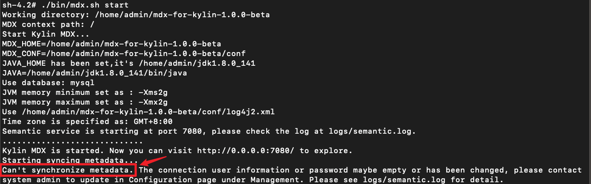
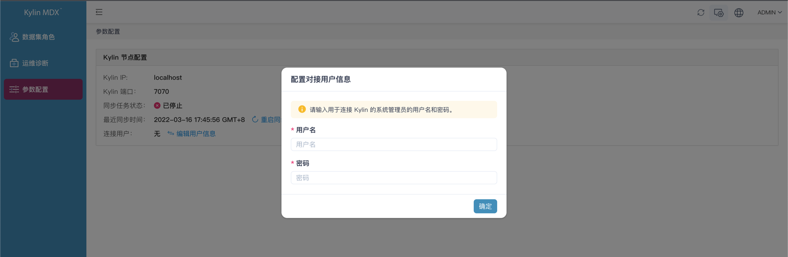

## 在 Linux 环境安装

在本节中，我们将引导您在 Linux 操作系统环境中快速安装 MDX for Kylin。

**请确保您的服务器满足 MDX for Kylin 的安装要求**，MDX for Kylin 对服务器的要求请参阅[**安装前置条件**](prerequisite.cn.md)。

- [下载安装包](#下载安装包)
- [创建数据库](#创建数据库)
- [解压安装包](#解压安装包)
- [加密元数据库访问密码](#加密元数据库访问密码)
- [修改配置文件](#修改配置文件)
- [启动 MDX for Kylin](#启动-mdx-for-kylin)
- [注意事项](#注意事项)

### 下载安装包

- 首先访问 [Github 地址](https://github.com/Kyligence/mdx-kylin/issues/1#issue-1174836123) 下载 MDX for Kylin 安装包

### 创建数据库

- 创建一个全新的数据库，并将 character_set_database 设定为 **utf8mb4** 或 **utf8**, 将 collation_server 设定为 **utf8mb4_unicode_ci** 或 **utf8_unicode_ci**，

- **注意**：

   - MySQL 5.7 中的样例创建数据库语句如下：

   ```mysql
   mysql> create database `<数据库名称>` default character set utf8mb4 collate utf8mb4_unicode_ci;
   ```
  
   - PostgreSQL 10.1 中的样例创建数据库语句如下：

   ```
   postgresql> create database <数据库名称> encoding='utf8';
   ```

### 解压安装包

- 解压缩 MDX for Kylin 安装包

   ```sh
   $ tar -xf [安装包文件名]
   如:
   $ tar -xf mdx-for-kylin-1.0.0-beta.tar.gz
   ```

### 加密元数据库访问密码

- 读取解压后的文件；加密 MDX for Kylin 数据库密码，并记录返回的字符

  ```sh
  $ cd [解压后文件]
  $ bin/mdx.sh encrypt '<填入 MDX for Kylin 数据库密码>'
  ```

  > 注意：如果输入的密码包含特殊字符, 需要用单引号包裹, 如果密码里面有单引号, 那么可以用双引号包裹.

### 修改配置文件

- 修改 conf 目录下的配置文件：

   配置 insight.properties 参数。

   ```properties
   $ vi conf/insight.properties
   
   修改以下配置项：
   insight.kylin.host: 需要连接的 Kylin 服务器的 IP 地址或 Hostname
   insight.kylin.port: 需要连接的 Kylin 服务器的端口号
   insight.kylin.ssl: 需要连接的 kylin 是否启用了 SSL，默认为 false
   insight.database.type: 需要连接的 MDX for Kylin 数据库的类型，默认为 mysql, 如果使用PostgreSQL作为元数据库，需要更改类型为postgresql
   insight.database.useSSL: 需要连接的 MDX for Kylin 数据库是否使用SSL连接，默认为 false
   insight.database.ip: 需要连接的 MDX for Kylin 数据库服务器的 IP 地址或 Hostname
   insight.database.port: 需要连接的 MDX for Kylin 数据库的端口号
   insight.database.name: 需要连接的 MDX for Kylin 数据库的名称
   insight.database.username: 需要连接 MDX for Kylin 数据库的连接用户名
   insight.database.password: 需要填入通过第四步加密以后的 MDX for Kylin 数据库管理员密码
   insight.semantic.port: MDX for Kylin Semantic 的端口，设置后，使用该端口登陆 MDX for Kylin
   insight.semantic.datasource-version: 需要指明连接的 MDX for Kylin 版本，仅支持 2, 表示对接 Kylin
   insight.mdx.cluster.nodes: 需要将集群中所有 MDX for Kylin 节点的 ip 和 port 信息加入配置文件中, 例如insight.mdx.cluster.nodes=ip1:port1,ip2:port2
   ```
   
   > 注意：若不设置 `insight.mdx.cluster.nodes` ，会导致无法在 UI 中生成诊断包。
   
   更多高级配置可参考[基本配置参数](../configuration/properties.cn.md)文档。
   
   如果您有集群部署的需求，还请先阅读手册[诊断包](../operations/diagnosis.cn.md)章节
   
### 启动 MDX for Kylin

- 启动 MDX for Kylin，首次启动会需要几分钟的时间来更新元数据

   ```sh
   $ bin/mdx.sh start
   ```

- **注意**：在首次启动时，由于未并未填写与 Kylin 通信的账户信息，所以同步任务会失败。详情如下图，此时您可正常登陆 MDX for Kylin 并填写同步信息，填写后即可正常同步。
  



- 安装成功后，您可以通过 `http://{host}:{insight.semantic.port}/login/` 登陆 MDX for Kylin

- 由于 MDX for Kylin 需要与 Kylin 进行通信，所以首次启动时，登陆系统后，系统会提示您填写连接使用的用户名和密码


- 停止 MDX for Kylin

    ```sh
    $ bin/mdx.sh stop
    ```
